# ChatGPT技术原理解析：从RL之PPO算法、RLHF到GPT4、instructGPT

# 目录

- [ChatGPT技术原理解析：从RL之PPO算法、RLHF到GPT4、instructGPT](#chatgpt技术原理解析从rl之ppo算法rlhf到gpt4instructgpt)
- [目录](#目录)
- [前言](#前言)
- [第一部分 从RL、策略梯度到TRPO、PPO算法、RLHF](#第一部分-从rl策略梯度到trpoppo算法rlhf)
  - [1.1 近端策略优化PPO：解决TRPO的计算量大的问题](#11-近端策略优化ppo解决trpo的计算量大的问题)
  - [1.2 模仿学习(逆强化学习)思路下的RLHF：从人类反馈中学习](#12-模仿学习逆强化学习思路下的rlhf从人类反馈中学习)
    - [1.2.1 什么是模仿学习(逆强化学习)](#121-什么是模仿学习逆强化学习)
    - [1.2.2 RLHF：基于人类偏好的深度强化学习](#122-rlhf基于人类偏好的深度强化学习)
- [第二部分 从GPT/GPT2/GPT3到GPT3.5/GPT4：微调到prompt学习的过渡](#第二部分-从gptgpt2gpt3到gpt35gpt4微调到prompt学习的过渡)
  - [2.1 GPT：基于Transformer Decoder预训练 + 微调/Finetune](#21-gpt基于transformer-decoder预训练--微调finetune)
    - [2.1.1 GPT = Multi-Head Attention层 + Feed forward层 + 求和与归一化的前置LN层 + 残差](#211-gpt--multi-head-attention层--feed-forward层--求和与归一化的前置ln层--残差)
    - [2.1.2 什么是Self-Attention与Masked Self-Attention](#212-什么是self-attention与masked-self-attention)
  - [2.2 GPT2承1启3：基于prompt尝试舍弃微调 直接Zero-shot Learning](#22-gpt2承1启3基于prompt尝试舍弃微调-直接zero-shot-learning)
  - [2.3 GPT3：In-context learning正式开启prompt新范式(小样本学习)](#23-gpt3in-context-learning正式开启prompt新范式小样本学习)
    - [2.3.1 GPT3在0样本、单样本、小样本下的突出能力](#231-gpt3在0样本单样本小样本下的突出能力)
    - [2.3.2 In Context Learning(ICL)背后的玄机：隐式微调？](#232-in-context-learningicl背后的玄机隐式微调)
  - [2.4 Prompt技术的升级与创新：指令微调技术(IFT)与思维链技术(CoT)](#24-prompt技术的升级与创新指令微调技术ift与思维链技术cot)
    - [2.4.1 Google提出FLAN大模型：基于指令微调技术Instruction Fine-Tuning (IFT)](#241-google提出flan大模型基于指令微调技术instruction-fine-tuning-ift)
    - [2.4.2 关于PL的进一步总结：到底如何理解prompt learning](#242-关于pl的进一步总结到底如何理解prompt-learning)
    - [2.4.3 基于思维链(Chain-of-thought)技术下的prompt](#243-基于思维链chain-of-thought技术下的prompt)
  - [2.5 GPT3到GPT3.5：从InstructGPT到ChatGPT初版的迭代过程](#25-gpt3到gpt35从instructgpt到chatgpt初版的迭代过程)
  - [2.6 ChatGPT初版与InstructGPT的差别：基于GPT3还是GPT3.5微调](#26-chatgpt初版与instructgpt的差别基于gpt3还是gpt35微调)
  - [2.7 基于GPT4的ChatGPT改进版：新增多模态技术能力](#27-基于gpt4的chatgpt改进版新增多模态技术能力)
- [第三部分 InstructGPT/ChatGPT训练三阶段及多轮对话能力](#第三部分-instructgptchatgpt训练三阶段及多轮对话能力)
  - [3.1 基于GPT3的InstructGPT训练三阶段](#31-基于gpt3的instructgpt训练三阶段)
    - [3.1.0 ChatGPT初版的前身之InstructGPT：基于RLHF手段微调的GPT](#310-chatgpt初版的前身之instructgpt基于rlhf手段微调的gpt)
    - [3.1.1 InstructGPT训练阶段1：针对预训练后的GPT3进行监督微调](#311-instructgpt训练阶段1针对预训练后的gpt3进行监督微调)
    - [3.1.2 InstructGPT训练阶段2：如何对多个输出排序及如何训练RM模型](#312-instructgpt训练阶段2如何对多个输出排序及如何训练rm模型)
    - [3.1.3 InstructGPT训练阶段3：如何通过PPO算法进一步优化模型的策略](#313-instructgpt训练阶段3如何通过ppo算法进一步优化模型的策略)
  - [3.2 InstructGPT如何更好的构建多轮对话能力](#32-instructgpt如何更好的构建多轮对话能力)
- [第四部分 类ChatGPT开源项目的训练框架/代码实现/部署微调](#第四部分-类chatgpt开源项目的训练框架代码实现部署微调)
- [后记(含修改/优化/完善记录)](#后记含修改优化完善记录)
- [参考文献与推荐阅读](#参考文献与推荐阅读)

**写在最前面**，为了彻底写清楚ChatGPT背后的所有关键细节，从1月初写到4月底仍未完工，除了本文之外，过程中涉及到多篇文章([RL](https://so.csdn.net/so/search?q=RL&spm=1001.2101.3001.7020) 论文 项目 CV多模态)，再加上之前写的Transformer、RL数学基础等多篇笔记，成了一个大系列：

- [Transformer通俗笔记：从Word2Vec、Seq2Seq逐步理解到GPT、BERT](https://blog.csdn.net/v_JULY_v/article/details/127411638)
- [RL所需的微积分/概率统计基础](https://blog.csdn.net/v_JULY_v/article/details/8308762)、[最优化基础](https://blog.csdn.net/v_JULY_v/article/details/81350035)
- [强化学习极简入门：通俗理解MDP、DP MC TC和Q学习、策略梯度、PPO](https://blog.csdn.net/v_JULY_v/article/details/128965854)
- [ChatGPT与多模态必读论文100篇(2.27日起，每周更新)](https://blog.csdn.net/v_JULY_v/article/details/129508065)
- 类ChatGPT的部署与微调：[从LLaMA、Alpaca/Vicuna/BELLE、中文版](https://blog.csdn.net/v_JULY_v/article/details/129709105)、[从GLM、ChatGLM到MOSS、ChatDoctor、可商用](https://blog.csdn.net/v_JULY_v/article/details/129880836)
- 类ChatGPT代码逐行解读：[从零实现Transformer、ChatGLM-6B](https://blog.csdn.net/v_JULY_v/article/details/130090649)、[从零实现TRL、ChatLLaMA、ColossalChat、DeepSpeed Chat](https://blog.csdn.net/v_JULY_v/article/details/129996493)
- AI绘画与CV多模态原理解析：[VAE、扩散模型DDPM、DETR、ViT/Swin transformer](https://blog.csdn.net/v_JULY_v/article/details/130361959)、CLIP/BLIP到stable diffusion、GPT4(后者待6月中旬发布)

另，我本人主讲的《[ChatGPT技术原理解析](https://www.julyedu.com/course/getDetail/481)》、及《[类ChatGPT项目实战 [定制中文垂直商用版,且提供GPU\]](https://www.julyedu.com/course/getDetail/483)》会比本系列讲的更加深入、细致、透彻。

---

# 前言

自从我那篇[Transformer通俗笔记](https://blog.csdn.net/v_JULY_v/article/details/127411638)一经发布，然后就不断改、不断找人寻求反馈、不断改，其中一位朋友倪老师(之前我司NLP高级班学员现课程助教老师之一)在谬赞[Transformer](https://so.csdn.net/so/search?q=Transformer&spm=1001.2101.3001.7020)笔记无懈可击的同时，给我建议到，“后面估计可以尝试尝试在BERT的基础上，讲一讲prompt学习了”。

再然后，当我还在各种改Transformer笔记的时候，12月初突然出来了一个ChatGPT刷爆朋友圈，即便很多之前不接触AI的朋友也在问ChatGPT这种类似聊天机器人却远胜一般聊天机器人各种问题(上一次出现这种盛况的还是16年的AlphaGo)。

据我观察，大家问ChatGPT的问题千奇百怪：

- 有的让他算经典的鸡兔同笼问题，且也能在和人类自然而流畅的互动中举一反三
- 有的让其根据要求排查代码bug，要知道此前debug想寻求帮助

  要么问人(问熟人用社交软件，问陌生人则类似那种问答网站，持续问一般得付费，毕竟没人乐意持续免费答疑大量技术难题)

  要么Google搜有没人遇到类似的问题(但别人遇到的问题很难与你的百分百一致)

  要么用Codex这类代码软件，但在和人类的互动交互上，还不是那么善解人意

所以ChatGPT就相当于你写代码或各类问题的私人顾问，而这个私人顾问能瞬间、精准理解你的意图，不会让你像用以前那种聊天机器人经常觉得智障甚至对牛弹琴，加之其背后依托的是人类级百科全书式的资料库，所以有人惊呼：ChatGPT会不会替代Google这类搜索引擎。

虽然一开始大部分技术者对待ChatGPT还是比较冷静的，毕竟它给的答案不像权威技术专家那样具备足够的公信力，也不像Google给出来源从而不能比较好的验证其正确程度，但后来很快发生的几件大事彻底改变了大家此前的看法：

1. 23年1月初，微软欲用 ChatGPT 扶必应“上位”，对抗 Google，且很快，ChatGPT直接让其所在的公司OpenAI估值翻倍
2. 23年3月中旬，OpenAI正式对外发布GPT-4，增加了多模态(支持图片的输入形式)，且ChatGPT底层的语言模型直接从GPT3.5升级到了GPT4，回答问题的准确率大幅提升
3. 23年3月17日，微软推出Microsoft 365 Copilot，集成GPT4的能力，实现自动化办公，通过在Word PPT Excel等办公软件上输入一行指令，瞬间解决一个任务
   3.23日更推出GitHub Copilot X，让自动化编程不再遥远
4. 23年3月24日，OpenAI宣布推出插件功能，赋予ChatGPT使用工具(数学问题精准计算)、联网(获取实时最新消息，底层知识不再只截止到21年9月份)的能力

然目前关于ChatGPT中文的资料里，真正**能让人一看就懂**的非常非常少，当少数文章具备比较好的可读性之后，你又会发现一旦涉及算法细节就千篇一律的泛泛而谈，如果不是泛泛而谈的，则更多堆砌概念和公式，有的甚至漏洞百出。

总之中文资料里，可能因为instructGPT/ChatGPT刚出来不久的缘故，**兼顾可读性、细节性、准确性**的文章少的可怜，考虑到ChatGPT非一蹴而就，而是经过了各个前置技术的发展、迭代、结合而成，故逐一阐述

- 2017年之前早已有之的一些数学/AI/**RL**等基础技术，比如微积分、概率统计、最优化、策略梯度、**TRPO**算法(2015年提出)
- 2017年6月OpenAI联合DeepMind首次正式提出的：Deep Reinforcement Learning from Human Preferences，即*基于人类偏好的深度强化学习*，简称**RLHF**
- 2017年7月的OpenAI团队提出的对TRPO算法的改进：**PPO**算法
  关于RL、策略梯度、TRPO、PPO则写在了此文《[强化学习极简入门：通俗理解MDP、DP MC TC和Q学习、策略梯度、PPO](https://blog.csdn.net/v_JULY_v/article/details/128965854)》
  且在这篇RL极简入门笔记之前，99%的文章都不会把PPO算法从头推到尾，该文把PPO从零推到尾，按照“RL-策略梯度-重要性采样(重要性权重)-增加基线(避免奖励总为正)-TRPO(加进KL散度约束)-PPO(解决TRPO计算量大的问题)”的顺序逐步介绍每一步推导
- 2017年6月的**Transformer**/Self-Attention
  关于transformer/self-attention，除了本文，更可以看下上篇《[Transformer通俗笔记：从Word2Vec、Seq2Seq逐步理解到GPT、BERT](https://blog.csdn.net/v_JULY_v/article/details/127411638)》
- 2018年6月的**GPT**(Generative Pre-trained Transformer)，其关键构成是基于Transformer-Decoder的Masked Self-Attention
- 2019年2月的融合prompt learning的**GPT2**，prompt learning的意义在于不用微调也能做任务
- 2020年5月的**GPT3**，参数规模到了1750亿，终于真正做到预训练之后不用再微调模式，通过In-context learning(简称**ICL**)开启prompt新范式，且你可能没想到的是，**这一年的9月份OpenAI已经开始研究GPT3与RLHF的结合了**，且此时用的策略优化方法为PPO
- 2021年7月的**Codex**，通过对GPT3进行大量的代码训练迭代而出Codex，从而具备代码/推理能力
- 2021年9月Google提出的FLAN大模型：基于指令微调技术Instruction Fine-Tuning (**IFT**)
  *此前，Google曾在21年5月对外宣布内部正在研发对话模型LaMDA，而FLAN is the instruction-tuned version of LaMDA-PT
  2019年10月，Google发布T5模型(transfer text to text transformer)，虽也基于transformer，但区别于BERT的编码器架构与GPT的解码器架构，T5是transformer的encoder-decoder架构
  2022年1月，Google发布LaMDA论文『* LaMDA: Language Models for Dialog Applications』
  *2022年4月，Google提出PaLM: Scaling Language Modeling with Pathways，5400亿参数
  2022年10月，Google提出Flan-T5
  23年3月6日，Google提出多模态LLM模型PaLM-E*
- 2022年1月的Google研究者提出的思维链技术(Chain of Thought，简称**CoT**)
- 2022年3月的OpenAI正式发布**instructGPT**：GPT3 + instruction tuning + RLHF + PPO，其中，instruction tuning和prompt learning的核心区别在于instruction tuning会提供更多的指令引导模型输出更符合预期的结果，例如
  提示学习：给女朋友买了这个项链，她很喜欢，这个项链太____了
  指令微调：判断这句话的情感：给女朋友买了这个项链，她很喜欢。选项：A=好；B=一般；C=差
  你也可以暂简单理解instruction tuning为带人类指令的prompting
- 2021年第4季度逐步发展而来的**GPT3.5**，并于22年不断融合Codex、InstructGPT的技术能力
- 2022年11月的**ChatGPT**：语言模型层面的核心架构是**GPT3.5**(基于Transformer-Decoder的Masked Self-Attention且融合了Codex的代码/推理能力、instruction tuning等技术) **+ RLHF + PPO3**
- 2023年3月中旬，OpenAI正式对外发布**GPT-4**，增加了多模态(支持图片的输入形式)，且ChatGPT底层的语言模型直接从GPT3.5升级到了GPT4

如你所见，自从1.6日开始写ChatGPT笔记，1.15日发布本文，但为把ChatGPT背后所涉及的关键技术阐述细致、透彻，故本文越写越长，长到最后成了一个系列，有的内容抽离出去独立成文，有的还在不断完善

# 第一部分 从RL、策略梯度到TRPO、PPO算法、RLHF

再次强调说明下，本第一部分在23年2.10日有个重要修改

- 2.10日之前，考虑到本文的主旨核心ChatGPT用到了RLHF和PPO，所以本文的第一部分从强化学习讲到PPO算法，毕竟虽然只是想重点介绍下PPO，但写到最后还是把PPO所有相关的前置知识都细致介绍了个遍，不然，总感觉有细节没交待而不够透彻
- 2.10日之后，又考虑到有些朋友可能对RL细节有所了解，或者更多希望整体了解ChatGPT整体架构而暂不细究其所用的策略迭代算法PPO的前置技术、RL细节

综上，为兼顾两者，且加之为避免本文篇幅过长而影响完读率，故把下面原先第一部分的大部分内容抽取出来放到了新一篇RL笔记里进一步细致阐述：[强化学习极简入门：通俗理解MDP、DP MC TC和Q学习、策略梯度、PPO](https://blog.csdn.net/v_JULY_v/article/details/128965854)

> 第一部分 RL基础：什么是RL与MRP、MDP
> 1.1 入门强化学习所需掌握的基本概念
>
> - 1.1.1 什么是强化学习：依据策略执行动作-感知状态-得到奖励
> - 1.1.2 RL与监督学习的区别和RL方法的分类
>
> 1.2 什么是马尔科夫决策过程
>
> - 1.2.1 MDP的前置知识：随机过程、马尔可夫过程、马尔可夫奖励
> - 1.2.2 马尔可夫决策过程(MDP)：马尔可夫奖励(MRP) + 智能体动作因素
>
> ---
>
> 第二部分 RL进阶之三大表格求解法：DP、MC、TD
> 2.1 动态规划法
>
> - 2.1.1 什么是动态规划
> - 2.1.2 通过动态规划法求解最优策略
>
> 2.2 蒙特卡洛法
> 2.3 时序差分法及与DP、MC的区别
> 2.4 RL的分类：基于模型(Value-base/Policy-based)与不基于模型
>
> ---
>
> 第三部分 价值学习：从n步Sarsa算法到Q-learning、DQN
> 3.1 TD(0)控制/Sarsa(0)算法与TD(n)控制/n步Sarsa算法
> 3.2 Q-learning
>
> - 3.2.1 重要性采样：让同策略完成到异策略的转变
> - 3.2.2 Sarsa算法与Q-learning更新规则的对比
>
> 3.3 DQN
>
> ---
>
> 第四部分 策略学习：从策略梯度、Actor-Criti到TRPO、PPO算法
> 4.1 策略梯度与其突出问题：采样效率低下
>
> - 4.1.1 什么是策略梯度和梯度计算/更新的流程
> - 4.1.2 避免采样的数据仅能用一次：重要性采样(为采样q解决p从而增加重要性权重)
>
> 4.2 优势演员-评论家算法(Advantage Actor-Criti)：为避免奖励总为正增加基线
> 4.3 基于信任区域的TRPO：加进KL散度解决两个分布相差大或步长难以确定的问题

## 1.1 近端策略优化PPO：解决TRPO的计算量大的问题

如上所述，PPO算法是针对TRPO计算量的大的问题提出来的，正因为PPO基于TRPO的基础上改进，故PPO也解决了策略梯度不好确定学习率Learning rate (或步长Step size) 的问题

毕竟通过上文，我们已经得知

1. 如果 step size 过大, 学出来的 Policy 会一直乱动，不会收敛；但如果 Step Size 太小，想完成训练，我们会等到地老天荒
2. 而PPO 利用 New Policy 和 Old Policy 的比例，限制了 New Policy 的更新幅度，让策略梯度对稍微大点的 Step size 不那么敏感

具体做法是，PPO算法有两个主要的变种：近端策略优化惩罚（PPO-penalty）和近端策略优化裁剪（PPO-clip），其中PPO-penalty和TRPO一样也用上了KL散度约束。

近端策略优化惩罚PPO-penalty的流程如下

1. 首先，明确目标函数，咱们需要优化$`J^{\theta^{\prime}}(\theta)`$，让其最大化
```math
J^{\theta^{\prime}}(\theta)=\mathbb{E}_{\left(s_{t}, a_{t}\right) \sim \pi_{\theta^{\prime}}}\left[\frac{p_{\theta}\left(a_{t} \mid s_{t}\right)}{p_{\theta^{\prime}}\left(a_{t} \mid s_{t}\right)} A^{\theta^{\prime}}\left(s_{t}, a_{t}\right)\right]
```

  『注：如果你想仔细抠接下来各种公式但一上来就被上面这个弄迷糊了，说明还是需要先看下上文说过的这篇[RL极简入门](https://blog.csdn.net/v_JULY_v/article/details/128965854)，而一旦踏入RL，便得做好两万五千里的准备，当然，**如果只是想了解ChatGPT背后大概的技术原理，可以不用细抠PPO的公式怎么来的，不影响你对ChatGPT整体架构的理解**，且下文会讲其在ChatGPT中是如何运用的』

2. 接下来，先初始化一个策略的参数$`\theta`$，在每一个迭代里面，我们用前一个训练的迭代得到的actor的参数$`\theta`$与环境交互，采样到大量状态-动作对， 根据$`\theta^{\prime}`$交互的结果，估测$`A^{\theta^{\prime}}(s_t, a_t)`$
3. 由于目标函数牵涉到重要性采样，而在做重要性采样的时候，$`p_{\theta}(a_t | s_t)`$不能与$`p_{\theta^{\prime}}(a_t | s_t)`$相差太多，所以需要在训练的时候加个约束，这个约束就好像正则化的项一样，是$`\theta$与$\theta^{\prime}`$输出动作的 KL散度，用于衡量$`\theta`$与$`\theta^{\prime}`$的相似程度，我们希望在训练的过程中，学习出的$`\theta`$与$`\theta^{\prime}`$越相似越好
   所以需要最后使用 PPO 的优化公式：$`J_{\mathrm{PPO}}^{\theta'}(\theta) = J^{\theta^{\prime}}(\theta) - \beta KL(\theta, \theta^{\prime})`$


   当然，也可以把上述那两个公式合二为一『如此可以更直观的看出，PPO-penalty把KL散度约束作为惩罚项放在了目标函数中(可用梯度上升的方法去最大化它)，此举相对TRPO减少了计算量
```math
\begin{aligned} J_{\mathrm{PPO}}^{\theta'}(\theta) = \mathbb{E}_{\left(s_{t}, a_{t}\right) \sim \pi_{\theta^{\prime}}} \left[ \frac{p_{\theta}\left(a_{t} \mid s_{t}\right)}{p_{\theta^{\prime}}\left(a_{t} \mid s_{t}\right)} A^{\theta^{\prime}}\left(s_{t}, a_{t}\right)\right] - \beta KL(\theta, \theta^{\prime}) \end{aligned}
```

上述流程有一个细节并没有讲到，即$`\beta`$是怎么取值的呢，事实上，$`\beta`$是可以动态调整的，故称之为自适应KL惩罚(adaptive KL penalty)，具体而言

- 先设一个可以接受的 KL 散度的最大值$`KL_{max}`$，假设优化完$`J_{\mathrm{PPO}}^{\theta^{\prime}}(\theta)=J^{\theta^{\prime}}(\theta)-\beta \mathrm{KL}\left(\theta, \theta^{\prime}\right)`$以后，KL 散度值太大导致$`\mathrm{KL}(\theta,\theta^{\prime})>\mathrm{KL}_{\max}`$，意味着$`\theta`$与$`\theta^{\prime}`$差距过大(即学习率/步长过大)，也就代表后面惩罚的项$`\beta \mathrm{KL}(\theta ,\theta^{\prime})`$惩罚效果太弱而没有发挥作用，故增大惩罚把$`\beta`$增大
- 再设一个 KL 散度的最小值$`KL_{min}`$
  如果优化完$` J_{\mathrm{PPO}}^{\theta^{\prime}}(\theta)=J^{\theta^{\prime}}(\theta)-\beta \mathrm{KL}\left(\theta, \theta^{\prime}\right)`$以后，KL散度值比最小值还要小导致$`\mathrm{KL}(\theta,\theta^{\prime})< {KL}_{\min}`$，意味着 $`\theta$与$\theta^{\prime}`$ 差距过小，也就代表后面这一项$`\beta \mathrm{KL}(\theta ,\theta^{\prime})`$的惩罚效果太强了，我们怕它只优化后一项，使$`\theta$与$\theta^{\prime}`$ 一样，这不是我们想要的，所以减小惩罚即减小$`\beta`$

总之，近端策略优化惩罚可表示为

````math
\begin{aligned} J_{\text{PPO}}^{\theta'}(\theta)=J^{\theta'}(\theta)-\beta \text{KL}\left(\theta, \theta'\right) \end{aligned}
````

```math
\begin{aligned} J^{\theta'}(\theta) \approx \sum_{\left(s_{t}, a_{t}\right)} \frac{p_{\theta}\left(a_{t} \mid s_{t}\right)}{p_{\theta'}\left(a_{t} \mid s_{t}\right)} A^{\theta'}\left(s_{t}, a_{t}\right)\end{aligned}
```

当然，如果觉得计算 KL散度很复杂，则还有一个PPO2算法，即近端策略优化裁剪PPO-clip，包括PPO算法的一个简单实现，均详见[RL极简入门](https://blog.csdn.net/v_JULY_v/article/details/128965854)一文

```math
\begin{aligned} J_{\mathrm{PPO2}}^{\theta'}(\theta) \approx \sum_{\left(s_{t}, a_{t}\right)} \min &\left(\frac{p_{\theta}\left(a_{t} | s_{t}\right)}{p_{\theta'}\left(a_{t} | s_{t}\right)} A^{\theta'}\left(s_{t}, a_{t}\right),{clip}\left(\frac{p_{\theta}\left(a_{t} | s_{t}\right)}{p_{\theta'}\left(a_{t} | s_{t}\right)}, 1-\varepsilon, 1+\varepsilon\right) A^{\theta'}\left(s_{t}, a_{t}\right)\right) \end{aligned}
```

> PPO算法是一种具体的Actor-Critic算法实现，比如在对话机器人中，输入的prompt是state，输出的response是action，想要得到的策略就是怎么从prompt生成action能够得到最大的reward，也就是拟合人类的偏好。具体实现时，可以按如下两大步骤实现
>
> - 首先 Make Experience 部分，利用 SFT 、Actor、RM、Critic模型计算生成 Experience 存入 buffer 中
>   具体做法是先定义4个模型：Actor(action_logits)、SFT(sft_logits)、Critic(value)、RM「r(x, y)」，和kl_div、reward、优势函数adv
>   然后从prompt库中采样出来的prompt在经过SFT(很快，你会通过本文下文可知，微调过GPT3/GPT3.5的模型称之为SFT)做generate得到一个response，这个『prompt + response』定义为sequence(这个采样的过程是批量采样进行generate，得到一个sequence buffer)，接着这个sequence buffer的内容做batched之后输入给4个模型做inference
>
>   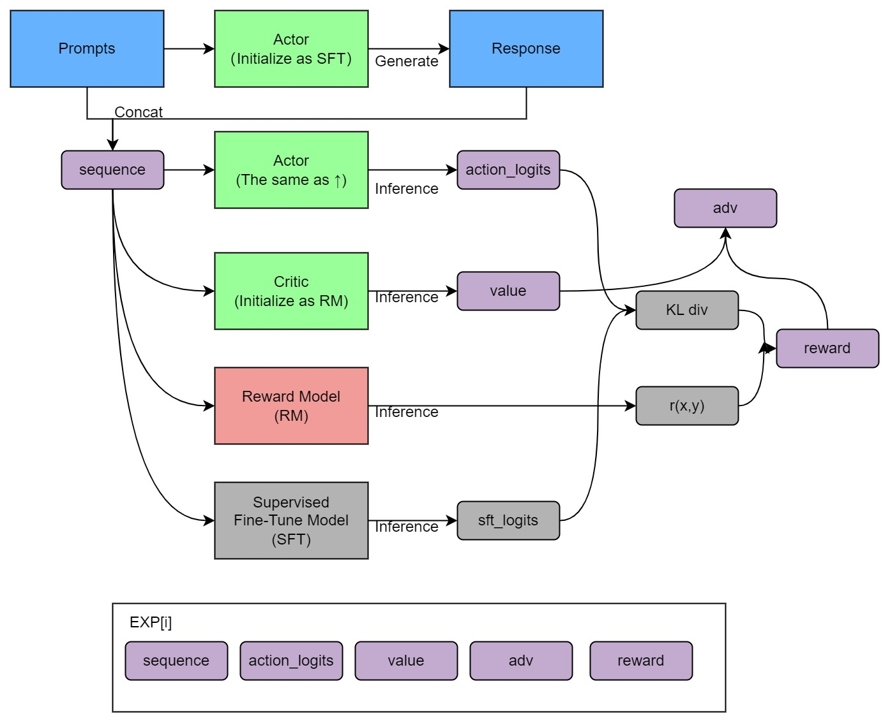
>
> * 之后是参数更新部分，利用 Experience 计算价值损失(value loss)和策略损失(policy loss)
>
>   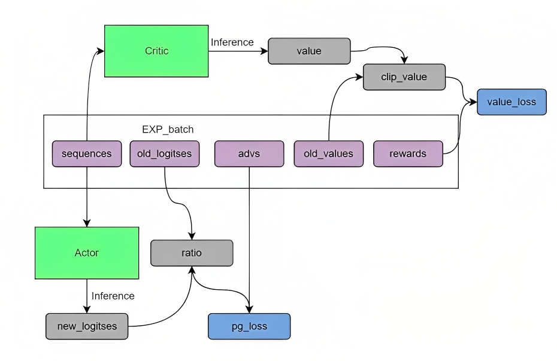
>
>   更多请参见[强化学习极简入门](https://blog.csdn.net/v_JULY_v/article/details/128965854)的最后一小节4.4.3节...

## 1.2 模仿学习(逆强化学习)思路下的RLHF：从人类反馈中学习

### 1.2.1 什么是模仿学习(逆强化学习)

虽然RL理论上虽不需要大量标注数据，但实际上它所需求的reward会存在缺陷：

1. 比如游戏AI中，reward的制定非常困难，可能要制定成百上千条游戏规则，这并不比标注大量数据来得容易，又比如自动驾驶的多步决策（sequential decision）场景中，学习器很难频繁地获得reward，容易累计误差导致一些严重的事故

   
2. 再比如聊天机器人方面，不好定义什么是好的对话、什么是不好的对话，当然，对此可以收集很多人类的对话当做范例，如此，模仿学习思路下的*基于人来偏好的深度强化学习*(对应论文为：Deep Reinforcement Learning from Human Preferences 2017，简称RLHF)应运而生
   RLHF试图解决的问题是，在奖励函数不够明确的情况下，通过基于人类对事物比较的偏好而非绝对奖励值训练奖励函数

模仿学习的思路是不让模型在人类制定的规则下自己学习，而是让模型模仿人类的行为。而逆强化学习就是模仿学习的其中一种，何谓逆强化学习呢？

- 原来的强化学习里，有Environment和Reward Model（由奖励函数推出什么样的策略/动作是最好的），但逆强化学习没有奖励函数，只有一些人类/专家的示范，怎么办呢
- 可以通过人类标注数据训练得到Reward Model（相当于有了人类标注数据，则相信它是不错的，然后反推人类因为什么样的奖励函数才会采取这些行为）
- 有了奖励函数之后，就可以使用一般的强化学习的方法去找出最优策略/动作

### 1.2.2 RLHF：基于人类偏好的深度强化学习

实际上，RLHF(Reinforcement Learning with Human Feedback)这一概念最早被定义为*基于人类反馈的强化学习*，它最早是在2008年《TAMER：Training an Agent Manually via Evaluative Reinforcement》一文中被提及的

在2017年前后，深度强化学习(Deep Reinforcement Learning)逐渐发展并流行起来，如你所见，2017年6月由OpenAI联合Google DeepMind一块推出：*基于人类偏好的深度强化学习*《[Deep Reinforcement Learning from Human Preferences](https://arxiv.org/pdf/1706.03741)》，也简称RLHF


当让一个强化学习智能体探索环境并与之交互(比如Atari游戏)，RLHF的核心步骤如下图所示：

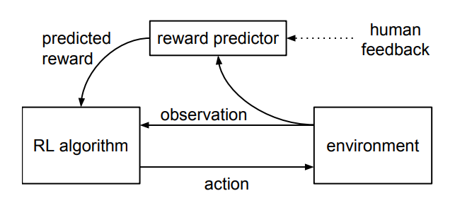

1. 首先，智能体的一对1-2秒的行为片段定期地回馈给人类操作员，人类基于偏好对智能体的行为作出某种偏好性的选择评判
2. 接着，人类这种基于偏好的选择评判被预测器(reward predictor)来预测奖励函数
3. 智能体通过预测器预测出的奖励函数作出更优的行为(毕竟智能体要最大化奖励嘛)

再之后，OpenAI团队通过下述两篇论文进一步阐述了RLHF

- [Fine-Tuning Language Models from Human Preferences(Zieglar et al. 2019)](https://arxiv.org/pdf/1909.08593.pdf)

  在Reward model的训练中，我们需要人的参与，human labelers给policy模型生成的文本进行选择「比如在四个答案选项(y0，y1，y2，y3)中选择一个最好的」，这个选择作为reward model学习的标签

  

  Reward mode训练好后，那么在训练policy model时，Reward model便可以完全取代human labeler选择，这种基于偏好的选择作为信号传给policy model，再利用OpenAI默认的策略优化算法PPO来训练

  
- [Learning to summarize with human feedback(Stiennon et al., 2020)](https://arxiv.org/pdf/2009.01325.pdf)

  如你所见，OpenAI团队在2020年9月的这篇论文里就已经提出了类似instructGPT/ChatGPT的训练模式：

  

  1. 根据人工标注数据微调监督模型

    所谓微调，即指当我们预训练出一个语言模型后，为了更好的让它完成咱们手头上的任务，会通过一定的样例/样本对该模型的参数做一定的调整或适配

  2. 训练一个奖励函数(下文会详述reward的这个损失函数，这里暂且做个粗略理解，即相当于reward不再是人直接给了，而是用高质量标注训练一个好的reward模型)
```math
loss(r_\theta) = -E_{(x,y_0,y_1,i)\sim D}[log( \sigma (r_\theta(x, y_i) - r_\theta(x, y_{1-i}))]
```

  3. 有了reward，接下来便可以通过PPO优化模型的策略，且为避免RM过于绝对，还给RM加了个\beta惩罚项(下文会详细阐述这个公式)
```math
R(x, y) = r_\theta (x, y) - \beta log\left [ \pi _{\phi}^{RL}(y|x)/\pi _{}^{SFT}(y|x) \right ]
```

# 第二部分 从GPT/GPT2/GPT3到GPT3.5/GPT4：微调到prompt学习的过渡

## 2.1 GPT：基于Transformer Decoder预训练 + 微调/Finetune

NLP自发展以来，先后经历了4种任务处理范式

1. 第一种范式，非神经网络时代的完全监督学习(Fully Supervised Learning, Non-Neural Network)
   具体而言，即手工设计一系列特征模板，来输入模型。模型对任务的处理结果高度依赖于特征模板的设计，同时也高度依赖领域专家的知识。举个例子，比如对于条件随机场CRF模型，业界甚至有一个专门的库CRF++帮助自动生成大量的随机模板然后输入模型进行训练，从而避免对领域专家的过度依赖
2. 第二范式，基于神经网络的完全监督学习(Fully Supervised Learning, Neural Network)
   神经网络学派开始流行以后，处理范式基本基本是预训练后的词嵌入表征 + 模型架构的调整，在这个时期，一方面的工作在词嵌入上，比如NNLM/CBOW/SKIP-GRAM/GLOVE/ELMO等，另一方面的工作则在模型架构上，比如BI-LSTM/SEQ2SEQ架构在神经机器翻译领域NMT的应用等
3. 第三范式，预训练-微调范式 (Pre-train、Fine-tune)
   相比于第二范式而言，第三范式的优点在于更进一步减少了人工的参与，不再需要对于每个任务采取不同的模型架构，而是在超大的文本数据集上预训练一个具备泛化能力的通用的模型，然后再根据下游任务本身的特点对模型进行针对性的微调即可，使得一个模型解决多种任务成为可能，比如GPT1模型
4. 第四范式，预训练、提示、预测范式(Pre-train、Prompt、Predict)
   在这个过程我们往往不对预训练语言模型改动太多，我们希望是通过对合适prompt的利用将下游任务建模的方式重新定义，这则是GPT2、GPT3的特点

### 2.1.1 GPT = Multi-Head Attention层 + Feed forward层 + 求和与归一化的前置LN层 + 残差

GPT由openAI在2018年通过此论文“Improving Language Understanding by Generative Pre-Training”提出，使用了一个大型的未标记文本语料库来进行生成式预训练(该语料库包含40GB的文本数据，比如互联网上抓取的网页、维基百科、书籍和其他来源的文本)

在GPT 被提出之前

1. 大多数深度学习方法都需要大量人工标注的高质量数据，但是标注数据的代价是巨大的
   故如何利用容易获取的大规模无标注数据来为模型的训练提供指导成为亟待解决的第一个问题
2. 另外NLP领域中有许多任务依赖于自然语言在隐含空间中的表征，不同任务对应的表征很可能是不同的，这使得根据一种任务数据学习到的模型很难泛化到其他任务上
   因此如何将从大规模无标注数据上学习到的表征应用到不同的下游任务成为亟待解决的第二个问题

在上一篇Transformer笔记中，我们已经了解到：GPT是“Generative Pre-Training Transformer”的简称，从名字看其含义是指的生成式的预训练，它和BERT都是 **(无监督)预训练-(监督)微调模式** 的典型代表

- 第一阶段，在未标记数据上使用语言建模目标来学习神经网络模型的初始参数
- 第二阶段，针对目标任务使用相应的标记数据对这些参数进行微调
  之所以叫微调是因为在这个阶段用的数据量远远小于第一阶段，并且基本没有更改模型架构和引入过多新的参数

由于Decoder具备文本生成能力，故作为侧重生成式任务的GPT选择了Transformer Decoder部分作为核心架构


不过，与原始的Transformer Decoder相比，GPT所用的结构删除了Encoder-Decoder Attention，只保留了多头注意力层Multi-Head Attention层和前馈神经网络Feed forward层，最后再加上求和与归一化的前置LN层 + 残差

通过这样的结构，GPT便可以利用无标注的自然语言数据进行训练：根据给定的前$`i - 1`$个token，预测第 $`i`$ 个token，训练过程中使用的是基于最大似然估计的损失函数，即让模型预测的概率分布尽可能接近实际下一个单词的分布


其中的关键便是这个Self-Attention，模型通过自注意力机制可以学习序列中不同位置之间的依赖关系，即在处理每个位置的信息时，模型会考虑序列中和该位置的信息有关联的其他所有位置上的信息，这种机制使得模型能够有效地处理长距离依赖关系

### 2.1.2 什么是Self-Attention与Masked Self-Attention

所谓自注意力，即指当我们需要用到自注意力编码单词$`X_1,X_2,X_3,X_4`$的时候，会按下面几个步骤依次处理(配图来自[此文](https://jalammar.github.io/illustrated-gpt2/))

1. 为每个单词路径创建Query、Key、Value，具体做法就是每个单词的表示向量和对应的权重矩阵$`(W^Q, W^K, W^V)`$做矩阵乘法

   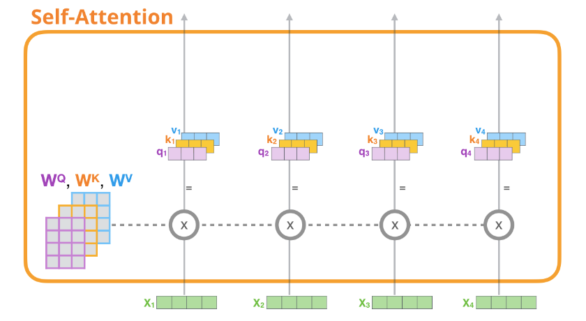

2. 对于每个输入token，使用其Query向量对其他所有的token的Key向量进行评分，获得注意力分数，比如通过$`X_1`$的$`q_1`$向量，分别与$`X_1,X_2,X_3,X_4`$的$`k_1,k_2,k_3,k_4`$向量分别做点乘，最终得到$`X_1`$在各个单词$`X_1,X_2,X_3,X_4`$上的注意力分数：20% 10% 50% 20%

   
3. 将Value向量乘以上一步得到的注意力分数(相当于对当下单词而言，不同单词重要性的权重)，之后加起来，从而获得所有token的加权和

   

之后对每个token都进行上述同样的三步操作，最终会得到每个token新的表示向量，新向量中包含该token的上下文信息，之后再将这些数据传给Transformer组件的下一个子层：前馈神经网络


至于所谓Masked Self-Attention就是在处理当前词的时候看不到后面的词。举个例子，处理“it”的时候，注意力机制看不到“it”后面的词(通过将“it”后面的词的权重设置为一个非常大的负数，进一步softmax之后变为0，从而屏蔽掉)，但会关注到“it”前面词中的“a robot”，继而注意力会计算三个词“it”、“a”、“robot”的向量及其attention分数的加权和


更多细节可以看下上篇[BERT笔记](https://blog.csdn.net/v_JULY_v/article/details/127411638)(特别是此前还不了解Transformer的)，或此文：[图解注意力机制](https://blog.csdn.net/qq_36667170/article/details/125635257)

## 2.2 GPT2承1启3：基于prompt尝试舍弃微调 直接Zero-shot Learning

虽然GPT1的预训练加微调的范式仅需要少量的微调和些许的架构改动，但能不能有一种模型完全不需要对下游任务进行适配就可以表现优异？GPT2便是在往这个方向努力：不微调但给模型一定的参考样例以帮助模型推断如何根据任务输入生成相应的任务输出

最终，针对小样本/零样本的N-shot Learning应运而生，分为如下三种

- Zero-shot Learning (零样本学习)，是指在没有任何样本/示例情况下，让预训练语言模型完成特定任务
  相当于不再使用二阶段训练模式(预训练+微调)，而是彻底放弃了微调阶段，仅通过大规模多领域的数据预训练，让模型在Zero-shot Learming的设置下自己学会解决多任务的问题，而且效果还不错(虽然GPT2通过Zero-shot Learming在有些任务的表现上尚且还不如SOTA模型，但基本超越了一些简单模型，说明潜力巨大)，你说神不神奇？

  这就好比以前我们刚开始学解题时，听老师讲了一系列知识和方法之后，老师为了让我们更好的解题，在正式答题考试之前，会先通过几个样题让我们找找感觉，方便在样题中微调或修正自己对所学知识/方法的理解
  Zero-shot Learming则相当于没有练手/预热、没有参考样例/演示/范本，学完知识/方法之后直接答题!
- One shot Learning (单样本学习)，顾名思义，是指在只有一个样本/示例的情况下，预训练语言模型完成特定任务
- Few-shot Learning (少样本或小样本学习)，类似的，是指在只有少量样本/示例的情况下，预训练语言模型完成特定任务

此外，只需将自然语言的任务示例和提示信息作为上下文输入给GPT-2，它就可以在小样本的情况下执行任何NLP任务，包括所谓的完形填空任务，比如

> 假如我要判断“我喜欢这个电影" 这句话的情感（“正面" 或者 "负面"），原有的任务形式是把他看成一个分类问题
>
> 输入：我喜欢这个电影
>
> 输出：“正面" 或者 "负面"
>
> 而如果用GPT2去解决的话，任务可以变成“完形填空"，
>
> 输入：我喜欢这个电影，整体上来看，这是一个 __ 的电影
>
> 输出：“有趣的" 或者 "无聊的"

加的这句提示“**整体上来看，这是一个 __ 的电影**”对于让模型输出人类期望的输出有很大的帮助。

这个所谓的提示用NLP的术语表达就是prompt，即给预训练语言模型的一个线索/提示，帮助它可以更好的理解人类的问题

例如有人忘记了某篇古诗，我们给予特定的提示，他就可以想起来，例如当有人说：

> 白日依山尽

大家自然而然地会想起来下一句诗：黄河入海流

亦或者，搜索引擎，可以根据我们的输入，进行输出的提示：


## 2.3 GPT3：In-context learning正式开启prompt新范式(小样本学习)

### 2.3.1 GPT3在0样本、单样本、小样本下的突出能力

GPT3简单来说，就是规模大、有钱多金、效果出奇好，具体而言，它的参数规模达到了1750亿，并且使用45TB数据进行训练(当然，GPT3论文中说道：*constituting 45TB of compressed plaintext before filtering and 570GB after filtering, roughly equivalent to 400 billion byte-pair-encoded tokens*)，其预训练任务就是“句子接龙”，给定前文持续预测下一个字，而且更为关键的是，在小样本的情况下，其性能表现一度超越SOTA模型

为形象描述，举一个GPT3在0样本、单样本、少量样本下的机器翻译使用范例，如下图

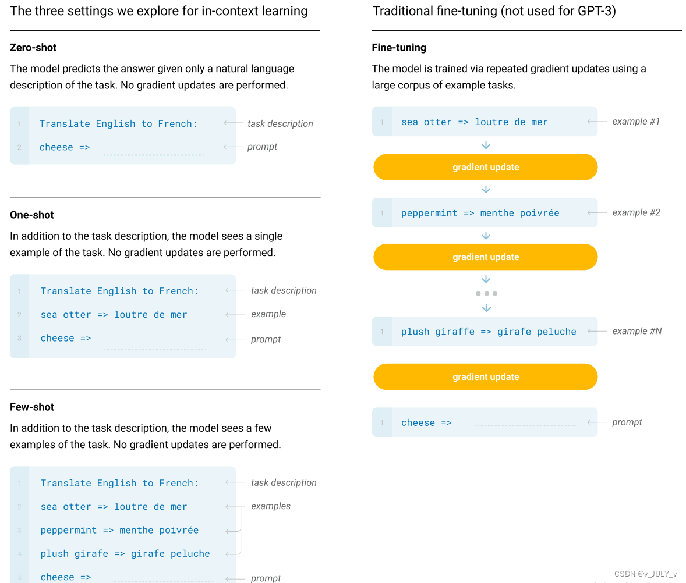

- 图中右侧是普通模型微调的过程，模型通过大量训练预料进行训练，然后基于特定的任务数据进行梯度迭代更新(gradient update)，训练至收敛后的模型才具备良好的翻译能力
- 图中左侧是GPT3分别在0样本(只给出任务描述)、单样本(只给出任务描述+一个翻译样本)、小样本(给出任务描述+少量样本)的情况下所展示出的能力
  一方面，单样本也好 小样本也好，更多只是**作为例子去提示模型，模型不利用样本做训练，即不做模型参数的任何更新**
  二方面，人们一度惊讶于其在0样本下如此强大的学习能力，使得很多人去研究背后的In Context Learning

  毕竟，我们知道普通模型微调的原理：拿一些例子当作微调阶段的训练数据，利用反向传播去修正LLM的模型参数，而修正模型参数这个动作，确实体现了LLM从这些例子学习的过程
  但是，In Context Learning只是拿出例子让LLM看了一眼，并没有根据例子，用反向传播去修正LLM模型参数的动作，就要求它去预测新例子

  此举意味着什么呢？

  1 既然没有修正模型参数，这意味着LLM并未经历一个修正过程，相当于所有的举一反三和推理/推断的能力在上一阶段预训练中便已具备(或许此举也导致参数规模越来越大)，才使得模型在面对下游任务时 不用微调、不做梯度更新或参数更新，且换个角度讲，如此巨大规模的模型想微调参数其门槛也太高了

  2 预训练中 好的预训练数据非常重要，就好比让模型在0样本下翻译英语到法语，那预训练数据中 必然有大量英语、法语的文本数据

  3 抓什么样的数据 多大规模 怎么喂给模型等等一系列工程细节，这块是导致很多模型效果有差距的重要原因之一

### 2.3.2 In Context Learning(ICL)背后的玄机：隐式微调？

零样本下 模型没法通过样本去学习/修正，但即便是少样本下，也有工作试图证明In Context Learning并没有从样本中学习，比如“Rethinking the Role of Demonstrations: What Makes In-Context Learning Work?”，它发现了：

1. 在提供给LLM的样本示例$`(x_i, y_i)`$中，$`y_i`$是否是$`x_i`$对应的正确答案其实并不重要，如果我们把正确答案$`y_i`$替换成随机的另外一个答案$`y_j`$，这并不影响In Context Learning的效果

   比如下图中，无论是分类任务(图中上部分)，还是多项选择任务(图中下部分)，随机标注设置下(红)模型表现均和正确标注(黄)表现相当，且明显超过没有in-context样本的zero-shot设置(蓝)

   

   这起码说明了一点：In Context Learning并没有提供给LLM那个从$`x`$映射到$`y`$的映射函数信息：$`y = f(x)`$，否则的话你乱换正确标签，肯定会扰乱这个$`y = f(x)`$ 映射函数，也就是说，In Context Learning并未学习这个输入空间到输出空间的映射过程
2. 真正对In Context Learning影响比较大的是：$`x`$和$`y`$的分布，也就是输入文本 $`x`$ 的分布和候选答案 $`y`$  有哪些，如果你改变这两个分布，比如把 $`y`$ 替换成候选答案之外的内容，则In Context Learning效果急剧下降
   总之，**这个工作证明了In Context Learning并未学习映射函数，但是输入和输出的分布很重要**，这两个不能乱改(此部分 待后续23年5月份进一步补充完善)

有些工作认为LLM还是从给出的示例学习了这个映射函数 $`y=f(x)`$，不过是种隐式地学习

- 比如“What learning algorithm is in-context learning? Investigations with linear models”认为Transformer能够隐式地从示例中学习 $`x`$ 到 $`y`$ 的映射过程，它的激活函数中包含了一些简单映射函数，而LLM通过示例能够激发对应的那一个
- 而“Why Can GPT Learn In-Context? Language Models Secretly Perform Gradient Descent as Meta-Optimizers”这篇文章则将ICL看作是一种隐式的Fine-tuning

## 2.4 Prompt技术的升级与创新：指令微调技术(IFT)与思维链技术(CoT)

### 2.4.1 Google提出FLAN大模型：基于指令微调技术Instruction Fine-Tuning (IFT)

OpenAI的GPT3虽然不再微调模型(pre-training + prompt)，但Google依然坚持预训练 + 微调的模式

2021年9月，谷歌的研究者们在此篇论文中《Finetuned Language Models Are Zero-Shot Learners》提出了基于**Instruction Fine-Tuning**(指令微调，简称IFT)的FLAN大模型(参数规模为137B)，极大地提升了大语言模型的理解能力与多任务能力，且**其在评估的25个数据集中有20个数据集的零样本学习能力超过175B版本的GPT3**(毕竟指令微调的目标之一即是致力于improving zero-shot generalization to tasks that were not seen in training)，最终达到的效果就是：遵循人类指令，举一反三地完成任务

有两点值得注意的是

1. 根据论文中的这句话：“FLAN is the instruction-tuned version of LaMDA-PT”，可知指令微调的是LaMDA，而LaMDA是Google在21年5月对外宣布内部正在研发的对话模型(不过，LaMDA的论文直到22年1月才发布)
2. 论文中也解释了取名为FLAN的缘由

   We take a pretrained language model of 137B parameters and perform instruction tuning—finetuning the model on a mixture of more than 60 NLP datasets expressed via natural language instructions.

   We refer to this resulting model as FLAN, for **F**inetuned **La**nguage **N**et

至于IFT的数据通常是由人工手写指令和语言模型引导的指令实例的集合，这些指令数据由三个主要组成部分组成：指令、输入和输出，对于给定的指令，可以有多个输入和输出实例


相比于GPT-3，且区别在于Finetune，FLAN的核心思想是，当面对给定的任务A时，首先将模型在大量的其他不同类型的任务比如B、C、D...上进行微调，微调的方式是将任务的指令与数据进行拼接(可以理解为一种Prompt)，随后给出任务A的指令，直接进行推断，如下图所示


例如，我们的最终目标是推理任务

1. FLAN首先讲语言模型在其他任务上进行微调，包括给定任务指令的翻译、常识推理、情感分类等
   在面对翻译任务时可以给出指令“请把这句话翻译成西班牙语”
   在面对常识推理任务时可以给出指令“请预测下面可能发生的情况”
2. 而当模型根据这些“指令”完成了微调阶段的各种任务后（将指令拼接在微调数据的前面），在面对从未见过的自然语言推理任务的指令比如：“这段话能从假设中推导出来吗？” 时，就能更好地调动出已有的知识回答问题


相当于通过指令微调之后，模型可以更好的做之前预训练时没见过的新任务且降低了对prompt的敏感度(某些场景下不一定非得设计特定prompt才能激发模型更好的回答)

这或许也启发了OpenAI重新注意到了微调这一模式(毕竟如上文所述，原本GPT3在预训练之后已彻底放弃再微调模型)，从而在InstructGPT中针对GPT3做Supervised fine-tuning(简称SFT)

### 2.4.2 关于PL的进一步总结：到底如何理解prompt learning

自此，总结一下，关于「prompt learning」最简单粗暴的理解，其实就是让模型逐步学会人类的各种自然指令或人话，而不用根据下游任务去微调模型或更改模型的参数，直接根据人类的指令直接干活，这个指令就是prompt，而设计好的prompt很关键 也需要很多技巧，是一个不算特别小的工程，所以叫prompt engineering，再进一步，对于技术侧 这里面还有一些细微的细节

> 1. GPT3 出来之前(2020年之前)，模型基本都是预训练 + 微调，比如GPT1和BERT
> 2. GPT3刚出来的时候，可以只预训练 不微调，让模型直接学习人类指令直接干活 即prompt learning，之所以可以做到如此 是因为GPT3 当时具备了零样本或少样本学习能力
>    当然，说是说只预训练 不微调，我个人觉得还是微调了的，只是如上文所说的某种隐式微调而已
> 3. 2021年，Google发现微调下GPT3后 比OpenAI不微调GPT3在零样本上的学习能力更加强大
>    从而现在又重新回归：预训练之后 再根据下游任务微调的模式，最后封装给用户，客户去prompt模型
>
>    所以现在的prompt learning更多针对的是 去提示/prompt：**已具备零样本学习能力的且还做了进一步微调的GPT3.5/GPT4**
>    (怎么微调呢，比如很快下文你会看到的SFT和RLHF，当然 也可以不做微调，比如后来Meta发布的类ChatGPT模型LLaMA本身便没咋做微调，虽它刚发布时比不上GPT3.5/4之类的，但其核心意义在于13B通过更多数据训练之后 在很多任务上可以强过175B的GPT3)
>
>    再之后，就出来了很多个基于LLaMA微调的各种开源模型(这块可以查看本文开头所列的：类ChatGPT的部署与微调系列文章)

### 2.4.3 基于思维链(Chain-of-thought)技术下的prompt

为让大语言模型进一步具备解决数学推理问题的能力，22年1月，谷歌大脑团队的Jason Wei、Xuezhi Wang等人提出了最新的Prompting机制——Chain of Thought(简称CoT)，简言之就是给模型推理步骤的prompt，让其学习人类如何一步步思考/推理，从而让模型具备基本的推理能力，最终可以求解一些简单甚至相对复杂的数学推理能力

以下是一个示例(下图左侧为standard prompting，下图右侧为基于Cot的prompt，高亮部分为chain-of-thought)，模型在引入基于Cot技术的prompt的引导下，一步一步算出了正确答案，有没有一种眼前一亮的感觉？相当于模型具备了逻辑推理能力


那效果如何呢，作者对比了标准prompting、基于Cot技术的prompting分别在这三个大语言模型LaMDA、GPT、PaLM(除了GPT由openAI发布，另外两个均由Google发布)上的测试结果，测试发现：具有540B参数的PaLM模型可以在一个代表小学水平的数学推理问题集GSM8K(GSM8K最初由OpenAI于2021年10月提出)上的准确率达到了60.1%左右


很快，这项技术引起了很多人的关注，比如不论是few-shot还是zero-shot，在加入Cot技术之后，都能回答此前不能回答的某些数学推理问题，甚至出现了风靡一时的“let's think step by step”的梗(通过该条语句可以激发模型的推理能力)


## 2.5 GPT3到GPT3.5：从InstructGPT到ChatGPT初版的迭代过程

据OpenAI官网对GPT3.5的介绍，**GPT3.5从2021年第四季度开始**就混合使用文本和代码进行训练，我们来看下GPT3.5的各个系列模型及其各自的发展演变脉络图

**基于GPT3的发展路线：一条是侧重代码/推理的Codex，一条侧重理解人类的instructGPT**

- 第一条线：为了具备代码/推理能力：GPT3 + 代码训练 = Codex
  2020 年5-6月，OpenAI先后发布了
  GPT3的论文《Language Models are Few-Shot Learners》
  GPT-3的最大规模的版本——175B(1750亿参数)大小的API Davinci(有着2048个词的上下文窗口)，此时的GPT3还只能写一些简单的代码和做一些简单的数学题

  2021 年7月，OpenAI发布Codex的论文《Evaluating Large Language Models Trained on Code》，其中初始的Codex是根据120亿参数的GPT-3变体进行微调的，且通过对159GB的Python代码进行代码训练
  后来这个120 亿参数的模型演变成OpenAI API中的code-cushman-001，具备较强的代码/推理能力

  代码能力好理解，通过大量的代码训练，但其推理能力是如何获取到的呢，其中关键在于很多代码是为了解决数学推理问题，训练中可以用『类似后续22年年初Google一些研究者定义的CoT技术』获取推理能力，当然，此时文本上的能力尚且偏弱
- 第二条线：为了更好理解人类：GPT3 + 指令学习 + RLHF = instructGPT

  上文第一部分已经提到过，根据OpenAI的这篇论文《Learning to summarize with human feedback (Stiennon et al., 2020)》可知，2020年openAI便再研究GPT3与RLHF的结合了，但此时还是会经常一本正经的胡说八道，且很容易输出负面甚至带有危害的内容(毕竟人类言论中存在不少不友好的言论)

  在OpenAI于2021年彻底加强Codex之后，终于有时间解决模型与人类对话的问题了，于是在2022年3月，OpenAI发布遵循人类指令学习的论文(指令学习可以认为就是指令微调instruct tuning)：Training language models to follow instructions with human feedback，这就是instructGPT，且把RLHF用得更好了

  其核心API就是instruct-davinci-beta和text-davinci-001(当然，文本上的能力不错但代码/推理上的能力偏弱)

  

**基于GPT3.5的发展路线：增强代码/推理能力且更懂人类终于迭代出ChatGPT**

- 首先，融合代码/推理与理解人类的能力，且基于code-cushman-002迭代出text-davinci-002
  2022年4月至7月，OpenAI开始对code-davinci-002(有着8192个token的上下文窗口)模型进行Beta测试，也称其为Codex(当配备完善的思维链时，其在GSM8K等数学测试数据上的表现十分优异)
  2022 年5-6月发布的text-davinci-002是一个基于code-davinci-002的有监督指令微调(即在code-davinci-002基础上加入supervised instruction tuning) 模型
  在text-davinci-002上面进行指令微调很可能降低了模型的上下文学习能力，但是增强了模型的零样本能力(更懂人类)
- 其次，为了进一步理解人类：text-davinci-002 + RLHF = text-davinci-003/ChatGPT
  text-davinci-003、ChatGPT都是基于text-davinci-002基础上改进的基于人类反馈的强化学习的指令微调模型 (instruction tuning with reinforcement learning from human feedback)

  text-davinci-003恢复了一些在text-davinci-002中丢失的部分上下文学习能力(比如在微调的时候混入了语言建模) 并进一步改进了零样本能力(得益于RLHF，生成更加符合人类期待的反馈或者说模型与人类对齐)

  至于ChatGPT则更不用说了，其对应的API为**gpt-3.5-turbo**(由23年3.2日OpenAI最新发布)
  $`\rightarrow`$
  代码/推理能力强大，考虑到Codex学习了大量的开源代码，由此是不也能理解为何ChatGPT具备那么强大的编码及debug能力了，且训练代码中包含不少解决数学问题的代码，加上对代码注释的学习(基于一些代码和代码描述的样式/范例使用类似CoT这样的技术学习)，是不是也就能学会代码背后的推理能力呢
  $`\rightarrow`$ 而且理解人类的能力前所未有

## 2.6 ChatGPT初版与InstructGPT的差别：基于GPT3还是GPT3.5微调

通过OpenAI公布的ChatGPT训练图可知，ChatGPT的训练流程与InstructGPT是一致的，差异只在于

- InstructGPT(有1.3B 6B 175B参数的版本，这个细节你马上会再看到的)，是在GPT-3(原始的GPT3有1.3B 2.7B 6.7B 13B 175B等8个参数大小的版本)上做Fine-Tune
- 22年11月份的初版ChatGPT是在GPT-3.5上做Fine-Tune

  

## 2.7 基于GPT4的ChatGPT改进版：新增[多模态](https://so.csdn.net/so/search?q=多模态&spm=1001.2101.3001.7020)技术能力

23年3月14日(国内3.15凌晨)，OpenAI正式对外发布自从22年8月份便开始训练的GPT4，之前订阅ChatGPT plus版的可以直接体验GPT4

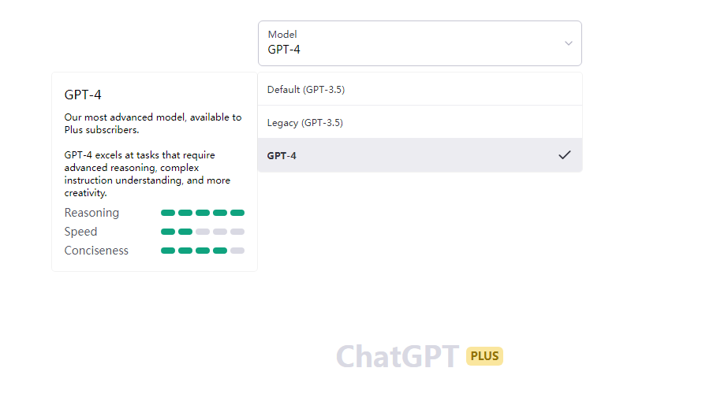

根据OpenAI官网发布的《GPT-4 Technical Report》可知

1. gpt-4 has a context length of 8,192 tokens. We are also providing limited access to our 32,768–context (about 50 pages of text，约25000个字) version
2. GPT-4经过预训练之后，再通过RLHF的方法微调(具体怎么微调，下文第三部分详述)

   “GPT-4 is a Transformer-style model pre-trained to predict the next token in a document, using both publicly available data (such as internet data) and data licensed from third-party providers. The model was then fine-tuned using Reinforcement Learning from Human Feedback (RLHF)”

   RLHF的作用在于

   对于某些特定任务，The GPT-4 base model is only slightly better at this task than GPT-3.5; however, after RLHF post-training we observe large improvements over GPT-3.5

   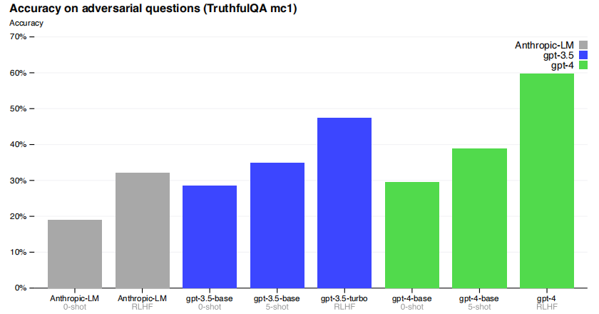
3. RLHF之外，为了进一步让模型输出安全的回答，过程中还提出了基于规则的奖励模型RBRMs(rule-based reward models)，奖励规则由人编写

   RBRMs相当于是零样本下GPT-4的决策依据或者分类器
   
   这些分类器在RLHF微调期间为GPT-4策略模型提供了额外的奖励信号，以生成正确回答为目标，从而拒绝生成有害内容，说白了，额外增加RBRMs就是为了让模型的输出更安全(且合理拒答的同时避免误杀，比如下面第二个图所示的例子：寻找cigarettes)

   

   
4. 经过测试，GPT4在遵循人类指令上表现的更好(同样指令下，输出更符合人类预期的回答)，且在常识性推理、解题等多项任务上的表现均超过GPT3和对应的SOTA
5. 具备了多模态的能力，可以接受图片形式的输入(图片输入接口暂未开放)，并按指令读图

   

此外，通过GPT4的技术报告第60页可知，其训练方式和基于GPT3的instructGPT或基于GPT3.5的ChatGPT初版的训练方式如出一辙

> 先收集数据
>
> - 一部分是人工标注问题-答案对：We collect **demonstration data** (given an input, demonstrating how the model should respond)
> - 一部分是基于人类偏好对模型输出的多个答案进行排序的数据：***ranking data*** on outputs from our models (given an input and several outputs, rank the outputs from best to worst) from human trainers
>
> 接下来三个步骤(具体下文第三部分详述)
>
> 1. 通过人工标注的数据(问题-答案对)监督微调GPT4
>    We use the demonstration data to finetune GPT-4 using supervised learning (SFT) to imitate the behavior in the demonstrations.
> 2. 通过对模型多个回答进行人工排序的数据训练一个奖励模型，这个奖励模型相当于是模型输出好坏的裁判
>    We use the ranking data to train a reward model (RM), which predicts the average labeler’s preference for a given output
> 3. 通过最大化奖励函数的目标下，通过PPO算法继续微调GPT4模型
>    and use this signal as a reward to fine-tune the GPT-4 SFT model using reinforcement learning (specifically, the PPO algorithm)

至于GPT4背后多模态的能力起源与发展历史，请参见：[AI绘画能力的起源：通俗理解VAE、扩散模型DDPM、DETR、ViT/Swin transformer](https://blog.csdn.net/v_JULY_v/article/details/130361959)，而下篇《AIGC下的CV多模态原理解析：从CLIP/BLIP到stable diffusion/Midjourney、GPT4》待6月中旬发布

# 第三部分 InstructGPT/ChatGPT训练三阶段及多轮对话能力

## 3.1 基于GPT3的InstructGPT训练三阶段

### 3.1.0 ChatGPT初版的前身之InstructGPT：基于RLHF手段微调的GPT

根据InstructGPT的原始论文可知，InstructGPT的训练分为三个阶段（有监督微调“经过无监督预训练好的GPT3”、然后基于人类偏好排序的数据训练一个奖励模型、最终在最大化奖励的目标下通过PPO算法来优化策略）：
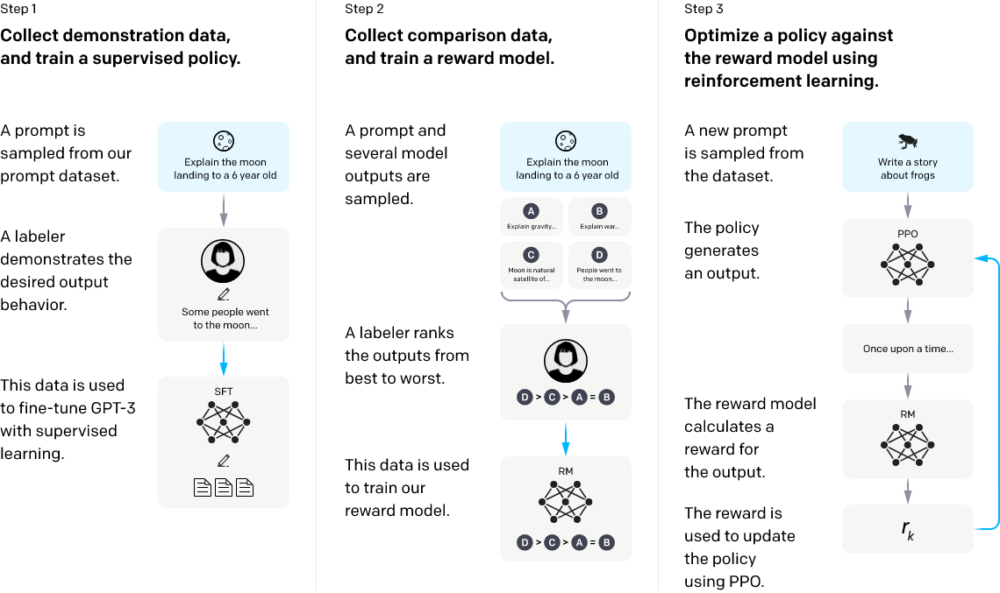

1. **阶段1：利用人类的问答数据去对GPT3进行有监督训练出SFT模型(作为baseline)**

   首先，OpenAI是先设计了一个prompt dataset，里面有大量的提示样本，给出了各种各样的任务描述，其次，找了一个团队对这个prompt dataset进行标注(本质就是人工回答问题)
   
   最后，用这个来自OpenAI API和labeler-written的13k大小的标注好的数据集(问题-答案对)比如$`<x_1, y_1>,<x_2, y_2>,<x_3, y_3>\cdots<x_n, y_n>`$，微调GPT3(trained for 16 epochs, 使用余弦学习率衰减, and residual dropout of 0.2)，这个微调好的GPT3我们称之为SFT模型(SFT的全称Supervised fine-tuning，监督微调之意)，它作为baseline具备了最基本的预测能力(该基线模型的大小为**175B**)
   
   $\longrightarrow$说白了，让人类就一些问题写出人工答案，再把这些问题和答案丢给模型学习，这便是有监督训练，但人类不可能针对所有问题都写出答案给到模型(如果人类能把所有问题都标注/回答了，那还要模型干嘛，^_^)

   $\longrightarrow$所以我们需要让模型学到人类的喜爱偏好(训练出一个RM模型代替人类当裁判，避免让实验人员守在电脑前对模型吐出来的结果不停地打分)

   $\longrightarrow$继而在遵循这种喜爱偏好下生成人类期待的答案，想达到这个效果就是得让模型明确什么是更好的输出，怎么明确？通过奖惩!
2. **阶段2：通过RLHF的思路训练一个奖励模型RM**

   首先通过『移除了最后一层unembedding layer的上一阶段的SFT模型』初始化出我们的RM模型，考虑到175B计算量大且不稳定不适合作为奖励函数，故最后大小缩减到**6B**

   然后回答来自OpenAI API和labeler-written且规模大小为33k的数据集的一些问题比如$`x_{n+1}`$，接着针对每个问题收集4个不同的输出从而获取4个回答$`(y_{n+1}^{1},y_{n+1}^{2},y_{n+1}^{3},y_{n+1}^{4})`$

   可能有的读者会疑问为何有多个输出，原因在于模型每次预测一个词都有对应的概率，根据不同的概率大小可以采样出很多答案，比如通过beam search保留k个当前最优的答案(beam search相当于贪心算法的加强版，除了最好的答案外，还会保留多个比较好的答案供选择)

   接着人工对这4个回答的好坏进行标注且排序，排序的结果用来训练一个奖励模型RM，具体做法就是学习排序结果从而理解人类的偏好『顺带提一嘴，如论文第12页中所述：“We ran anexperiment where we split our labelers into 5 groups, and train 5 RMs (with 3 different seeds) using5-fold cross validation (training on 4 of the groups, and evaluating on the held-out group)”，你可以通过不同的数据组训练好几个RM，最终选择一个最优的』

   但通过人来标注/排序的结果训练出奖励模型之后怎么用呢，这就是训练阶段3要做的事情
3. **阶段3：通过训练好的RM模型预测结果且通过PPO算法优化模型策略**

   **首先**，让第一阶段微调好的SFT模型初始化出一个PPO模型
   通过instructGPT论文第56页得知，experimented with a few variants of the SFT models as the PPO’s init model，即PPO模型有多个大小的版本，比如**1.3B 6B 175B**(可理解为带着RL且初始版本为SFT的模型)

   **然后**，去回答仅来自OpenAI API不带人类任何标注的且规模大小为**31k**的一些问题比如$`x_{n+2}`$
   此时不再让人工评估好坏，而是让阶段2训练好的奖励模型RM去给PPO模型的预测结果比如$`(y_{n+2}^{1},y_{n+2}^{2},y_{n+2}^{3},y_{n+2}^{4})`$进行打分进而排序(看是否优质，比如是否迎合人类偏好)

   **之后**，通过不断更大化奖励而优化PPO模型的生成策略(因为生成策略更好，模型的回答便会更好)，策略优化的过程中使用PPO算法限制策略更新范围

   **最后**，根据优化后的策略再次生成$`\longrightarrow`$RM再评估$`\longrightarrow`$模型再优化后再生成，如此循环进行，直到策略最优为止
   最终效果还不错，哪怕是1.3B的PPO模型的效果也要比175B的SFT、175B的GPT3的效果都要更好
   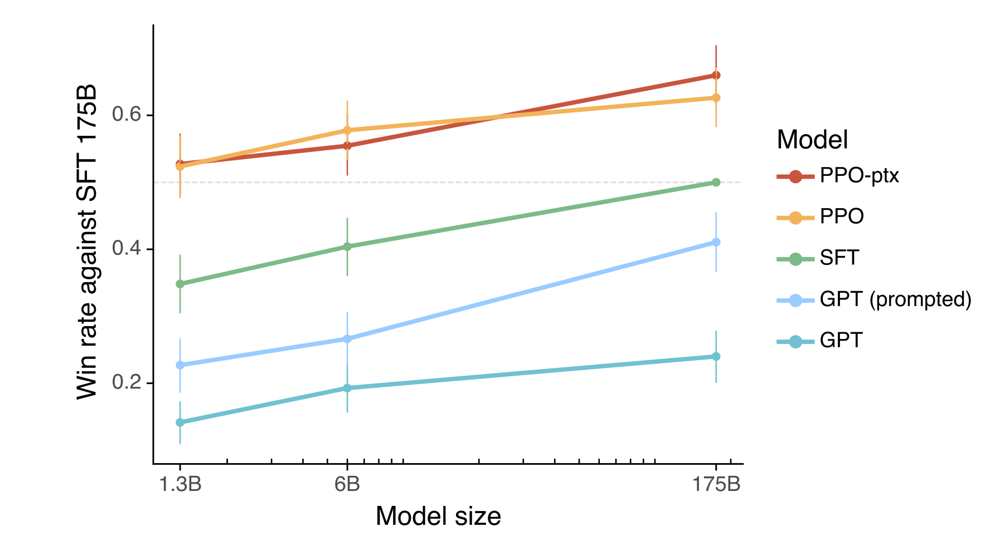
   当然 这三步下来，比如第一轮迭代出一个相对最优的策略后，后面某个时间段 比如第二轮是可以再次通过新一批人类排序的数据训练一个新的RM，然后再迭代出一个当下最优的策略

   此外，如instructGPT论文第17页所述，这三步下来所花费的代价相比预训练GPT3要小很多：The costof collecting our data and the compute for training runs, including experimental runsis a fraction of what was spent to train GPT-3: training our 175B SFT model requires 4.9 petaflops/s-days and training our 175B PPO-ptx model requires 60 petaflops/s-days,compared to 3,640 petaflops/s-days for GPT-3 (Brown et al., 2020)，且如论文第40页所说，所有模型都是用的Adam优化器训练，β1=0.9和β2=0.95

另 值得一提的是，上文反复提到策略，那怎么理解这个经常在RL中出现的“策略”呢，举几个例子

- 类似于一个人做事如果有好的策略或方法论，他便能有更好的行为或效率，从而把事情做更好
- 再比如一家公司如果有好的经营策略，这家公司便能有更好的经营结果，从而取得更好的业绩
- 对于模型也是一样的，如果它有更好的生成策略，它便能给人类提供更好的回答

此外，可能有读者疑问，InstructGPT使用RLHF的思路，只是为了训练出一个奖励函数么？事实上，还有额外多方面的用途

1. 一方面是为了让GPT的输出与对用户的友好度上尽可能地对齐（Alignment），即微调出一个用户友好型GPT
   以往的GPT训练，都是基于大量无标注的语料，这些语料通常收集自充斥大量“行话”、“黑话”的互联网中，这样训练出来的语言模型，它可能会有虚假的、恶意的或者有负面情绪等问题的输出
2. 二方面，为了更好的理解人类的意图

因此，通过人工干预微调GPT，使其输出对用户友好(避免乱说话)，且更好的和人类对话，所以，对InstructGPT的简单理解，可以是*基于人类偏好的深度强化学习*(RLHF)手段微调的GPT。

接下来，我们分别具体阐述上面的阶段1、阶段2、阶段3。

### 3.1.1 InstructGPT训练阶段1：针对预训练后的GPT3进行监督微调

阶段1的本质就是使用监督学习方法对GPT-3模型进行微调(回归到预训练-微调模式)，具体使用labeler demonstrations作为训练数据，具体微调过程中


1. 进行了16个周期(epochs)的训练

   一个周期指的是在整个训练数据集上进行一次完整的前向和反向传播
2. 采用了余弦学习率衰减策略

   这是一种调整学习率的方法(学习率是一个调整模型权重更新速度的超参数)，使其在训练过程中逐渐减小，有助于模型在后期训练中更好地收敛
3. 残差丢弃率(residual dropout)为0.2

   这是一种正则化技术，有助于防止模型过拟合，在训练过程中，丢弃率决定了神经元被随机关闭的概率

### 3.1.2 InstructGPT训练阶段2：如何对多个输出排序及如何训练RM模型

训练RM的核心是由人类对SFT生成的多个输出(基于同一个输入)进行排序，再用来训练RM。按照模仿学习的定义，直观上的理解可以是，RM在模仿人类对回答语句的排序思路。

为了更具体的说明，我们代入一个场景，假设你向一个六岁小孩解释什么是登陆月球或什么是RL，如下图

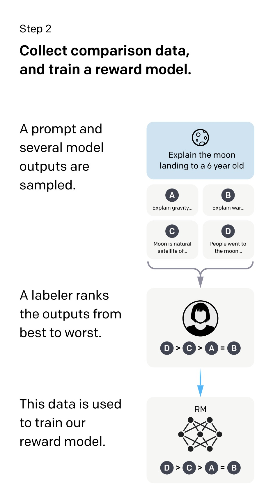

1. SFT生成了*A、B、C、D*四个回答语句，然后人类对照着Prompt输入(即提问)来对4个回答的好坏做出合适的排序，如$`D>C>A=B`$
2. 为了让RM学到人类偏好（即排序），可以4个语句两两组合分别计算loss再相加取均值，即分别计算计算$`C_4^2`$个即6个loss，具体的loss形式如下图：
```math
   \begin{aligned}loss(\theta)=-\frac{1}{\binom{K}{2}}E_{(x,y_{w},y_{l})\sim D}[\log(\sigma(r_{\theta}(x,y_{w})- r_\theta(x,y_l)))]\end{aligned}
```

针对这个损失函数需要逐一说明的是

1. 这是一个常见的排序模型，$`r_\theta(x,y)`$是RM模型，其中
   $`\to x`$是提示Prompt输入，实际训练中，使用的批量大小(batch size)为 64，表示每个批次中独立提示(prompts)的数量
   $`\to y`$是SFT的预测输出(比如$`y_w/y_l`$)，相当于针对每个prompt 随机生成$`K`$个输出($`4\leq K\leq9`$)，然后针对$`K`$个输出做$`\binom{K}{2}`$次比较，比如4个输出有6次比较，9个输出有36次比较
   $`D`$是人类比较的数据集

   有一点要提下的是，RLHF中的rank就好比监督学习中的弱标注——它并不提供直接的监督信号。但通过学习简单的排序，RM可以学到人类的偏好
   为何是排序，而非直接打分呢，道理很简单，排序相比打分更容易接近客观事实，即不同的标注员，打分的偏好会有很大的差异（比如同样一段精彩的文本，有人认为可以打1.0，但有人认为只能打0.8），而这种差异就会导致出现大量的噪声样本，若改成排序，则不同标注员的排序一致性相比打分一致性就大大提升了
2. 首先把你的问题$`x`$和答案$`y_w`$放进奖励函数$`r_\theta`$中，再把问题$`x`$和$`y_l`$也放进奖励函数$`r_\theta`$中，然后分别输出，假定$`y_w`$是语句组合对中相对$`y_l`$排序更高的，所以两者一减『这里面使用的是排序损失函数(即Pairwise ranking loss)，奖励的差异表示一种应答比另一种应答更受人类标注者青睐的对数概率』，我们希望相减的结果越大越好
3. 最后通过Logitech函数变成一个loss函数，而因为loss函数最前面加了一个负号，相当于最大化上面第2点最后相减的结果果$`r_\theta(x, y_w)-r_\theta(x, y_l)`$等于是最小化这个loss函数

值得一提的是，通过在训练集上进行了一个周期(epoch)的训练，选择了学习率(lr)为 9e-6，且采用余弦学习率调度策略，在训练结束时，学习率降低至初始值的10%。

最终，通过这种形式的梯度回传，RM逐渐学会了给D这类语句以高排名甚至打出一个高分，给A、B以低排名甚至打出一个低分，从而模仿到了人类偏好。到了这一步，不妨可以这么简单理解RLHF：所谓的*基于人类偏好的深度强化学习*，某种意义上来说，就是由人类的偏好来充当reward


### 3.1.3 InstructGPT训练阶段3：如何通过PPO算法进一步优化模型的策略

简而言之，阶段3可以用下图形象化表示


具体而言，instructGPT原始论文中的目标函数如下所示

```math
\begin{aligned}
\mathrm{objective}\left(\phi\right)= E_{(x,y)\sim D_{\pi_\phi^{RL}}}\left[r_{\theta}(x,y)-\beta\log\left(\pi_{\phi}^{\mathrm{RL}}(y\mid x)/\pi^{\mathrm{SFT}}(y\mid x)\right)\right]+  \gamma E_{x\sim D_{\mathrm{pretain}}}\left[\log(\pi_{\phi}^{\mathrm{RL}}(x))\right]
\end{aligned}
```

InstructGPT这篇论文吧，对大家实在是太友好了，友好到全篇论文就只给了两个公式(奖励函数的损失函数以及上面这个目标函数)，关键这两个公式都还只是简写，针对$`\phi`$这个目标函数在和交大张老师及七月在线赵、倪等老师核对之后，发现实际中真正要算的时候，需要先如下展开下(马上还有二次展开)

```math
\begin{aligned} objective(\phi ) &= E_{(x,y)\sim D_{\pi _{\phi }^{RL}}} [r_\theta (x,y) - \beta log(\pi _{\phi }^{RL}(y|x) / \pi ^{SFT}(y|x) )] + \gamma E_{x\sim D_{pretrain}} [log(\pi _{\phi }^{RL})] \\&= E_{(x,y)\sim D_{\pi _{ }^{RL'}}} \left [ \frac{\pi _{\phi }^{RL}(y|x)}{\pi ^{RL'}(y|x)}r_{\theta'} (x,y) - \beta log(\pi^{RL'}(y|x) / \pi ^{SFT}(y|x) ) \right ]+ \gamma E_{x\sim D_{pretrain}} [log(\pi _{\phi }^{RL})] \end{aligned}
```

$`\pi ^{SFT}`$是基线策略，$`\pi ^{RL ^{\prime}}`$是『新策略$`\pi _{\phi }^{RL}`$』更新之前的旧策略，为何呢？考虑到大部分文章在分析上面的目标函数时基本都是人云亦云、一带而过，故再逐一拆解下这个被一次展开后的目标函数，分为三个部分

1. <font color="red">第一部分</font>是$`r_{\theta '}(x,y)`$，相当于阶段2中根据人类偏好学习出来的RM模型「所以你便会看到这里的$`objective(\phi)`$中只有一个$`r_{\theta '}(x,y)`$，而不是再通过比较排序再训练$`r_{\theta '}(x,y)`$，毕竟这里的RM是已经通过上阶段比较排序而训练好的RM」，从而基于“最大化奖励”这个目标下不断优化PPO模型的策略$`\pi ^{RL'}`$(如上文所述，PPO模型一开始是被SFT模型初始化而来的)
2. <font color="red">第二部分</font>则是用KL散度对比RL在最大化RM的目标下学到的策略$`\pi ^{RL'}`$和基线策略$`\pi ^{SFT}`$的差距，一开始时，$`\pi ^{RL'}`$的初始化值就是$`\pi ^{SFT}`$，最终希望$`\pi ^{RL'}`$最终迭代结束后，它俩之间的差距不至于太大

   怎么避免它两相差太多呢？可以类似PPO算法那样，通过KL散度衡量两个策略的概率分布之间的差距，从而使得咱们_在优化策略时限制参数更新的范围_)
```math
   \begin{aligned}J_{\mathrm{PPO}}^{\theta'}(\theta)=\mathbb{E}_{(s_t,a_t)\sim\pi_{\theta'}}\left[\frac{p_\theta\left(a_t\mid s_t\right)}{p_{\theta'}\left(a_t\mid s_t\right)}A^{\theta'}\left(s_t,a_t\right)\right] \beta\mathrm{KL}\left(\theta,\theta^{\prime}\right)\end{aligned}
```

   好，接下来，重点来了，对于这前两部分，若简言之，$`\pi_{\phi}^{RL}/\mathcal{\pi}^{RL'}`$与PPO算法表达式中的$`\theta /\theta '`$一一对应，比如与环境交互的$`\theta '`$等同于旧策略$`\pi ^{RL'}`$，但具体而言，则有以下4点

   **①**已经掌握人类偏好的RM模型一旦判定现有回答的不够好，便得更新$`\pi_{\phi}^{RL}`$，但如果$`\pi_{\phi}^{RL}`$一旦变化，会导致后续$`\bar{R}_{\theta}=\mathbb{E}_{\tau \sim p_{\theta}(\tau)}\left[R(\tau) \nabla \log p_{\theta}(\tau)\right]`$计算一系列问答评分时中的$`p_\theta (\tau )`$发生变化(策略一变轨迹必变)，进而已采样的问答数据$`(x_{n+2},\left \{ y_{n+2}^{1},y_{n+2}^{2},y_{n+2}^{3},y_{n+2}^{4} \right \})(x_{n+3},\cdots )(x_{n+4},\cdots )(x_{n+5},\cdots )`$便没法继续使用，而只能不断采样一批批新的问答数据(更新一次$`\pi_{\phi}^{RL}`$后，得采样新一批数据；再更新一次$`\pi_{\phi}^{RL}`$后，再采样新一批数据..)

   **②**为避免$`\pi_{\phi}^{RL}`$只要一更新便只能一次次去采样一批批新问答数据
   说白了，为了提高数据利用率，我们改让$`\pi ^{RL'}`$去和环境交互『$`\pi ^{RL'}`$也被$`\pi^{SFT}`$初始化，且基于重要性采样的原则 增加重要性权重』
   然后通过最大化奖励而不断迭代$`\pi ^{RL'}`$(相当于在策略$`\pi ^{RL'}`$下模型回答的好不好始终由RM模型评判)，迭代过程中可一定程度的重复使用旧策略$`\pi ^{RL'}`$生成的已有数据反复验证(注意这里的用词：一定程度的重复使用，就像蓄水池一样，提高水资源的利用率，但会适时更新)

   ---

   考虑到有些读者对这一块 还是有些疑惑，故再补充说明下

   a) 首先，使用旧策略$`\pi ^{RL'}`$生成一批数据，包括状态、动作和奖励等信息，这些数据可以类似**Deep Q Network**那样，存储在一个经验回放缓冲区(Experience Replay Buffer)中

   b) 其次，在训练新策略$`\pi _{\phi }^{RL}`$时，从经验回放缓冲区中随机抽取一批数据

   c) 对于旧策略$`\pi ^{RL'}`$采样到的每个数据样本$`(x, y)`$，计算重要性采样权重$`w(x, y)`$
```math
w(x,y) = \frac{\pi _{\phi }^{RL}(y|x)}{\pi ^{RL'}(y|x)}
```

   d) 使用这些加权样本来更新新策略，具体来说，将原始目标函数中的期望部分替换为加权样本的期望：
```math
objective(\phi) = E_{(x, y) \sim D_{\pi^{RL'}}}[w(x, y) * r_{\theta'}(x, y)]
```

   e) 按照更新后的目标函数进行梯度计算和参数更新
   f) 在训练过程中，可以多次重复使用经验回放缓冲区中的数据进行训练(这里的多次可以理解为有限次数)。但是，需要注意的是，随着策略更新，新旧策略之间的差异可能会变大，这时重要性采样权重可能变得不稳定，从而影响训练的稳定性
   为了解决这个问题(**注意**，下面这几段对于很多人想了很久，也不一定能立马意识到的)

   <u>可以适时更新一批新数据</u>，比如

   $`\rightarrow`$ 前几轮通过旧策略$`\pi(RL')`$采样的数据放在经验缓冲区里，把新策略$`\pi(RL)`$多次迭代更新出$`\pi(RL2)`$、$`\pi(RL3)`$，这个过程中重要性采样的比值为$`\pi(RL2)或$`\pi(RL3)比上$`\pi(RL')`$

   $`\rightarrow`$ 再之后通过$`\pi(RL3)`$采样一批新数据再次放在经验缓冲区里，从而继续迭代$`\pi(RL3)`$更新出$`\pi(RL4)`$、$`\pi(RL5)`$，这个过程中重要性采样的比值为$`\pi(RL4)`$或$`\pi(RL5)`$比上$`\pi(RL3)`$，以此类推..

   <u>还可以使用一些方法限制策略更新的幅度</u>，例如PPO中的截断重要性采样比率(具体参见本文第一部分提到的RL极简入门一文)
```math
\begin{aligned} J_{\mathrm{PPO2}}^{\theta'}(\theta) \approx \sum_{\left(s_{t}, a_{t}\right)} \min &\left(\frac{p_{\theta}\left(a_{t} | s_{t}\right)}{p_{\theta'}\left(a_{t} | s_{t}\right)} A^{\theta'}\left(s_{t}, a_{t}\right),{clip}\left(\frac{p_{\theta}\left(a_{t} | s_{t}\right)}{p_{\theta'}\left(a_{t} | s_{t}\right)}, 1-\varepsilon, 1+\varepsilon\right) A^{\theta'}\left(s_{t}, a_{t}\right)\right) \end{aligned}
```

   相当于为了对重要性比值做约束，故**在$`r_{\theta'}(x,y)`$的部分里得加个截断处理**(*说白了，重要性比值 根据截断去约束，当然你也可以改成 根据一个KL散度去约束，毕竟截断和KL散度约束都是实现PPO算法本身的方式，遗憾的是原论文中的目标函数$`objective(\phi)`$对于这点也未展开体现出来，算是简洁的不能再简洁了，所以你得再仔细体会下上面这几段*)，如下所示
```math
\begin{aligned} objective(\phi ) &= E_{(x,y)\sim D_{\pi _{\phi }^{RL}}} [r_\theta (x,y) - \beta log(\pi _{\phi }^{RL}(y|x) / \pi ^{SFT}(y|x) )] + \gamma E_{x\sim D_{pretrain}} [log(\pi _{\phi }^{RL})] \\&= E_{(x,y)\sim D_{\pi _{ }^{RL'}}} [\frac{\pi _{\phi }^{RL}(y|x)}{\pi ^{RL'}(y|x)}r_{\theta'}(x,y) - \beta log(\pi^{RL'}(y|x) / \pi ^{SFT}(y|x) )] + \gamma E_{x\sim D_{pretrain}} [log(\pi _{\phi }^{RL})] \\&= E_{(x,y)\sim D_{\pi _{ }^{RL'}}} \left [ \min \left(\frac{\pi_{\phi }^{RL}(y|x)}{\pi ^{RL'}(y|x)} A^{\theta^{RL'}}\left(x,y\right),{clip}\left(\frac{\pi_{\phi }^{RL}(y|x)}{\pi ^{RL'}(y|x)}, 1-\varepsilon, 1+\varepsilon\right) A^{\theta^{RL'}}\left(x,y\right)\right) - \beta log(\pi^{RL'}(y|x) / \pi ^{SFT}(y|x) ) \right ]+ \gamma E_{x\sim D_{pretrain}} [log(\pi _{\phi }^{RL})] \end{aligned}
```

   且慢，上述公式第二行基于当前(旧)策略的RM最大化，故$`r(x,y)`$的参数是$`\theta ^{\prime}`$而非$`\theta`$ 能理解，然后拆开成第三行，大中括号里前面的部分也好理解：限制更新前后两个新旧策略的比值大小(相当于限制新策略的更新范围)，但大中括号里后面的部分中再加个$`\beta`$惩罚项是何意？下文马上具体阐述

   ---

   **③**迭代中我们追求整个目标函数$`objective(\phi)`$最大化，自然实时优化中的当前(旧)策略『$`\pi(RL')`$』与基线策略$`\pi(SFT)`$的差距，即KL散度约束的$`\beta log(\pi^{RL'}(y|x)/\pi ^{SFT}(y|x))`$最小『这也是 $`objective(\phi)`$中唯一的KL散度约束，而KL散度越小代表两个策略之间的差距越小』
```math
\begin{aligned} objective(\phi ) &= E_{(x,y)\sim D_{\pi _{\phi }^{RL}}} [r_\theta (x,y) - \beta log(\pi _{\phi }^{RL}(y|x) / \pi ^{SFT}(y|x) )] + \gamma E_{x\sim D_{pretrain}} [log(\pi _{\phi }^{RL})] \\&= E_{(x,y)\sim D_{\pi _{ }^{RL'}}} \left [ \frac{\pi _{\phi }^{RL}(y|x)}{\pi ^{RL'}(y|x)}r_{\theta'}(x,y) - \beta log(\pi^{RL'}(y|x) / \pi ^{SFT}(y|x) ) \right ] + \gamma E_{x\sim D_{pretrain}} [log(\pi _{\phi }^{RL})] \\&= E_{(x,y)\sim D_{\pi _{ }^{RL'}}} \left [ \min \left(\frac{\pi_{\phi }^{RL}(y|x)}{\pi ^{RL'}(y|x)} r_{\theta'}(x,y),{clip}\left(\frac{\pi_{\phi }^{RL}(y|x)}{\pi ^{RL'}(y|x)}, 1-\varepsilon, 1+\varepsilon\right) r_{\theta'}(x,y)\right) - \beta log(\pi^{RL'}(y|x) / \pi ^{SFT}(y|x) ) \right ]+ \gamma E_{x\sim D_{pretrain}} [log(\pi _{\phi }^{RL})]\\&= E_{(x,y)\sim D_{\pi _{ }^{RL'}}} \left [ \min \left(\frac{\pi_{\phi }^{RL}(y|x)}{\pi ^{RL'}(y|x)} A^{\theta^{RL'}}\left(x,y\right),{clip}\left(\frac{\pi_{\phi }^{RL}(y|x)}{\pi ^{RL'}(y|x)}, 1-\varepsilon, 1+\varepsilon\right) A^{\theta^{RL'}}\left(x,y\right)\right) \right ]+ \gamma E_{x\sim D_{pretrain}} [log(\pi _{\phi }^{RL})] \end{aligned}
```

   再解释下这个目标函数，总共4行

   首先，第二行大中括号里后面的部分 再加个$`\beta`$惩罚项的用意是什么呢？instructGPT原始论文中是这么说的，“**In addition, we add a per-token KL penalty from the SFT model at each token to mitigate overoptimization of the reward model**”
   言外之意，由于在当前(旧)策略下的生成/预测结果由裁判RM评判(别忘了 当前策略优化的目的就是为了让RM最大化)，而凡事没有绝对，所以对优化策略的过程中加了一个惩罚项，防止一切RM说了算进而过于绝对变成独裁，相当于避免不断优化的当前策略与基线策略偏离太远

   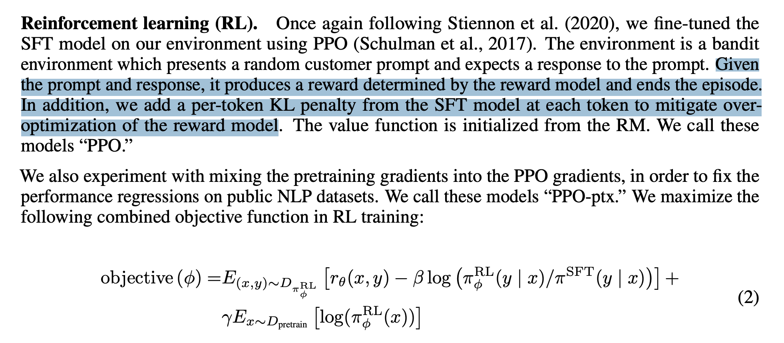

   其次，实际代码实现时，把后面的惩罚项融入进了优势函数$`A^{\theta^{RL'}}\left(x,y\right)`$中，即(至于为何是近似，因为还有一些表达项没体现出来 需要进一步展开，其具体展开可以看下下面马上要提到的微软DeepSpeed Chat的实现)
```math
\mathrm{A}(\mathrm{x}, \mathrm{y}) \approx \mathrm{r}(\mathrm{x}, \mathrm{y})-\beta \log \left[\frac{\pi^{\mathrm{RL'}}(\mathrm{y} \mid \mathrm{x})}{\pi^{\mathrm{SFT}}(\mathrm{y} \mid \mathrm{x})}\right]
```

   而如果忘了KL散度公式的具体表达或者忘了怎么推导而来的，可以看下[RL极简入门](https://blog.csdn.net/v_JULY_v/article/details/128965854)关于TRPO的部分
```math
\begin{aligned} D_{KL}(p||q) &= H(p,q) - H(p) \\&= -\sum p(x)logq(x) + \sum p(x)logp(x) \\&= -\sum p(x)log\frac{q(x)}{p(x)} \\&= \sum p(x)log\frac{p(x)}{q(x)} \end{aligned}
```

   **④**直到$`\pi^{RL'}`$迭代出最优策略
3. <font color="red">第三部分</font>是加在最后边的偏置项，其中， $`D_{pretrain}`$是GPT3的预训练数据分布，预训练损失系数$`\gamma`$控制预训练梯度的强度，且$`\gamma`$设置为0则称为PPO模型，否则称为PPO-ptx模型

   之所以加最后的这个偏置项，是防止ChatGPT在训练过程中过度优化，从而避免过于放飞自我，通过某种刁钻的方式取悦人类，而不是老老实实地根据人类的问题给出正确答案
   通俗点说，以保持GPT3原有的核心性能，防止各种训练之后，忘了最早是从哪里出发的(不忘来时路：GPT3$`\rightarrow`$SFT$`\rightarrow`$RM$`\rightarrow`$RLHF)

   更多可以看下一些类ChatGPT项目的代码实现(比如本ChatGPT系列的此文：[类ChatGPT逐行代码解读(2/2)：从零实现ChatLLaMA、ColossalChat、DeepSpeed Chat](https://blog.csdn.net/v_JULY_v/article/details/129996493))，比如ColossalChat和微软DeepSpeed Chat的实现
   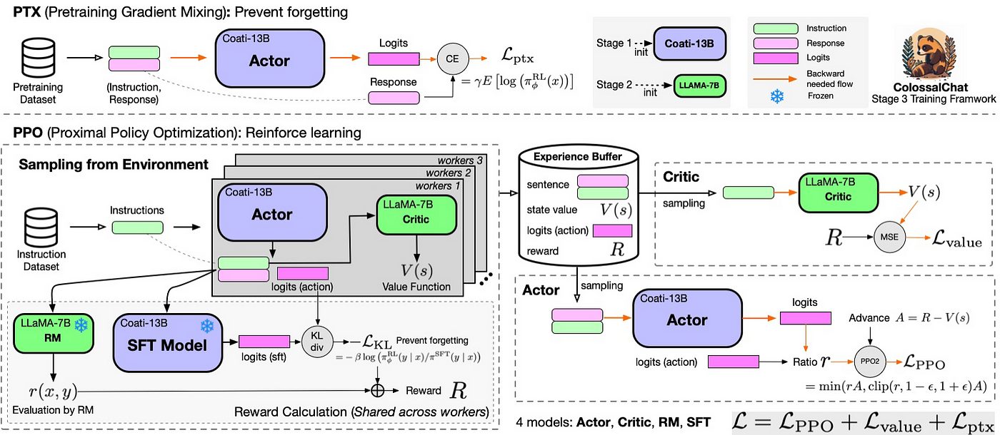

## 3.2 InstructGPT如何更好的构建多轮对话能力

这里我们先从自然语言任务中最基本的语言模型简单说起。一个语言模型大概是说，当你给定前面的若干个词后，它会给你下一个词；而当你有了下一个词后，它会再给你接一个词，以此递推

1. 实际上，我们向ChatGPT提出的问题，可以看成是下图的输入$`X`$，然后我们可以将ChatGPT给出的回答抽象成下图的输出$`Y`$
2. 而ChatGPT这类语言模型，提供了若干个类似手机输入法的“候选句”，每个候选句对应的概率不一
3. 所谓的语言模型的训练，其实就是让模型调整候选句对应的概率，使得输出的候选句的概率尽可能大

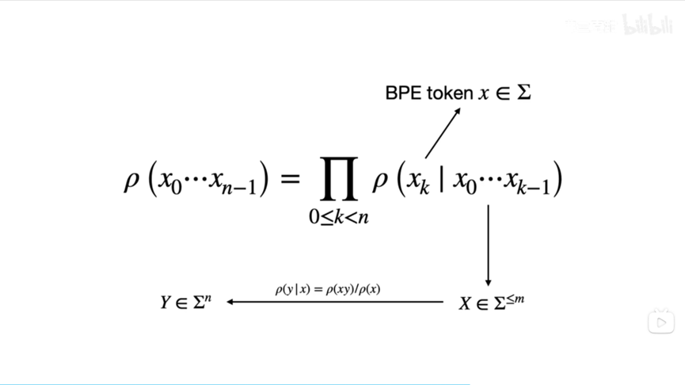

对应到强化学习的框架中，环境从某种意义上说被直接被奖励模型RM取代了，如下图

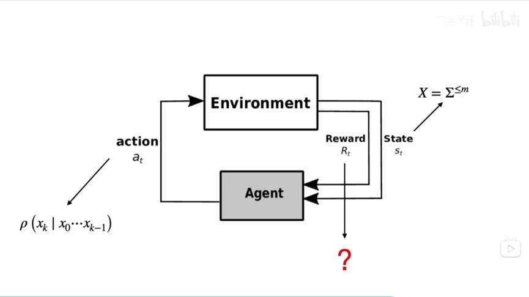

1. 图中的状态State即是输入语句$`X`$，Agent则是模型，当模型拿到一个$`X`$，它根据生成/回答策略执行的动作action即是预测下一个单词$`x_k`$(是个概率分布，可以选取概率最大的候选词)
2. 注意，ChatGPT需要输出一整句话$`Y`$，所以要完成最终的输出，需要做若干次action，即多次预测
   怎么做多次预测呢，当RM接收到模型给出的下一个单词的预测$`x_k`$后，会把这个单词$`x_k`$放到已有单词序列$`X`$的末尾，即$`\left \{ x_0\cdots x_{k-1} x_k \right \}`$，从而继续让模型预测下一个词$`x_{k+1}`$
3. 打个比方，这里的智能体就是手机输入法，而环境就是使用输入法的用户。用户所做的事情，就是当输入法给出一系列候选词后，**基于某种偏好选择某个词**，然后让手机输入法再去猜下一个词，直到输入法把整个句子猜出来为止

这里我们明白了在语言模型场景下强化学习的状态和动作对应什么，那么奖励Reward呢？由于上文已经分析过instructGPT的目标函数了，这里就不再赘述，直接上图(注，如果你发现与上文的符号没有完全对应，那是因为下图中的公式只是简写，没有展开)：

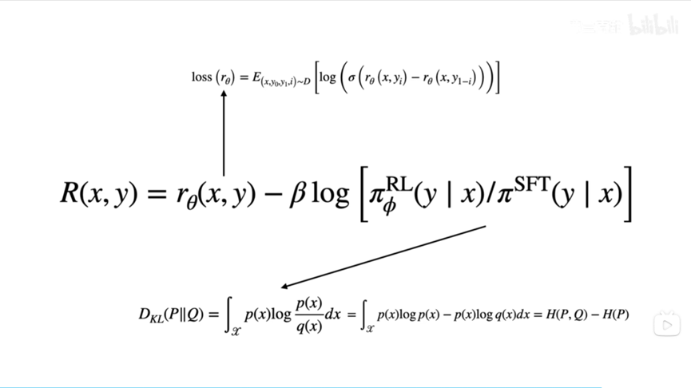

至此，还有一个细节问题，即奖励函数是对整个输入语句$`X`$和整个输出语句$`Y`$而言的，而我们又在之前讨论过，智能体是根据一个一个词来去拼凑出整个回答的。图中的奖赏函数只能给出完整回答的奖赏，那么在智能体生成回答的过程中，每个动作action给出的词$`x_k`$对应的奖赏是什么呢？

这个细节在InstructGPT的论文只浅浅提了一嘴：“**Given the prompt and response, it produces a reward determined by the reward model and ends the episode.**”。幸运的是，上文提到过的这篇论文《Learning from summarize from Human feedback》中的一个引脚标注给出了这个疑问的答案

> 论文里说，奖赏模型只在最终生成回答之后才给出奖赏，在中间的过程中是不给出奖赏的。在这里论文里没有使用回答一词，而是使用总结一词，因为它的任务是将一篇长文章进行归纳总结
>
> 
>
> 换言之，只有在ChatGPT输出了EOS token的时候，整个轨迹才结束（EOS token是NLP中用来表示一段话结束的标志）

如七月在线ChatGPT课学员春天所说，如果看下微软DeepSpeed Chat的代码实现之后，你会发现，1个对话只对应1个奖励，跟对话中的时间步t其实关系并不大，它只在对话的末位token给出1个具体奖励分值来，其余token位置的分值都是0，所以在计算优势值时，除了末位的token有分值外，其他时间步的分值都是0，而critic的价值估计是跟时间步t相关的，每1个token位置都有价值

总结上文，可得

1. 由于多轮对话要求语言模型有记忆性，因此无法直接使用RL，问题出在奖赏函数中：ChatGPT的奖励函数是针对GPT的一整个输入语句$`X`$和一整个输出语句$`Y`$而言的，而ChatGPT的语言模型在强化学习的训练策略中，每个action其实输出的是一个个词语
2. 因此，OpenAI的团队采取不对序列的中间生成给予reward的方式解决这个矛盾

考虑到多轮对话场景里，存在某一轮对话中的代词指向上一轮对话中的某个人或物的可能，为此，ChatGPT多轮对话的核心关键是

1. “基于Transformer的生成式模型”GPT3/GPT3.5足够强大
   在回答用户问题的过程中，每段对话都是一个个序列
   把之前的部分对话内容(对历史对话数据的规模做个限制，比如限制在8K大小，另 GPT4可以处理的上下文大小最高可达32k)都保存下来，和当前的输入一起作为输入给模型，这些信息被编码成一个向量作为模型的输入

   且得益于Transformer的自注意力机制，使得模型能够理解不同对话历史之间的依赖关系，并在生成回答时考虑到之前的对话历史
   此外，模型还使用位置编码来区分每个对话历史的位置，确保模型可以正确地捕捉到对话历史的顺序信息
2. 其次，为加强多轮对话能力，instructGPT/ChatGPT在训练的时候就引入了大量多轮对话的数据

---

# 第四部分 类ChatGPT开源项目的训练框架/代码实现/部署微调

虽说GPT3在2020年就出来了，但OpenAI并未开源，所以直到一年半后以后才有国内外各个团队比如DeepMind等陆续复现出来，这些大厂的复现代码我们自然无法窥知一二，毕竟人家也未开源出来

再到后来基于GPT3的InstructGPT、基于GPT3.5的ChatGPT初版(GPT3.5的参数规模也尚无准确定论)、GPT4均未开源，OpenAI不再open，好在Meta等公司或研究者开源出了一系列类ChatGPT项目，本部分针对其中部分做下简要推荐..

...

为避免本文篇幅再次过长，本第4部分余下的内容已抽取出去独立成文，请点击：

- 类ChatGPT的部署与微调：(上)[从LLaMA、Alpaca/Vicuna/BELLE、中文版](https://blog.csdn.net/v_JULY_v/article/details/129709105)、(下)[从ChatGLM、MOSS到ChatDoctor、可商用](https://blog.csdn.net/v_JULY_v/article/details/129880836)
- 类ChatGPT代码逐行解读：(1/2)[从零起步实现Transformer、llama/ChatGLM](https://blog.csdn.net/v_JULY_v/article/details/130090649)、(2/2)[从零实现TRL、ChatLLaMA、ColossalChat、DeepSpeed Chat](https://blog.csdn.net/v_JULY_v/article/details/129996493)

---

# 后记(含修改/优化/完善记录)

事实上，可能很多朋友也已经意识到，本文的前大部分内容里，GPT-N理解起来相对轻松(包括Transformer通过理解上篇BERT笔记不算特别复杂)，而instructGPT/ChatGPT的整体架构思想也不算复杂，但其中涉及到的RL部分则让想深挖细节的初学者变得立马吃力起来(除非你已“入一定门”，或者你有课程/老师可以不断问)，比如一个PPO算法，要真正把这个概念讲清楚、讲透彻且从零推到尾则没那么容易了。

以下是本文的部分修改/优化/完善记录

1. **开始第一大阶段的修改**
   1.22日，优化关于“instructGPT：如何基于RLHF运用到多轮对话场景”中的部分描述
   且为避免篇幅过长而影响完读率，权衡之下把扩展阅读下的SeqGAN相关内容删除
2. 1.27日，修改此部分内容：“instructGPT/ChatGPT：如何更好的构建多轮对话能力”，之前的阐述没在点子上
3. 2.9日，受正在编写的[微积分和概率统计笔记](https://blog.csdn.net/v_JULY_v/article/details/8308762)的启发：把公式、定理、概念、技术放在历史这个大背景下阐述会让读者理解更为深刻，故，在本文开头前沿里，新增ChatGPT各个前置技术的发展、迭代、结合，并依据这些前置技术的先后提出顺序重新编排全文结构
4. 2.10日，把第一部分中的大部分RL细节抽取出来放到新一篇笔记《[RL极简入门](https://blog.csdn.net/v_JULY_v/article/details/128965854)》里
5. 2.15日，针对本文开头所梳理的ChatGPT各项前置技术的推出时间从年份细化到月份，新增“RLHF”，及“低成本实现ChatGPT低配版训练过程的开源项目”
6. 2.16日，为更一目了然，进一步完善本文对自注意力机制的阐述
7. 2.17日，进一步完善本文对RLHF的阐述，比如新增对两篇RLHF相关论文的介绍
8. 2.21日，根据instructGPT原始论文，修正大量同类解读中针对“ChatGPT训练三步骤”也存在的不够精准的个别描述
9. 2.22日，新增关于“Prompt技术的升级与创新：指令微调技术(IFT)与思维链技术(CoT)”的部分
10. **进入第二大阶段的修改**
    2.25日，新增关于"GPT3到GPT3.5：从instructGPT到ChatGPT的迭代过程"的部分

    相比前几天有了质的提升
    之前哪怕修改十几次也都是1.x版本，今天的这个版本可以称之为2.0版本了，还会不断完善
11. 2.26日，修正instructGPT/ChatGPT训练三步骤中“$`\pi_{\phi}^{R L}/\pi^{SFT}`$与PPO算法表达式中$`\theta /\theta '`$的对应关系”
    且修正为：SFT就是基线模型 最后不用去更新它的策略$`\pi^{SFT}`$，更新的是论文中命名为PPO模型的策略$`\pi_{\phi}^{R L}`$
12. 2.28日，修正对one-shot和few-shot的描述，相当于one-shot相当于就一个样本/示例，few-shot就是少量样本/示例
    且在本文最后附上了“ChatGPT相关技术的100篇论文必读榜”
13. 3.1日，修正训练RM模型的描述中个别不够准确的措辞，比如通过人类的排序而非打分去训练奖励函数/模型
    且删除关于“近端策略优化裁剪PPO-clip”的介绍，毕竟详细的可以查看另一篇RL极简入门
14. 3.2日，考虑到本文一读者留言说，“第三部分的$`objective(\phi)`$，其中RL是需要更新的模型，而SFT是代替RL采样的不变的模型。那么为什么数学期望的下标的是RL，这不是意味着对正在更新的模型采样吗？如果是这样那PPO还有什么意义呢？”
    故为方便大家一目了然，已把该目标函数展开了下
15. 3.3日，在本文第二部分开头补充“NLP自发展以来先后经历的4种任务处理范式”
16. 3.7日，修正RLHF这一概念的最早提出时间，且补充关于beam search的介绍、完善关于“GPT的(无监督)预训练-(监督)微调模式”的描述
17. **进入第三大阶段的修改(根据论文精修)**
    3.8日，通过再次回顾GPT3的论文，补充关于为何GPT3不需要微调的原因，且修正个别不太精准的描述
18. 3.11日，根据Google的FLAN论文，修订关于指令微调的部分细节，以让行文更准确
19. 3.15日，新增一节“2.7 ChatGPT改进版：底层语言模型从GPT3.5升级到GPT4”的内容
    新增一小节“3.3.2 斯坦福Alpaca：人人都可微调Meta家70亿参数的LLaMA大模型”的内容
20. 3.16日，新增“Masked Self-Attention对屏蔽尾部词的实现方法”的描述
21. 3.17日，新增关于“GPT4的训练方式和基于GPT3的instructGPT或基于GPT3.5的ChatGPT初版的训练方式如出一辙”的描述
    修订对RLHF的精准定义：*基于人类偏好的深度强化学习*
22. 3.19日，把之前文末推荐的一些开源项目独立出来并完善为本文的“第四部分 关于类ChatGPT的部分开源项目”，并重点阐述Meta开源的LLaMA
23. 3.20，通过再次回顾instructGPT论文里的训练三阶段，给本文补充一些细节
24. 3.21，根据论文《SELF-INSTRUCT: Aligning Language Model with Self Generated Instructions》，修正“4.3 斯坦福Alpaca：人人都可微调Meta家70亿参数的LLaMA大模型”节中不准确的描述
25. 3.22，随着对一系列开源项目的研究深入，为避免本文篇幅再度过长，故把本文的第4部分 抽取出去独立成文：《类ChatGPT开源项目的部署与微调：从LLaMA到ChatGLM-6B》
26. 3.25，根据ChatGPT/GPT的最新技术发展，更新前言里的部分内容
27. 3.28，修正个别细节，比如根据instructGPT论文第56页可知，PPO模型初始化时曾experimented with a few variants of the SFT models as the PPO’s init model，即PPO模型有多个大小的版本，比如1.3B 6B 175B
28. **进入第四大阶段的修改(根据论文再修)**
    4.7，补充关于SFT与RM模型训练中的一些超参数的设置
29. 4.18，补充关于GPT1、GPT3的数据集的相关细节
30. 4.21，修正一个描述的笔误，即奖励模型的训练中，用的损失函数是rank loss，而非MSE loss
31. 4.27，依据RLHF部分中提到的论文“Fine-Tuning Language Models from Human Preferences”，增加关于instructGPT目标函数中 KL奖励系数$`\beta`$的具体设置方法，毕竟网上很少有文章介绍这点
32. 4.29，考虑到不少同学在我所讲的ChatGPT原理解析课里询问有关prompt learning的细节，故新增一节“2.4.2 关于prompt learning的进一步总结：到底如何理解prompt learning”
33. 5.5，针对本文下面部分读者的留言，新增一些小细节的描述，比如为何$`objective(\phi)$中不对$r_\theta (x,y)`$再进行比较排序训练了，原因是之前的阶段2 已经通过比较排序训练好了$`r_\theta (x,y)`$
    再比如新增对于“旧策略生成的数据 是具体怎么重复使用的”这一问题的解释说明，毕竟网上同类文章里 还没见过有哪篇如此细致的解释说明过
---
34. **进入第五大阶段的修改(结合上课反馈 + 类ChatGPT的开源代码实现)**

    5.7，因为讲ChatGPT原理课，故在再次完整回顾instructGPT论文之后，补充一些数据、训练代价等细节
35. 5.9，因ChatGPT原理课一学员“吹牛班的春天”的意见/建议，特修正「instructGPT训练阶段三」中个别不够准确的描述，至此本文开始从完善阶段超完美阶段进发(换言之，本次修改后使得本文正式突破85分，超100分迈进)
36. 5.13，根据上面5.9的补充意见，算是史无前例的二次展开了instructGPT论文中目标函数的表达式，以和相关描述完全对应起来
    当你持续复现instructGPT的话，你会发现细节很多，而只有当你想复现你才会去思考这些细节，从而造就本文或本系列才有的细致
37. 5.20，再次细化对instructGPT论文中目标函数的解释说明，比如$`objective(\phi)`$二次展开后，大中括号里后面的部分再加个$`\beta`$惩罚项是和用意呢？原因很简单：防止「实时优化当前(旧)策略的过程中 通过基于当前(旧)策略的RM最大化时，让当前(旧)策略离基线策略太偏

    总之，目标函数后面的$`\beta`$惩罚项和PPO算法已经无关了
    和PPO算法有关的 都在前面的$`r(x,y)$里，展开后可以通过KL散度去约束新策略相比旧策略的差距，也可以通过截断去约束新策略与旧策略的差距
    β惩罚项约束的是不断优化的当前(旧)策略与基线策略的差距，故这个时候的KL只是一个普普通通的KL
    这点 初看的时候 很容易混淆

    且通过借鉴「实现了instructGPT三阶段训练方式的微软DeepSpeed Chat」的代码实现，把这个带β的惩罚项融入进优势函数中
38. 5.28，为让逻辑更加清晰，更一目了然，再度优化此节“InstructGPT训练阶段3：如何通过PPO算法进一步优化模型的策略”的行文描述

为了写本笔记，过去两个月翻了大量中英文资料/paper(中间一度花了大量时间去深入RL)，大部分时间读的更多是中文资料，2月最后几天读的更多是英文paper，正是2月底这最后几天对ChatGPT背后技术原理的研究才真正进入状态(后还组建了一个“**ChatGPT之100篇论文阅读组**”，我和10来位博士、业界大佬从23年2.27日起上半年之内读完ChatGPT相关技术的100篇论文，榜单见[此文](https://blog.csdn.net/v_JULY_v/article/details/129508065))，当然 还在不断深入，由此而感慨：

- 读的论文越多，你会发现大部分人对ChatGPT的技术解读都是不够准确或全面的，毕竟很多人没有那个工作需要或研究需要，去深入了解各种细节
- 因为100天100篇这个任务，让自己有史以来一篇一篇一行一行读100篇，之前看的比较散 不系统 抠的也不细
  比如回顾“Attention is all you need”这篇后，对优化上一篇Transformer笔记便有了很多心得

总之，读的论文越多(论文之后 可以再抠代码实现/复现)，博客内相关笔记的质量将飞速提升 自己的技术研究能力也能有巨大飞跃

# 参考文献与推荐阅读

1. [Transformer通俗笔记：从Word2Vec、Seq2Seq逐步理解到GPT、BERT](https://blog.csdn.net/v_JULY_v/article/details/127411638)，July
2. 《预训练语言模型》，电子工业出版
3. GPT3原始论文：[Language Models are Few-Shot Learners](https://arxiv.org/abs/2005.14165)，这是[翻译之一](https://zhuanlan.zhihu.com/p/527825405?utm_campaign=&utm_medium=social&utm_oi=644502718257958912&utm_psn=1612933486922444800&utm_source=qq)
4. [GPT，GPT-2，GPT-3 论文精读](https://www.bilibili.com/video/BV1AF411b7xQ/?spm_id_from=333.788.recommend_more_video.13&vd_source=02a7bf3dbb14104d4c31a9017ba6bd89)，2018年6月份OpenAI提出GPT(当年10月份Google提出BERT)，随后2019年2月14日推出GPT2，20年年中推出GPT3，此文介绍了[GPT发家史](https://mp.weixin.qq.com/s/FOCR-9X5LVtjxVMWoAtw4g)
5. 此外，写过图解Word2vec、图解transformer的**Jay Alammar**也写过：[图解GPT2](http://jalammar.github.io/illustrated-gpt2/)([其翻译版](https://lolitasian.blog.csdn.net/article/details/125529598))、[图解GPT3](http://jalammar.github.io/how-gpt3-works-visualizations-animations/)([其翻译版](https://blogcn.acacess.com/how-gpt3-works-visualizations-and-animations-zhong-yi))
6. [GPT系列论文阅读笔记](https://zhuanlan.zhihu.com/p/350017443)，另 300行代码实现GPT：[GitHub - karpathy/minGPT: A minimal PyTorch re-implementation of the OpenAI GPT (Generative Pretrained Transformer) training](https://github.com/karpathy/minGPT)
7. OpenAI关于对GPT3.5的介绍：[https://beta.openai.com/docs/model-index-for-researchers](https://beta.openai.com/docs/model-index-for-researchers)
8. [prompt提示学习（一）简要介绍](https://zhuanlan.zhihu.com/p/473775925)
9. [CMU刘鹏飞：近代自然语言处理技术发展的“第四范式”](https://zhuanlan.zhihu.com/p/395115779)
10. [大模型prompt Turing技术上](https://event.baai.ac.cn/activities/172)，这是针对这次分享的[解读](https://zhuanlan.zhihu.com/p/442486331?utm_campaign=&utm_medium=social&utm_oi=644502718257958912&utm_psn=1598459789645860864&utm_source=qq)
11. [NLP小样本学习：如何用20条数据完成文本分类](https://www.julyedu.com/video/play/264/19744)，此外，小样本学习也是七月NLP高级班上重点讲的技术之一，最新一期NLP11则加入了ChatGPT背后原理的解析
12. [【论文解读】in-context learning到底在学啥？](https://zhuanlan.zhihu.com/p/484999828)
13. [万字拆解！追溯ChatGPT各项能力的起源](https://mp.weixin.qq.com/s/7N3HveaIfn2N-zKjBoRL1A)
14. [A Survey for In-context Learning](https://blog.csdn.net/v_JULY_v/article/details/128579457)，这是对[该论文的解读](https://zhuanlan.zhihu.com/p/602243473)，该论文作者之一维护的一个[Paper List for In-context Learning](https://github.com/dqxiu/ICL_PaperList)
15. 首次提出instruction turning的FLAN原始论文：[FINETUNED LANGUAGE MODELS ARE ZERO-SHOT LEARNERS](https://arxiv.org/pdf/2109.01652)，这是[解读之一](https://www.zkxjob.com/4878)
    此外，FLAN-T5原始论文：[Scaling Instruction-Finetuned Language Models](https://arxiv.org/pdf/2210.11416)，这是对[T5的解读之一](https://zhuanlan.zhihu.com/p/580468546)
16. [GPT-3.5 + ChatGPT: An illustrated overview - Life Architect](https://lifearchitect.ai/chatgpt/)
17. [Chain-of-Thought Prompting Elicits Reasoning in Large Language Models](https://arxiv.org/pdf/2201.11903)，思维链技术的开山之作，这是针对该篇论文的[来自亚马逊一研究者的解读(YouTube)](https://www.youtube.com/watch?v=H4J59iG3t5o)，这是针对该篇论文的[解读笔记](https://blog.csdn.net/qq_42190727/article/details/127818593)，这是[关于Cot的一些关键paper](https://github.com/Timothyxxx/Chain-of-ThoughtsPapers)，这是T5作者之一[关于Cot的分享](https://www.kuxai.com/article/560)之一
18. [Large Language Models are Zero-Shot Reasoners](https://arxiv.org/pdf/2205.11916v4)，来自东京大学和Google的研究者
19. [Multimodal Chain-of-Thought Reasoning in Language Models](https://arxiv.org/pdf/2302.00923)，来自亚马逊的研究者
20. [Large Language Models Are Reasoning Teachers](https://blog.csdn.net/kebijuelun/article/details/128498072)，提出了 Fine-tune-CoT 方法，旨在利用非常大的语言模型 (LMs) 的CoT推理能力来教导小模型如何解决复杂任务
21. [PLM 是做题家吗？一文速览预训练语言模型数学推理能力新进展](https://hub.baai.ac.cn/view/21744)
22. [有了Chain of Thought Prompting，大模型能做逻辑推理吗？](https://zhuanlan.zhihu.com/p/589087074?utm_campaign=&utm_medium=social&utm_oi=644502718257958912&utm_psn=1612534711494070272&utm_source=qq)
23. [热点解读：大模型的突现能力和ChatGPT引爆的范式转变](https://www.jiqizhixin.com/articles/2022-12-29-10)
24. 通向AGI之路：大型语言模型（LLM）技术精要，张俊林
25. Codex介绍页面：[OpenAI Codex](https://openai.com/blog/openai-codex/)，Codex原始论文：[Evaluating Large Language Models Trained on Code](https://arxiv.org/pdf/2107.03374)，另这是针对[Codex原始论文的解读](https://www.youtube.com/watch?v=oZriUGkQSNM)
26. **PPO原始论文**：[Proximal Policy Optimization Algorithms](https://arxiv.org/pdf/1707.06347.pdf)
27. PPO算法解读(英文2篇)：解读1 [RL — Proximal Policy Optimization (PPO) Explained](https://jonathan-hui.medium.com/rl-proximal-policy-optimization-ppo-explained-77f014ec3f12)、解读2 [Proximal Policy Optimization (PPO)](https://huggingface.co/blog/deep-rl-ppo)
28. PPO算法解读(中文3篇)：[Easy RL上关于PPO的详解](https://datawhalechina.github.io/easy-rl/#/chapter5/chapter5)、[详解近端策略优化](https://www.cnblogs.com/xingzheai/p/15931681.html)、[详解深度强化学习 PPO算法](https://zhuanlan.zhihu.com/p/88525394?utm_id=0)
29. PPO算法实现：[https://github.com/lvwerra/trl](https://github.com/lvwerra/trl)
30. [如何选择深度强化学习算法？MuZero/SAC/PPO/TD3/DDPG/DQN/等](http://www.deeprlhub.com/d/166-muzerosacppotd3ddpgdqn)
31. Google搜索：instructGPT如何基于PPO算法进行训练，出来的一系列文章
32. **InstructGPT原始论文**(确实有68页，^_^)：[Training language models to follow instructions with human feedback](https://arxiv.org/pdf/2203.02155.pdf)，我是23年2.28日首次基本完整看完
33. [InstructGPT 论文精读](https://www.bilibili.com/video/BV1hd4y187CR/?spm_id_from=333.337.search-card.all.click)，来自动手学深度学习一书作者李沐的解读
34. [ChatGPT原理猜想(1)--从InstructGPT讲起](https://www.bilibili.com/video/BV1mR4y1r7fD/?spm_id_from=333.999.0.0&vd_source=02a7bf3dbb14104d4c31a9017ba6bd89)，[ChatGPT原理猜想(2)--InstructGPT深入学习](https://www.bilibili.com/video/BV1wM411U7S8/?spm_id_from=333.999.0.0&vd_source=02a7bf3dbb14104d4c31a9017ba6bd89)
35. [ChatGPT: Optimizing Language Models for Dialogue](https://openai.com/blog/chatgpt/)，OpenAI关于ChatGPT的官方发布页面
36. [ChatGPT会取代搜索引擎吗](https://zhuanlan.zhihu.com/p/589533490)，张俊林
37. [Illustrating Reinforcement Learning from Human Feedback (RLHF)](https://huggingface.co/blog/rlhf)，另这是[中文翻译版之一](https://zhuanlan.zhihu.com/p/591474085)
38. [OpenAI联合DeepMind发布全新研究：根据人类反馈进行强化学习](https://www.jiqizhixin.com/articles/2017-06-14-3)，表明2017年便开始研究RLHF了
39. [基于人类偏好的深度强化学习（Deep reinforcement learning from human preferences）](https://arxiv.org/abs/1706.03741)，这是[翻译版之一](https://blog.csdn.net/wxc971231/article/details/120588135)，这是[解读之一](https://blog.csdn.net/wxc971231/article/details/121785301)
40. [《Learning from summarize from Human feedback》](https://arxiv.org/pdf/2009.01325)，[这篇博客](https://blog.csdn.net/triplemeng/article/details/109734091)是对这篇论文的解读之一
41. [HuggingFace的视频分享：RL from Human Feedback- From Zero to chatGPT](https://www.bilibili.com/video/BV1VP4y1B7wP/?spm_id_from=333.337.search-card.all.click&vd_source=02a7bf3dbb14104d4c31a9017ba6bd89)，这是文字解读：[ChatGPT 背后的“功臣”——RLHF 技术详解](https://mp.weixin.qq.com/s?__biz=Mzk0MDQyNTY4Mw==&mid=2247484347&idx=1&sn=216b180e33cd4a422e3027c8176893cd&chksm=c2e0ab07f59722110732136a6761ffc05645cc02c38dad29e81a93adc183bb9e18c2f788814c&mpshare=1&scene=23&srcid=0204MDh7uzKCRjcNb8bj46Kb&sharer_sharetime=1675501004849&sharer_shareid=8dff0e13d79dbe85e759d04101e63bbf#rd)
42. [OpenAI's InstructGPT: Aligning Language Models with Human Intent](https://www.youtube.com/watch?v=QGpaBWOaHQI)
43. [不忽悠的ChatGPT，作者Ben](https://mp.weixin.qq.com/s/1eUHLP58KHoxJKcORxPN6A)
44. [别光顾着玩，让我来告诉你ChatGPT的原理](https://www.bilibili.com/video/BV1zW4y1g7pQ/?spm_id_from=333.999.0.0&vd_source=02a7bf3dbb14104d4c31a9017ba6bd89)，来自B站UP主弗兰克甜
45. [浅析ChatGPT的原理及应用](https://mp.weixin.qq.com/s/ZteG05KWiabjXKUIS6yRGQ)，此外，这里还有一篇外文解读：[How ChatGPT actually works](https://www.assemblyai.com/blog/how-chatgpt-actually-works/?continueFlag=e8b9a5063408f7cd43498176aa606bf5)
46. [Role of RL in Text Generation by GAN(强化学习在生成对抗网络文本生成中扮演的角色)](https://zhuanlan.zhihu.com/p/29168803)
47. [抱抱脸：ChatGPT背后的算法——RLHF](https://blog.csdn.net/xixiaoyaoww/article/details/128367726)
48. [关于指令微调等关键技术：What Makes a Dialog Agent Useful？](https://huggingface.co/blog/dialog-agents)，这是此文的[翻译版](https://zhuanlan.zhihu.com/p/602458131)
49. [谷歌FLAN-T5作者亲讲：5400亿参数，1800个任务，如何实现大语言模型“自我改进”](https://www.kuxai.com/article/560)
50. [为什么chatgpt的上下文连续对话能力得到了大幅度提升？](https://www.zhihu.com/question/575481512)
51. [LaMDA: Language Models for Dialog Applications](https://arxiv.org/pdf/2201.08239.pdf)，Google对话机器人LaMDA原始英文论文
52. [https://github.com/hpcaitech/ColossalAI/tree/main/applications/ChatGPT](https://github.com/hpcaitech/ColossalAI/tree/main/applications/ChatGPT)
53. [https://www.hpc-ai.tech/blog/colossal-ai-chatgpt](https://www.hpc-ai.tech/blog/colossal-ai-chatgpt)
54. [ChatGPT原理介绍](https://www.nolibox.com/creator_articles/principle_of_ChatGPT.html)
55. [ChatGPT 标注指南来了！数据是关键](https://mp.weixin.qq.com/s?__biz=MzIyNjM2MzQyNg==&mid=2247639618&idx=1&sn=7bb1f6a7a3e003f1bcf82203109376d6&chksm=e87d730fdf0afa195b16a7682b8df8224bd72fdc56492856d81009b79041fc676119d5be698a&mpshare=1&scene=23&srcid=0314e8tnfrfym5oyzp8Cn327&sharer_sharetime=1678789636849&sharer_shareid=8dff0e13d79dbe85e759d04101e63bbf#rd)
56. [https://openai.com/research/gpt-4](https://openai.com/research/gpt-4)，GPT4的介绍页面
57. LLaMA模型惨遭泄漏，Meta版ChatGPT被迫「开源」！GitHub斩获8k星，评测大量出炉
58. [还在为玩不了ChatGPT苦恼？这十几个开源平替也能体验智能对话](https://mp.weixin.qq.com/s?__biz=MzA3MzI4MjgzMw==&mid=2650871383&idx=1&sn=2901386b9312716f811f6000b7cff63d&chksm=84e4d229b3935b3f4e5f14e7b7a62cc68bfcdf31c70b1b10a536f799155d4f1aec17f85271c0&mpshare=1&scene=23&srcid=0319WUORTSvKevn3tOkIynNH&sharer_sharetime=1679206553340&sharer_shareid=8dff0e13d79dbe85e759d04101e63bbf#rd)
59. [大模型训练避坑指南](https://mp.weixin.qq.com/s?__biz=MzAxMTk4NDkwNw==&mid=2247493145&idx=1&sn=87943b1ab16838f4d8878f7fb76c59b3&chksm=9bba6f7daccde66b6029eeaf24b14afc01e78e2aa9c52fb3c5d4d0c79fbfa3d23a0e2e4e23a8&mpshare=1&scene=23&srcid=0320tCLl18M1Cv6vz9Aq6C6n&sharer_sharetime=1679296389054&sharer_shareid=8dff0e13d79dbe85e759d04101e63bbf#rd)
60. 复现instructGPT的两个尝试：[Instruct GPT复现的一些细节与想法](https://zhuanlan.zhihu.com/p/609078527)、[复现 Instruct GPT / RLHF](https://zhuanlan.zhihu.com/p/622134699)
61. [ChatGPT相关技术必读论文100篇(2.27日起，几乎每天更新)](https://blog.csdn.net/v_JULY_v/article/details/129508065)
