# ChatGPT技术原理解析：从RL之PPO算法、RLHF到GPT4、instructGPT

# 目录

- [前言](#前言)

- [第一部分 从RL、策略梯度到TRPO、PPO算法、RLHF](#第一部分-从rl策略梯度到trpoppo算法rlhf)
  - [1.1 近端策略优化PPO：解决TRPO的计算量大的问题](#11-近端策略优化ppo解决trpo的计算量大的问题)
  - [1.2 模仿学习(逆强化学习)思路下的RLHF：从人类反馈中学习](#12-模仿学习逆强化学习思路下的rlhf从人类反馈中学习)
    - [1.2.1 什么是模仿学习(逆强化学习)](#121-什么是模仿学习逆强化学习)
    - [1.2.2 RLHF：基于人类偏好的深度强化学习](#122-rlhf基于人类偏好的深度强化学习)

- [第二部分 从GPT/GPT2/GPT3到GPT3.5/GPT4：微调到prompt学习的过渡](#第二部分-从gptgpt2gpt3到gpt35gpt4微调到prompt学习的过渡)

  - [2.1 GPT：基于Transformer Decoder预训练 + 微调/Finetune](#21-gpt基于transformer-decoder预训练--微调finetune)
    - [2.1.1 GPT = Multi-Head Attention层 + Feed forward层 + 求和与归一化的前置LN层 + 残差](#211-gpt--multi-head-attention层--feed-forward层--求和与归一化的前置ln层--残差)
    - [2.1.2 什么是Self-Attention与Masked Self-Attention](#212-什么是self-attention与masked-self-attention)
    
  - [2.2 GPT2承1启3：基于prompt尝试舍弃微调 直接Zero-shot Learning](#22-gpt2承1启3基于prompt尝试舍弃微调-直接zero-shot-learning)

  - [2.3 GPT3：In-context learning正式开启prompt新范式(小样本学习)](#23-gpt3in-context-learning正式开启prompt新范式小样本学习)
    - [2.3.1 GPT3在0样本、单样本、小样本下的突出能力](#231-gpt3在0样本单样本小样本下的突出能力)
    - [2.3.2 In Context Learning(ICL)背后的玄机：隐式微调？](#232-in-context-learningicl背后的玄机隐式微调)
    
  - [2.4 Prompt技术的升级与创新：指令微调技术(IFT)与思维链技术(CoT)](#24-prompt技术的升级与创新指令微调技术ift与思维链技术cot)
    - [2.4.1 Google提出FLAN大模型：基于指令微调技术Instruction Fine-Tuning (IFT)](#241-google提出flan大模型基于指令微调技术instruction-fine-tuning-ift)
    - [2.4.2 关于PL的进一步总结：到底如何理解prompt learning](#242-关于pl的进一步总结到底如何理解prompt-learning)
    - [2.4.3 基于思维链(Chain-of-thought)技术下的prompt](#243-基于思维链chain-of-thought技术下的prompt)
    
  - [2.5 GPT3到GPT3.5：从InstructGPT到ChatGPT初版的迭代过程](#25-gpt3到gpt35从instructgpt到chatgpt初版的迭代过程)

  - [2.6 ChatGPT初版与InstructGPT的差别：基于GPT3还是GPT3.5微调](#26-chatgpt初版与instructgpt的差别基于gpt3还是gpt35微调)

  - [2.7 基于GPT4的ChatGPT改进版：新增多模态技术能力](#27-基于gpt4的chatgpt改进版新增多模态技术能力)

    

**写在最前面**，为了彻底写清楚ChatGPT背后的所有关键细节，从1月初写到4月底仍未完工，除了本文之外，过程中涉及到多篇文章([RL](https://so.csdn.net/so/search?q=RL&spm=1001.2101.3001.7020) 论文 项目 CV多模态)，再加上之前写的Transformer、RL数学基础等多篇笔记，成了一个大系列：

- [Transformer通俗笔记：从Word2Vec、Seq2Seq逐步理解到GPT、BERT](https://blog.csdn.net/v_JULY_v/article/details/127411638)
- [RL所需的微积分/概率统计基础](https://blog.csdn.net/v_JULY_v/article/details/8308762)、[最优化基础](https://blog.csdn.net/v_JULY_v/article/details/81350035)
- [强化学习极简入门：通俗理解MDP、DP MC TC和Q学习、策略梯度、PPO](https://blog.csdn.net/v_JULY_v/article/details/128965854)
- [ChatGPT与多模态必读论文100篇(2.27日起，每周更新)](https://blog.csdn.net/v_JULY_v/article/details/129508065)
- 类ChatGPT的部署与微调：[从LLaMA、Alpaca/Vicuna/BELLE、中文版](https://blog.csdn.net/v_JULY_v/article/details/129709105)、[从GLM、ChatGLM到MOSS、ChatDoctor、可商用](https://blog.csdn.net/v_JULY_v/article/details/129880836)
- 类ChatGPT代码逐行解读：[从零实现Transformer、ChatGLM-6B](https://blog.csdn.net/v_JULY_v/article/details/130090649)、[从零实现TRL、ChatLLaMA、ColossalChat、DeepSpeed Chat](https://blog.csdn.net/v_JULY_v/article/details/129996493)
- AI绘画与CV多模态原理解析：[VAE、扩散模型DDPM、DETR、ViT/Swin transformer](https://blog.csdn.net/v_JULY_v/article/details/130361959)、CLIP/BLIP到stable diffusion、GPT4(后者待6月中旬发布)

另，我本人主讲的《[ChatGPT技术原理解析](https://www.julyedu.com/course/getDetail/481)》、及《[类ChatGPT项目实战 [定制中文垂直商用版,且提供GPU\]](https://www.julyedu.com/course/getDetail/483)》会比本系列讲的更加深入、细致、透彻。

------

# 前言

自从我那篇[Transformer通俗笔记](https://blog.csdn.net/v_JULY_v/article/details/127411638)一经发布，然后就不断改、不断找人寻求反馈、不断改，其中一位朋友倪老师(之前我司NLP高级班学员现课程助教老师之一)在谬赞[Transformer](https://so.csdn.net/so/search?q=Transformer&spm=1001.2101.3001.7020)笔记无懈可击的同时，给我建议到，“后面估计可以尝试尝试在BERT的基础上，讲一讲prompt学习了”。

再然后，当我还在各种改Transformer笔记的时候，12月初突然出来了一个ChatGPT刷爆朋友圈，即便很多之前不接触AI的朋友也在问ChatGPT这种类似聊天机器人却远胜一般聊天机器人各种问题(上一次出现这种盛况的还是16年的AlphaGo)。

据我观察，大家问ChatGPT的问题千奇百怪：

- 有的让他算经典的鸡兔同笼问题，且也能在和人类自然而流畅的互动中举一反三
- 有的让其根据要求排查代码bug，要知道此前debug想寻求帮助
  要么问人(问熟人用社交软件，问陌生人则类似那种问答网站，持续问一般得付费，毕竟没人乐意持续免费答疑大量技术难题)
  要么Google搜有没人遇到类似的问题(但别人遇到的问题很难与你的百分百一致)
  要么用Codex这类代码软件，但在和人类的互动交互上，还不是那么善解人意

所以ChatGPT就相当于你写代码或各类问题的私人顾问，而这个私人顾问能瞬间、精准理解你的意图，不会让你像用以前那种聊天机器人经常觉得智障甚至对牛弹琴，加之其背后依托的是人类级百科全书式的资料库，所以有人惊呼：ChatGPT会不会替代Google这类搜索引擎。

虽然一开始大部分技术者对待ChatGPT还是比较冷静的，毕竟它给的答案不像权威技术专家那样具备足够的公信力，也不像Google给出来源从而不能比较好的验证其正确程度，但后来很快发生的几件大事彻底改变了大家此前的看法：

1. 23年1月初，微软欲用 ChatGPT 扶必应“上位”，对抗 Google，且很快，ChatGPT直接让其所在的公司OpenAI估值翻倍
2. 23年3月中旬，OpenAI正式对外发布GPT-4，增加了多模态(支持图片的输入形式)，且ChatGPT底层的语言模型直接从GPT3.5升级到了GPT4，回答问题的准确率大幅提升
3. 23年3月17日，微软推出Microsoft 365 Copilot，集成GPT4的能力，实现自动化办公，通过在Word PPT Excel等办公软件上输入一行指令，瞬间解决一个任务
   3.23日更推出GitHub Copilot X，让自动化编程不再遥远
4. 23年3月24日，OpenAI宣布推出插件功能，赋予ChatGPT使用工具(数学问题精准计算)、联网(获取实时最新消息，底层知识不再只截止到21年9月份)的能力

然目前关于ChatGPT中文的资料里，真正**能让人一看就懂**的非常非常少，当少数文章具备比较好的可读性之后，你又会发现一旦涉及算法细节就千篇一律的泛泛而谈，如果不是泛泛而谈的，则更多堆砌概念和公式，有的甚至漏洞百出。

总之中文资料里，可能因为instructGPT/ChatGPT刚出来不久的缘故，**兼顾可读性、细节性、准确性**的文章少的可怜，考虑到ChatGPT非一蹴而就，而是经过了各个前置技术的发展、迭代、结合而成，故逐一阐述

- 2017年之前早已有之的一些数学/AI/**RL**等基础技术，比如微积分、概率统计、最优化、策略梯度、**TRPO**算法(2015年提出)
- 2017年6月OpenAI联合DeepMind首次正式提出的：Deep Reinforcement Learning from Human Preferences，即*基于人类偏好的深度强化学习*，简称**RLHF**
- 2017年7月的OpenAI团队提出的对TRPO算法的改进：**PPO**算法
  关于RL、策略梯度、TRPO、PPO则写在了此文《[强化学习极简入门：通俗理解MDP、DP MC TC和Q学习、策略梯度、PPO](https://blog.csdn.net/v_JULY_v/article/details/128965854)》
  且在这篇RL极简入门笔记之前，99%的文章都不会把PPO算法从头推到尾，该文把PPO从零推到尾，按照“RL-策略梯度-重要性采样(重要性权重)-增加基线(避免奖励总为正)-TRPO(加进KL散度约束)-PPO(解决TRPO计算量大的问题)”的顺序逐步介绍每一步推导

- 2017年6月的**Transformer**/Self-Attention
  关于transformer/self-attention，除了本文，更可以看下上篇《[Transformer通俗笔记：从Word2Vec、Seq2Seq逐步理解到GPT、BERT](https://blog.csdn.net/v_JULY_v/article/details/127411638)》
  
- 2018年6月的**GPT**(Generative Pre-trained Transformer)，其关键构成是基于Transformer-Decoder的Masked Self-Attention
- 2019年2月的融合prompt learning的**GPT2**，prompt learning的意义在于不用微调也能做任务
- 2020年5月的**GPT3**，参数规模到了1750亿，终于真正做到预训练之后不用再微调模式，通过In-context learning(简称**ICL**)开启prompt新范式，且你可能没想到的是，**这一年的9月份OpenAI已经开始研究GPT3与RLHF的结合了**，且此时用的策略优化方法为PPO
  
- 2021年7月的**Codex**，通过对GPT3进行大量的代码训练迭代而出Codex，从而具备代码/推理能力
- 2021年9月Google提出的FLAN大模型：基于指令微调技术Instruction Fine-Tuning (**IFT**)
  *此前，Google曾在21年5月对外宣布内部正在研发对话模型LaMDA，而FLAN is the instruction-tuned version of LaMDA-PT
  2019年10月，Google发布T5模型(transfer text to text transformer)，虽也基于transformer，但区别于BERT的编码器架构与GPT的解码器架构，T5是transformer的encoder-decoder架构
  2022年1月，Google发布LaMDA论文『* LaMDA: Language Models for Dialog Applications』
  *2022年4月，Google提出PaLM: Scaling Language Modeling with Pathways，5400亿参数
  2022年10月，Google提出Flan-T5
  23年3月6日，Google提出多模态LLM模型PaLM-E*
- 2022年1月的Google研究者提出的思维链技术(Chain of Thought，简称**CoT**)
  
- 2022年3月的OpenAI正式发布**instructGPT**：GPT3 + instruction tuning + RLHF + PPO，其中，instruction tuning和prompt learning的核心区别在于instruction tuning会提供更多的指令引导模型输出更符合预期的结果，例如
  提示学习：给女朋友买了这个项链，她很喜欢，这个项链太____了
  指令微调：判断这句话的情感：给女朋友买了这个项链，她很喜欢。选项：A=好；B=一般；C=差
  你也可以暂简单理解instruction tuning为带人类指令的prompting
- 2021年第4季度逐步发展而来的**GPT3.5**，并于22年不断融合Codex、InstructGPT的技术能力
- 2022年11月的**ChatGPT**：语言模型层面的核心架构是**GPT3.5**(基于Transformer-Decoder的Masked Self-Attention且融合了Codex的代码/推理能力、instruction tuning等技术) **+ RLHF + PPO3**
  
- 2023年3月中旬，OpenAI正式对外发布**GPT-4**，增加了多模态(支持图片的输入形式)，且ChatGPT底层的语言模型直接从GPT3.5升级到了GPT4

如你所见，自从1.6日开始写ChatGPT笔记，1.15日发布本文，但为把ChatGPT背后所涉及的关键技术阐述细致、透彻，故本文越写越长，长到最后成了一个系列，有的内容抽离出去独立成文，有的还在不断完善

# 第一部分 从RL、策略梯度到TRPO、PPO算法、RLHF

再次强调说明下，本第一部分在23年2.10日有个重要修改

- 2.10日之前，考虑到本文的主旨核心ChatGPT用到了RLHF和PPO，所以本文的第一部分从强化学习讲到PPO算法，毕竟虽然只是想重点介绍下PPO，但写到最后还是把PPO所有相关的前置知识都细致介绍了个遍，不然，总感觉有细节没交待而不够透彻
- 2.10日之后，又考虑到有些朋友可能对RL细节有所了解，或者更多希望整体了解ChatGPT整体架构而暂不细究其所用的策略迭代算法PPO的前置技术、RL细节

综上，为兼顾两者，且加之为避免本文篇幅过长而影响完读率，故把下面原先第一部分的大部分内容抽取出来放到了新一篇RL笔记里进一步细致阐述：[强化学习极简入门：通俗理解MDP、DP MC TC和Q学习、策略梯度、PPO](https://blog.csdn.net/v_JULY_v/article/details/128965854)

> 第一部分 RL基础：什么是RL与MRP、MDP
> 1.1 入门强化学习所需掌握的基本概念
>
> - 1.1.1 什么是强化学习：依据策略执行动作-感知状态-得到奖励
> - 1.1.2 RL与监督学习的区别和RL方法的分类
>
> 1.2 什么是马尔科夫决策过程
>
> - 1.2.1 MDP的前置知识：随机过程、马尔可夫过程、马尔可夫奖励
> - 1.2.2 马尔可夫决策过程(MDP)：马尔可夫奖励(MRP) + 智能体动作因素
>
> ------
>
> 第二部分 RL进阶之三大表格求解法：DP、MC、TD
> 2.1 动态规划法
>
> - 2.1.1 什么是动态规划
> - 2.1.2 通过动态规划法求解最优策略
>
> 2.2 蒙特卡洛法
> 2.3 时序差分法及与DP、MC的区别
> 2.4 RL的分类：基于模型(Value-base/Policy-based)与不基于模型
>
> ------
>
> 第三部分 价值学习：从n步Sarsa算法到Q-learning、DQN
> 3.1 TD(0)控制/Sarsa(0)算法与TD(n)控制/n步Sarsa算法
> 3.2 Q-learning
>
> - 3.2.1 重要性采样：让同策略完成到异策略的转变
> - 3.2.2 Sarsa算法与Q-learning更新规则的对比
>
> 3.3 DQN
>
> ------
>
> 第四部分 策略学习：从策略梯度、Actor-Criti到TRPO、PPO算法
> 4.1 策略梯度与其突出问题：采样效率低下
>
> - 4.1.1 什么是策略梯度和梯度计算/更新的流程
> - 4.1.2 避免采样的数据仅能用一次：重要性采样(为采样q解决p从而增加重要性权重)
>
> 4.2 优势演员-评论家算法(Advantage Actor-Criti)：为避免奖励总为正增加基线
> 4.3 基于信任区域的TRPO：加进KL散度解决两个分布相差大或步长难以确定的问题

## 1.1 近端策略优化PPO：解决TRPO的计算量大的问题

如上所述，PPO算法是针对TRPO计算量的大的问题提出来的，正因为PPO基于TRPO的基础上改进，故PPO也解决了策略梯度不好确定学习率Learning rate (或步长Step size) 的问题

毕竟通过上文，我们已经得知

1. 如果 step size 过大, 学出来的 Policy 会一直乱动，不会收敛；但如果 Step Size 太小，想完成训练，我们会等到地老天荒
2. 而PPO 利用 New Policy 和 Old Policy 的比例，限制了 New Policy 的更新幅度，让策略梯度对稍微大点的 Step size 不那么敏感

具体做法是，PPO算法有两个主要的变种：近端策略优化惩罚（PPO-penalty）和近端策略优化裁剪（PPO-clip），其中PPO-penalty和TRPO一样也用上了KL散度约束。

近端策略优化惩罚PPO-penalty的流程如下

1. 首先，明确目标函数，咱们需要优化$`J^{\theta^{\prime}}(\theta)`$，让其最大化
 ```math
J^{\theta^{\prime}}(\theta)=\mathbb{E}_{\left(s_{t}, a_{t}\right) \sim \pi_{\theta^{\prime}}}\left[\frac{p_{\theta}\left(a_{t} \mid s_{t}\right)}{p_{\theta^{\prime}}\left(a_{t} \mid s_{t}\right)} A^{\theta^{\prime}}\left(s_{t}, a_{t}\right)\right]
 ```


『注：如果你想仔细抠接下来各种公式但一上来就被上面这个弄迷糊了，说明还是需要先看下上文说过的这篇[RL极简入门](https://blog.csdn.net/v_JULY_v/article/details/128965854)，而一旦踏入RL，便得做好两万五千里的准备，当然，**如果只是想了解ChatGPT背后大概的技术原理，可以不用细抠PPO的公式怎么来的，不影响你对ChatGPT整体架构的理解**，且下文会讲其在ChatGPT中是如何运用的』

2. 接下来，先初始化一个策略的参数$`\theta`$，在每一个迭代里面，我们用前一个训练的迭代得到的actor的参数$`\theta`$与环境交互，采样到大量状态-动作对， 根据$`\theta^{\prime}`$交互的结果，估测$`A^{\theta^{\prime}}(s_t, a_t)`$

3. 由于目标函数牵涉到重要性采样，而在做重要性采样的时候，$`p_{\theta}(a_t | s_t)`$不能与$`p_{\theta^{\prime}}(a_t | s_t)`$相差太多，所以需要在训练的时候加个约束，这个约束就好像正则化的项一样，是$`\theta$与$\theta^{\prime}`$输出动作的 KL散度，用于衡量$`\theta`$与$`\theta^{\prime}`$的相似程度，我们希望在训练的过程中，学习出的$`\theta`$与$`\theta^{\prime}`$越相似越好
   所以需要最后使用 PPO 的优化公式：
   
   ```math
   \begin{aligned} J_{\mathrm{PPO}}^{\theta'}(\theta) = J^{\theta^{\prime}}(\theta) - \beta KL(\theta, \theta^{\prime}) \end{aligned}
   ```
   
   


   当然，也可以把上述那两个公式合二为一『如此可以更直观的看出，PPO-penalty把KL散度约束作为惩罚项放在了目标函数中(可用梯度上升的方法去最大化它)，此举相对TRPO减少了计算量

```math
\begin{aligned} J_{\mathrm{PPO}}^{\theta'}(\theta) = \mathbb{E}_{\left(s_{t}, a_{t}\right) \sim \pi_{\theta^{\prime}}} \left[ \frac{p_{\theta}\left(a_{t} \mid s_{t}\right)}{p_{\theta^{\prime}}\left(a_{t} \mid s_{t}\right)} A^{\theta^{\prime}}\left(s_{t}, a_{t}\right)\right] - \beta KL(\theta, \theta^{\prime}) \end{aligned}
```


上述流程有一个细节并没有讲到，即$`\beta`$是怎么取值的呢，事实上，$`\beta`$是可以动态调整的，故称之为自适应KL惩罚(adaptive KL penalty)，具体而言

- 先设一个可以接受的 KL 散度的最大值$`KL_{max}`$，假设优化完$`J_{\mathrm{PPO}}^{\theta^{\prime}}(\theta)=J^{\theta^{\prime}}(\theta)-\beta \mathrm{KL}\left(\theta, \theta^{\prime}\right)`$以后，KL 散度值太大导致$`\mathrm{KL}(\theta,\theta^{\prime})>\mathrm{KL}_{\max}`$，意味着$`\theta`$与$`\theta^{\prime}`$差距过大(即学习率/步长过大)，也就代表后面惩罚的项$`\beta \mathrm{KL}(\theta ,\theta^{\prime})`$惩罚效果太弱而没有发挥作用，故增大惩罚把$`\beta`$增大
- 再设一个 KL 散度的最小值$`KL_{min}`$
  如果优化完$` J_{\mathrm{PPO}}^{\theta^{\prime}}(\theta)=J^{\theta^{\prime}}(\theta)-\beta \mathrm{KL}\left(\theta, \theta^{\prime}\right)`$以后，KL散度值比最小值还要小导致$`\mathrm{KL}(\theta,\theta^{\prime})< {KL}_{\min}`$，意味着 $`\theta$与$\theta^{\prime}`$ 差距过小，也就代表后面这一项$`\beta \mathrm{KL}(\theta ,\theta^{\prime})`$的惩罚效果太强了，我们怕它只优化后一项，使$`\theta$与$\theta^{\prime}`$ 一样，这不是我们想要的，所以减小惩罚即减小$`\beta`$

总之，近端策略优化惩罚可表示为

````math
\begin{aligned} J_{\text{PPO}}^{\theta'}(\theta)=J^{\theta'}(\theta)-\beta \text{KL}\left(\theta, \theta'\right) \end{aligned}
````

```math
\begin{aligned} J^{\theta'}(\theta) \approx \sum_{\left(s_{t}, a_{t}\right)} \frac{p_{\theta}\left(a_{t} \mid s_{t}\right)}{p_{\theta'}\left(a_{t} \mid s_{t}\right)} A^{\theta'}\left(s_{t}, a_{t}\right)\end{aligned}
```


当然，如果觉得计算 KL散度很复杂，则还有一个PPO2算法，即近端策略优化裁剪PPO-clip，包括PPO算法的一个简单实现，均详见[RL极简入门](https://blog.csdn.net/v_JULY_v/article/details/128965854)一文

```math
\begin{aligned} J_{\mathrm{PPO2}}^{\theta'}(\theta) \approx \sum_{\left(s_{t}, a_{t}\right)} \min &\left(\frac{p_{\theta}\left(a_{t} | s_{t}\right)}{p_{\theta'}\left(a_{t} | s_{t}\right)} A^{\theta'}\left(s_{t}, a_{t}\right),{clip}\left(\frac{p_{\theta}\left(a_{t} | s_{t}\right)}{p_{\theta'}\left(a_{t} | s_{t}\right)}, 1-\varepsilon, 1+\varepsilon\right) A^{\theta'}\left(s_{t}, a_{t}\right)\right) \end{aligned}
```

​	


> PPO算法是一种具体的Actor-Critic算法实现，比如在对话机器人中，输入的prompt是state，输出的response是action，想要得到的策略就是怎么从prompt生成action能够得到最大的reward，也就是拟合人类的偏好。具体实现时，可以按如下两大步骤实现
>
> - 首先 Make Experience 部分，利用 SFT 、Actor、RM、Critic模型计算生成 Experience 存入 buffer 中
>   具体做法是先定义4个模型：Actor(action_logits)、SFT(sft_logits)、Critic(value)、RM「r(x, y)」，和kl_div、reward、优势函数adv
>   然后从prompt库中采样出来的prompt在经过SFT(很快，你会通过本文下文可知，微调过GPT3/GPT3.5的模型称之为SFT)做generate得到一个response，这个『prompt + response』定义为sequence(这个采样的过程是批量采样进行generate，得到一个sequence buffer)，接着这个sequence buffer的内容做batched之后输入给4个模型做inference
>
>   
>   
>   
>   
>   
>
> * 之后是参数更新部分，利用 Experience 计算价值损失(value loss)和策略损失(policy loss)
>
>     
>   
> 
>   
>   更多请参见[强化学习极简入门](https://blog.csdn.net/v_JULY_v/article/details/128965854)的最后一小节4.4.3节... 

## 1.2 模仿学习(逆强化学习)思路下的RLHF：从人类反馈中学习

### 1.2.1 什么是模仿学习(逆强化学习)

虽然RL理论上虽不需要大量标注数据，但实际上它所需求的reward会存在缺陷：

1. 比如游戏AI中，reward的制定非常困难，可能要制定成百上千条游戏规则，这并不比标注大量数据来得容易，又比如自动驾驶的多步决策（sequential decision）场景中，学习器很难频繁地获得reward，容易累计误差导致一些严重的事故

   
   
   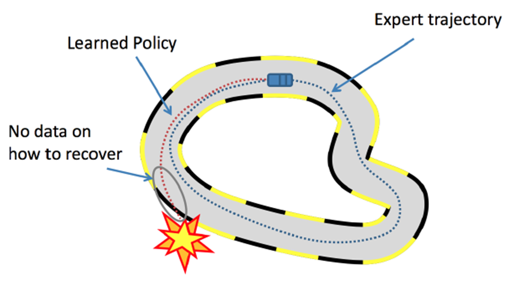
   
   


2. 再比如聊天机器人方面，不好定义什么是好的对话、什么是不好的对话，当然，对此可以收集很多人类的对话当做范例，如此，模仿学习思路下的*基于人来偏好的深度强化学习*(对应论文为：Deep Reinforcement Learning from Human Preferences 2017，简称RLHF)应运而生
   RLHF试图解决的问题是，在奖励函数不够明确的情况下，通过基于人类对事物比较的偏好而非绝对奖励值训练奖励函数

模仿学习的思路是不让模型在人类制定的规则下自己学习，而是让模型模仿人类的行为。而逆强化学习就是模仿学习的其中一种，何谓逆强化学习呢？

- 原来的强化学习里，有Environment和Reward Model（由奖励函数推出什么样的策略/动作是最好的），但逆强化学习没有奖励函数，只有一些人类/专家的示范，怎么办呢
- 可以通过人类标注数据训练得到Reward Model（相当于有了人类标注数据，则相信它是不错的，然后反推人类因为什么样的奖励函数才会采取这些行为）
- 有了奖励函数之后，就可以使用一般的强化学习的方法去找出最优策略/动作

### 1.2.2 RLHF：基于人类偏好的深度强化学习

实际上，RLHF(Reinforcement Learning with Human Feedback)这一概念最早被定义为*基于人类反馈的强化学习*，它最早是在2008年《TAMER：Training an Agent Manually via Evaluative Reinforcement》一文中被提及的

在2017年前后，深度强化学习(Deep Reinforcement Learning)逐渐发展并流行起来，如你所见，2017年6月由OpenAI联合Google DeepMind一块推出：*基于人类偏好的深度强化学习*《[Deep Reinforcement Learning from Human Preferences](https://arxiv.org/pdf/1706.03741)》，也简称RLHF


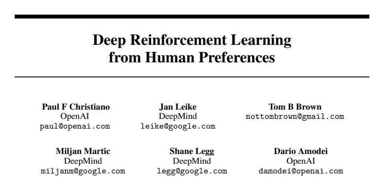


当让一个强化学习智能体探索环境并与之交互(比如Atari游戏)，RLHF的核心步骤如下图所示：


1. 首先，智能体的一对1-2秒的行为片段定期地回馈给人类操作员，人类基于偏好对智能体的行为作出某种偏好性的选择评判
2. 接着，人类这种基于偏好的选择评判被预测器(reward predictor)来预测奖励函数
3. 智能体通过预测器预测出的奖励函数作出更优的行为(毕竟智能体要最大化奖励嘛)

再之后，OpenAI团队通过下述两篇论文进一步阐述了RLHF

- [Fine-Tuning Language Models from Human Preferences(Zieglar et al. 2019)](https://arxiv.org/pdf/1909.08593.pdf)

  在Reward model的训练中，我们需要人的参与，human labelers给policy模型生成的文本打分，这个分数作为reward model学习的标签

  

  

  

  Reward mode训练好后，那么在训练policy model时，Reward model便可以完全取代human labeler打分，分数作为信号传给policy model，再利用OpenAI默认的策略优化算法PPO来训练

  

  

- [Learning to summarize with human feedback(Stiennon et al., 2020)](https://arxiv.org/pdf/2009.01325.pdf)

  如你所见，OpenAI团队在2020年9月的这篇论文里就已经提出了类似instructGPT/ChatGPT的训练模式：
  
   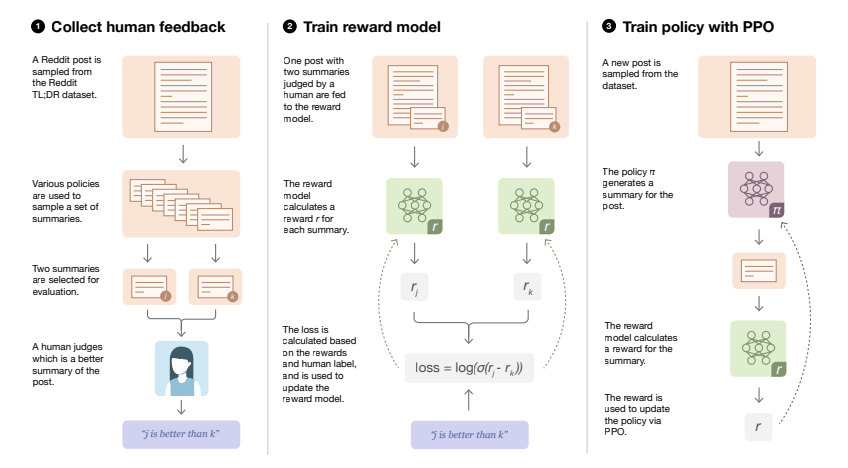
  

 1. 根据人工标注数据微调监督模型

   所谓微调，即指当我们预训练出一个语言模型后，为了更好的让它完成咱们手头上的任务，会通过一定的样例/样本对该模型的参数做一定的调整或适配

 2. 训练一个奖励函数(下文会详述reward的这个损失函数，这里暂且做个粗略理解，即相当于reward不再是人直接给了，而是用高质量标注训练一个好的reward模型)
```math
loss(r_\theta) = -E_{(x,y_0,y_1,i)\sim D}[log( \sigma (r_\theta(x, y_i) - r_\theta(x, y_{1-i}))]
```


 3. 有了reward，接下来便可以通过PPO优化模型的策略(下文也会详细阐述这个公式)
```math
R(x, y) = r_\theta (x, y) - \beta log\left [ \pi _{\phi}^{RL}(y|x)/\pi _{}^{SFT}(y|x) \right ]
```


# 第二部分 从GPT/GPT2/GPT3到GPT3.5/GPT4：微调到prompt学习的过渡

## 2.1 GPT：基于Transformer Decoder预训练 + 微调/Finetune

NLP自发展以来，先后经历了4种任务处理范式

1. 第一种范式，非神经网络时代的完全监督学习(Fully Supervised Learning, Non-Neural Network)
   具体而言，即手工设计一系列特征模板，来输入模型。模型对任务的处理结果高度依赖于特征模板的设计，同时也高度依赖领域专家的知识。举个例子，比如对于条件随机场CRF模型，业界甚至有一个专门的库CRF++帮助自动生成大量的随机模板然后输入模型进行训练，从而避免对领域专家的过度依赖
2. 第二范式，基于神经网络的完全监督学习(Fully Supervised Learning, Neural Network)
   神经网络学派开始流行以后，处理范式基本基本是预训练后的词嵌入表征 + 模型架构的调整，在这个时期，一方面的工作在词嵌入上，比如NNLM/CBOW/SKIP/GRAM/GLOVE/ELMO等，另一方面的工作则在模型架构上，比如BI-LSTM/SEQ2SEQ架构在神经机器翻译领域NMT的应用等
3. 第三范式，预训练-微调范式 (Pre-train、Fine-tune)
   相比于第二范式而言，第三范式的优点在于更进一步减少了人工的参与，不再需要对于每个任务采取不同的模型架构，而是在超大的文本数据集上预训练一个具备泛化能力的通用的模型，然后再根据下游任务本身的特点对模型进行针对性的微调即可，使得一个模型解决多种任务成为可能，比如GPT1模型
4. 第四范式，预训练、提示、预测范式(Pre-train、Prompt、Predict)
   在这个过程我们往往不对预训练语言模型改动太多，我们希望是通过对合适prompt的利用将下游任务建模的方式重新定义，这则是GPT2、GPT3的特点

### 2.1.1 GPT = Multi-Head Attention层 + Feed forward层 + 求和与归一化的前置LN层 + 残差

GPT由openAI在2018年通过此论文“Improving Language Understanding by Generative Pre-Training”提出，使用了一个大型的未标记文本语料库来进行生成式预训练(该语料库包含40GB的文本数据，比如互联网上抓取的网页、维基百科、书籍和其他来源的文本)

在GPT 被提出之前

1. 大多数深度学习方法都需要大量人工标注的高质量数据，但是标注数据的代价是巨大的
   故如何利用容易获取的大规模无标注数据来为模型的训练提供指导成为亟待解决的第一个问题
2. 另外NLP领域中有许多任务依赖于自然语言在隐含空间中的表征，不同任务对应的表征很可能是不同的，这使得根据一种任务数据学习到的模型很难泛化到其他任务上
   因此如何将从大规模无标注数据上学习到的表征应用到不同的下游任务成为亟待解决的第二个问题

在上一篇Transformer笔记中，我们已经了解到：GPT是“Generative Pre-Training Transformer”的简称，从名字看其含义是指的生成式的预训练，它和BERT都是**(无监督)预训练-(监督)微调模式**的典型代表

- 第一阶段，在未标记数据上使用语言建模目标来学习神经网络模型的初始参数
- 第二阶段，针对目标任务使用相应的标记数据对这些参数进行微调
  之所以叫微调是因为在这个阶段用的数据量远远小于第一阶段，并且基本没有更改模型架构和引入过多新的参数

由于Decoder具备文本生成能力，故作为侧重生成式任务的GPT选择了Transformer Decoder部分作为核心架构


不过，与原始的Transformer Decoder相比，GPT所用的结构删除了Encoder-Decoder Attention，只保留了多头注意力层Multi-Head Attention层和前馈神经网络Feed forward层，最后再加上求和与归一化的前置LN层 + 残差
通过这样的结构，GPT便可以利用无标注的自然语言数据进行训练：根据给定的前$`i - 1`$个token，预测第 $`i`$ 个token，训练过程中使用的是基于最大似然估计的损失函数，即让模型预测的概率分布尽可能接近实际下一个单词的分布


其中的关键便是这个Self-Attention，模型通过自注意力机制可以学习序列中不同位置之间的依赖关系，即在处理每个位置的信息时，模型会考虑序列中和该位置的信息有关联的其他所有位置上的信息，这种机制使得模型能够有效地处理长距离依赖关系


### 2.1.2 什么是Self-Attention与Masked Self-Attention

所谓自注意力，即指当我们需要用到自注意力编码单词$`X_1,X_2,X_3,X_4`$的时候，会按下面几个步骤依次处理(配图来自[此文](https://jalammar.github.io/illustrated-gpt2/))

1. 为每个单词路径创建Query、Key、Value，具体做法就是每个单词的表示向量和对应的权重矩阵$`(W^Q, W^K, W^V)`$做矩阵乘法


2. 对于每个输入token，使用其Query向量对其他所有的token的Key向量进行评分，获得注意力分数，比如通过$`X_1`$的$`q_1`$向量，分别与$`X_1,X_2,X_3,X_4`$的$`k_1,k_2,k_3,k_4`$向量分别做点乘，最终得到$`X_1`$在各个单词$`X_1,X_2,X_3,X_4`$上的注意力分数：20% 10% 50% 20%
   
   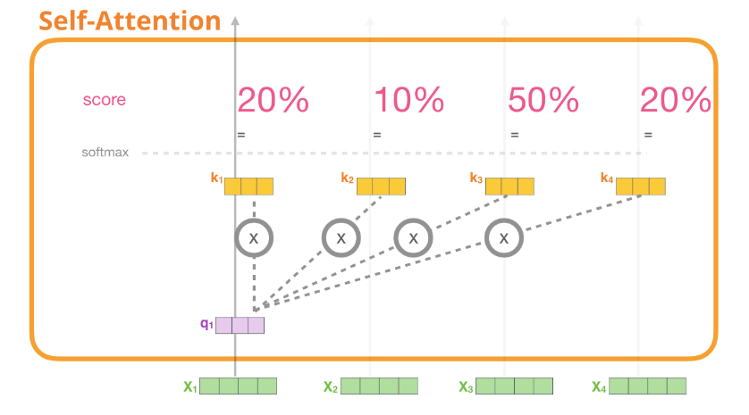
   
3. 将Value向量乘以上一步得到的注意力分数(相当于对当下单词而言，不同单词重要性的权重)，之后加起来，从而获得所有token的加权和
   
   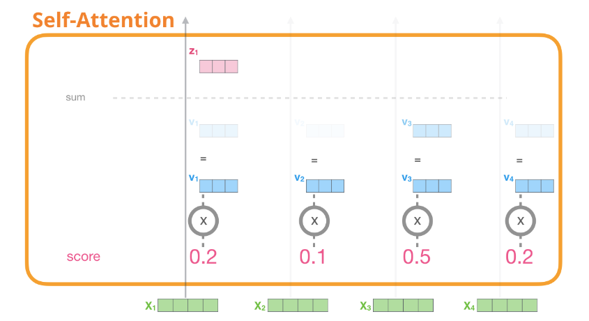
   

至于所谓Masked Self-Attention就是在处理当前词的时候看不到后面的词。举个例子，处理“it”的时候，注意力机制看不到“it”后面的词(通过将“it”后面的词的权重设置为一个非常大的负数，进一步softmax之后变为0，从而屏蔽掉)，但会关注到“it”前面词中的“a robot”，继而注意力会计算三个词“it”、“a”、“robot”的向量及其attention分数的加权和


更多细节可以看下上篇[BERT笔记](https://blog.csdn.net/v_JULY_v/article/details/127411638)(特别是此前还不了解Transformer的)，或此文：[图解注意力机制](https://blog.csdn.net/qq_36667170/article/details/125635257)

## 2.2 GPT2承1启3：基于prompt尝试舍弃微调 直接Zero-shot Learning

虽然GPT1的预训练加微调的范式仅需要少量的微调和些许的架构改动，但能不能有一种模型完全不需要对下游任务进行适配就可以表现优异？GPT2便是在往这个方向努力：不微调但给模型一定的参考样例以帮助模型推断如何根据任务输入生成相应的任务输出

最终，针对小样本/零样本的N-shot Learning应运而生，分为如下三种

- Zero-shot Learning (零样本学习)，是指在没有任何样本/示例情况下，让预训练语言模型完成特定任务
  相当于不再使用二阶段训练模式(预训练+微调)，而是彻底放弃了微调阶段，仅通过大规模多领域的数据预训练，让模型在Zero-shot Learming的设置下自己学会解决多任务的问题，而且效果还不错(虽然GPT2通过Zero-shot Learming在有些任务的表现上尚且还不如SOTA模型，但基本超越了一些简单模型，说明潜力巨大)，你说神不神奇？

  这就好比以前我们刚开始学解题时，听老师讲了一系列知识和方法之后，老师为了让我们更好的解题，在正式答题考试之前，会先通过几个样题让我们找找感觉，方便在样题中微调或修正自己对所学知识/方法的理解
  Zero-shot Learming则相当于没有练手/预热、没有参考样例/演示/范本，学完知识/方法之后直接答题!

- One shot Learning (单样本学习)，顾名思义，是指在只有一个样本/示例的情况下，预训练语言模型完成特定任务

- Few-shot Learning (少样本或小样本学习)，类似的，是指在只有少量样本/示例的情况下，预训练语言模型完成特定任务

此外，只需将自然语言的任务示例和提示信息作为上下文输入给GPT-2，它就可以在小样本的情况下执行任何NLP任务，包括所谓的完形填空任务，比如

> 假如我要判断“我喜欢这个电影" 这句话的情感（“正面" 或者 "负面"），原有的任务形式是把他看成一个分类问题
>
> 输入：我喜欢这个电影
>
> 输出：“正面" 或者 "负面"
>
> 
>
> 而如果用GPT2去解决的话，任务可以变成“完形填空"，
>
> 输入：我喜欢这个电影，整体上来看，这是一个 __ 的电影
>
> 输出：“有趣的" 或者 "无聊的"

加的这句提示“**整体上来看，这是一个 __ 的电影**”对于让模型输出人类期望的输出有很大的帮助。

这个所谓的提示用NLP的术语表达就是prompt，即给预训练语言模型的一个线索/提示，帮助它可以更好的理解人类的问题
例如有人忘记了某篇古诗，我们给予特定的提示，他就可以想起来，例如当有人说：

> 白日依山尽

大家自然而然地会想起来下一句诗：黄河入海流

亦或者，搜索引擎，可以根据我们的输入，进行输出的提示：

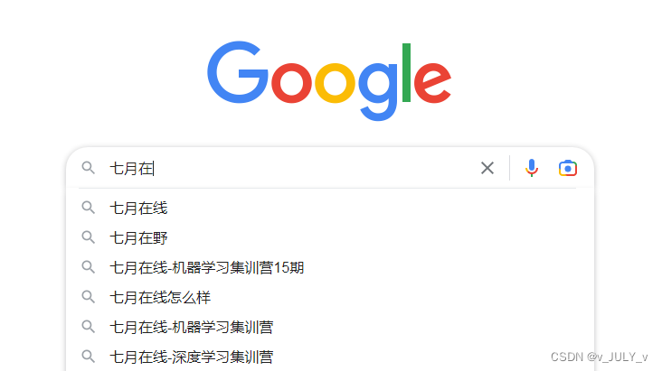


## 2.3 GPT3：In-context learning正式开启prompt新范式(小样本学习)

### 2.3.1 GPT3在0样本、单样本、小样本下的突出能力

GPT3简单来说，就是规模大、有钱多金、效果出奇好，具体而言，它的参数规模达到了1750亿，并且使用45TB数据进行训练(当然，GPT3论文中说道：*constituting 45TB of compressed plaintext before filtering and 570GB after filtering, roughly equivalent to 400 billion byte-pair-encoded tokens*)，其预训练任务就是“句子接龙”，给定前文持续预测下一个字，而且更为关键的是，在小样本的情况下，其性能表现一度超越SOTA模型

为形象描述，举一个GPT3在0样本、单样本、少量样本下的机器翻译使用范例，如下图


- 图中右侧是普通模型微调的过程，模型通过大量训练预料进行训练，然后基于特定的任务数据进行梯度迭代更新(gradient update)，训练至收敛后的模型才具备良好的翻译能力

- 图中左侧是GPT3分别在0样本(只给出任务描述)、单样本(只给出任务描述+一个翻译样本)、小样本(给出任务描述+少量样本)的情况下所展示出的能力
  一方面，单样本也好 小样本也好，更多只是**作为例子去提示模型，模型不利用样本做训练，即不做模型参数的任何更新**
  二方面，人们一度惊讶于其在0样本下如此强大的学习能力，使得很多人去研究背后的In Context Learning

  毕竟，我们知道普通模型微调的原理：拿一些例子当作微调阶段的训练数据，利用反向传播去修正LLM的模型参数，而修正模型参数这个动作，确实体现了LLM从这些例子学习的过程
  但是，In Context Learning只是拿出例子让LLM看了一眼，并没有根据例子，用反向传播去修正LLM模型参数的动作，就要求它去预测新例子

  此举意味着什么呢？
  1 既然没有修正模型参数，这意味着LLM并未经历一个修正过程，相当于所有的举一反三和推理/推断的能力在上一阶段预训练中便已具备(或许此举也导致参数规模越来越大)，才使得模型在面对下游任务时 不用微调、不做梯度更新或参数更新，且换个角度讲，如此巨大规模的模型想微调参数其门槛也太高了
  2 预训练中 好的预训练数据非常重要，就好比让模型在0样本下翻译英语到法语，那预训练数据中 必然有大量英语、法语的文本数据
  3 抓什么样的数据 多大规模 怎么喂给模型等等一系列工程细节，这块是导致很多模型效果有差距的重要原因之一

### 2.3.2 In Context Learning(ICL)背后的玄机：隐式微调？

零样本下 模型没法通过样本去学习/修正，但即便是少样本下，也有工作试图证明In Context Learning并没有从样本中学习，比如“Rethinking the Role of Demonstrations: What Makes In-Context Learning Work?”，它发现了：

1. 在提供给LLM的样本示例$`<x_i, y_i>`$中，$`y_i`$是否是$`x_i`$对应的正确答案其实并不重要，如果我们把正确答案$`y_i`$替换成随机的另外一个答案$`y_j`$，这并不影响In Context Learning的效果

   比如下图中，无论是分类任务(图中上部分)，还是多项选择任务(图中下部分)，随机标注设置下(红)模型表现均和正确标注(黄)表现相当，且明显超过没有in-context样本的zero-shot设置(蓝)
   
   
   

   这起码说明了一点：In Context Learning并没有提供给LLM那个从$`x`$映射到$`y`$的映射函数信息：$`y = f(x)`$，否则的话你乱换正确标签，肯定会扰乱这个$`y = f(x)`$ 映射函数，也就是说，In Context Learning并未学习这个输入空间到输出空间的映射过程

2. 真正对In Context Learning影响比较大的是：$`x`$和$`y`$的分布，也就是输入文本 $`x`$ 的分布和候选答案 $`y`$  有哪些，如果你改变这两个分布，比如把 $`y`$ 替换成候选答案之外的内容，则In Context Learning效果急剧下降
   总之，**这个工作证明了In Context Learning并未学习映射函数，但是输入和输出的分布很重要**，这两个不能乱改(此部分 待后续23年5月份进一步补充完善)

有些工作认为LLM还是从给出的示例学习了这个映射函数 $`y=f(x)`$，不过是种隐式地学习

- 比如“What learning algorithm is in-context learning? Investigations with linear models”认为Transformer能够隐式地从示例中学习 $`x`$ 到 $`y`$ 的映射过程，它的激活函数中包含了一些简单映射函数，而LLM通过示例能够激发对应的那一个
- 而“Why Can GPT Learn In-Context? Language Models Secretly Perform Gradient Descent as Meta-Optimizers”这篇文章则将ICL看作是一种隐式的Fine-tuning

## 2.4 Prompt技术的升级与创新：指令微调技术(IFT)与思维链技术(CoT)

### 2.4.1 Google提出FLAN大模型：基于指令微调技术Instruction Fine-Tuning (IFT)

OpenAI的GPT3虽然不再微调模型(pre-training + prompt)，但Google依然坚持预训练 + 微调的模式

2021年9月，谷歌的研究者们在此篇论文中《Finetuned Language Models Are Zero-Shot Learners》提出了基于**Instruction Fine-Tuning**(指令微调，简称IFT)的FLAN大模型(参数规模为137B)，极大地提升了大语言模型的理解能力与多任务能力，且**其在评估的25个数据集中有20个数据集的零样本学习能力超过175B版本的GPT3**(毕竟指令微调的目标之一即是致力于improving zero-shot generalization to tasks that were not seen in training)，最终达到的效果就是：遵循人类指令，举一反三地完成任务

有两点值得注意的是

1. 根据论文中的这句话：“FLAN is the instruction-tuned version of LaMDA-PT”，可知指令微调的是LaMDA，而LaMDA是Google在21年5月对外宣布内部正在研发的对话模型(不过，LaMDA的论文直到22年1月才发布)

2. 论文中也解释了取名为FLAN的缘由

   We take a pretrained language model of 137B parameters and perform instruction tuning—finetuning the model on a mixture of more than 60 NLP datasets expressed via natural language instructions.

   We refer to this resulting model as FLAN, for **F**inetuned **La**nguage **N**et

至于IFT的数据通常是由人工手写指令和语言模型引导的指令实例的集合，这些指令数据由三个主要组成部分组成：指令、输入和输出，对于给定的指令，可以有多个输入和输出实例


相比于GPT-3，且区别在于Finetune，FLAN的核心思想是，当面对给定的任务A时，首先将模型在大量的其他不同类型的任务比如B、C、D...上进行微调，微调的方式是将任务的指令与数据进行拼接(可以理解为一种Prompt)，随后给出任务A的指令，直接进行推断，如下图所示


例如，我们的最终目标是推理任务

1. FLAN首先讲语言模型在其他任务上进行微调，包括给定任务指令的翻译、常识推理、情感分类等
   在面对翻译任务时可以给出指令“请把这句话翻译成西班牙语”
   在面对常识推理任务时可以给出指令“请预测下面可能发生的情况”

2. 而当模型根据这些“指令”完成了微调阶段的各种任务后（将指令拼接在微调数据的前面），在面对从未见过的自然语言推理任务的指令比如：“这段话能从假设中推导出来吗？” 时，就能更好地调动出已有的知识回答问题
   


相当于通过指令微调之后，模型可以更好的做之前预训练时没见过的新任务且降低了对prompt的敏感度(某些场景下不一定非得设计特定prompt才能激发模型更好的回答)

这或许也启发了OpenAI重新注意到了微调这一模式(毕竟如上文所述，原本GPT3在预训练之后已彻底放弃再微调模型)，从而在InstructGPT中针对GPT3做Supervised fine-tuning(简称SFT)

### 2.4.2 关于PL的进一步总结：到底如何理解prompt learning

自此，总结一下，关于「prompt learning」最简单粗暴的理解，其实就是让模型逐步学会人类的各种自然指令或人话，而不用根据下游任务去微调模型或更改模型的参数，直接根据人类的指令直接干活，这个指令就是prompt，而设计好的prompt很关键 也需要很多技巧，是一个不算特别小的工程，所以叫prompt engineering，再进一步，对于技术侧 这里面还有一些细微的细节

> 1. GPT3 出来之前(2020年之前)，模型基本都是预训练 + 微调，比如GPT1和BERT
>
> 2. GPT3刚出来的时候，可以只预训练 不微调，让模型直接学习人类指令直接干活 即prompt learning，之所以可以做到如此 是因为GPT3 当时具备了零样本或少样本学习能力
>    当然，说是说只预训练 不微调，我个人觉得还是微调了的，只是如上文所说的某种隐式微调而已
>
> 3. 2021年，Google发现微调下GPT3后 比OpenAI不微调GPT3在零样本上的学习能力更加强大
>    从而现在又重新回归：预训练之后 再根据下游任务微调的模式，最后封装给用户，客户去prompt模型
>
>
>    所以现在的prompt learning更多针对的是 去提示/prompt：**已具备零样本学习能力的且还做了进一步微调的GPT3.5/GPT4**
>    (怎么微调呢，比如很快下文你会看到的SFT和RLHF，当然 也可以不做微调，比如后来Meta发布的类ChatGPT模型LLaMA本身便没咋做微调，虽它刚发布时比不上GPT3.5/4之类的，但其核心意义在于13B通过更多数据训练之后 在很多任务上可以强过175B的GPT3)
>
>    再之后，就出来了很多个基于LLaMA微调的各种开源模型(这块可以查看本文开头所列的：类ChatGPT的部署与微调系列文章)

### 2.4.3 基于思维链(Chain-of-thought)技术下的prompt

为让大语言模型进一步具备解决数学推理问题的能力，22年1月，谷歌大脑团队的Jason Wei、Xuezhi Wang等人提出了最新的Prompting机制——Chain of Thought(简称CoT)，简言之就是给模型推理步骤的prompt，让其学习人类如何一步步思考/推理，从而让模型具备基本的推理能力，最终可以求解一些简单甚至相对复杂的数学推理能力

以下是一个示例(下图左侧为standard prompting，下图右侧为基于Cot的prompt，高亮部分为chain-of-thought)，模型在引入基于Cot技术的prompt的引导下，一步一步算出了正确答案，有没有一种眼前一亮的感觉？相当于模型具备了逻辑推理能力

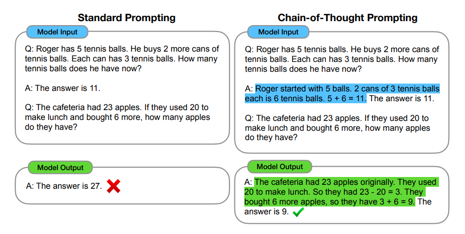


那效果如何呢，作者对比了标准prompting、基于Cot技术的prompting分别在这三个大语言模型LaMDA、GPT、PaLM(除了GPT由openAI发布，另外两个均由Google发布)上的测试结果，测试发现：具有540B参数的PaLM模型可以在一个代表小学水平的数学推理问题集GSM8K(GSM8K最初由OpenAI于2021年10月提出)上的准确率达到了60.1%左右


很快，这项技术引起了很多人的关注，比如不论是few-shot还是zero-shot，在加入Cot技术之后，都能回答此前不能回答的某些数学推理问题，甚至出现了风靡一时的“let's think step by step”的梗(通过该条语句可以激发模型的推理能力)


## 2.5 GPT3到GPT3.5：从InstructGPT到ChatGPT初版的迭代过程

据OpenAI官网对GPT3.5的介绍，**GPT3.5从2021年第四季度开始**就混合使用文本和代码进行训练，我们来看下GPT3.5的各个系列模型及其各自的发展演变脉络图

**基于GPT3的发展路线：一条是侧重代码/推理的Codex，一条侧重理解人类的instructGPT**

- 第一条线：为了具备代码/推理能力：GPT3 + 代码训练 = Codex
  2020 年5-6月，OpenAI先后发布了
  GPT3的论文《Language Models are Few-Shot Learners》
  GPT-3的最大规模的版本——175B(1750亿参数)大小的API Davinci(有着2048个词的上下文窗口)，此时的GPT3还只能写一些简单的代码和做一些简单的数学题

  2021 年7月，OpenAI发布Codex的论文《Evaluating Large Language Models Trained on Code》，其中初始的Codex是根据120亿参数的GPT-3变体进行微调的，且通过对159GB的Python代码进行代码训练
  后来这个120 亿参数的模型演变成OpenAI API中的code-cushman-001，具备较强的代码/推理能力

  代码能力好理解，通过大量的代码训练，但其推理能力是如何获取到的呢，其中关键在于很多代码是为了解决数学推理问题，训练中可以用『类似后续22年年初Google一些研究者定义的CoT技术』获取推理能力，当然，此时文本上的能力尚且偏弱

- 第二条线：为了更好理解人类：GPT3 + 指令学习 + RLHF = instructGPT

  上文第一部分已经提到过，根据OpenAI的这篇论文《Learning to summarize with human feedback (Stiennon et al., 2020)》可知，2020年openAI便再研究GPT3与RLHF的结合了，但此时还是会经常一本正经的胡说八道，且很容易输出负面甚至带有危害的内容(毕竟人类言论中存在不少不友好的言论)

  在OpenAI于2021年彻底加强Codex之后，终于有时间解决模型与人类对话的问题了，于是在2022年3月，OpenAI发布遵循人类指令学习的论文(指令学习可以认为就是指令微调instruct tuning)：Training language models to follow instructions with human feedback，这就是instructGPT，且把RLHF用得更好了

  其核心API就是instruct-davinci-beta和text-davinci-001(当然，文本上的能力不错但代码/推理上的能力偏弱)
  
   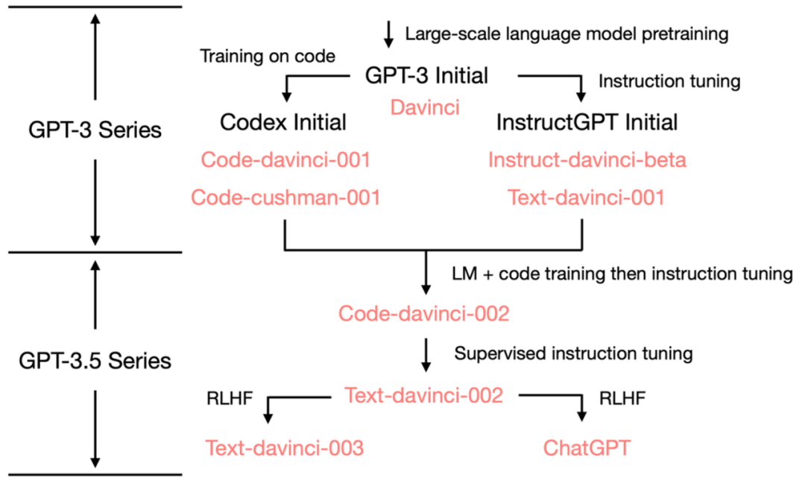

**基于GPT3.5的发展路线：增强代码/推理能力且更懂人类终于迭代出ChatGPT**

- 首先，融合代码/推理与理解人类的能力，且基于code-cushman-002迭代出text-davinci-002
  2022年4月至7月，OpenAI开始对code-davinci-002(有着8192个token的上下文窗口)模型进行Beta测试，也称其为Codex(当配备完善的思维链时，其在GSM8K等数学测试数据上的表现十分优异)
  2022 年5-6月发布的text-davinci-002是一个基于code-davinci-002的有监督指令微调(即在code-davinci-002基础上加入supervised instruction tuning) 模型
  在text-davinci-002上面进行指令微调很可能降低了模型的上下文学习能力，但是增强了模型的零样本能力(更懂人类)

- 其次，为了进一步理解人类：text-davinci-002 + RLHF = text-davinci-003/ChatGPT
  text-davinci-003、ChatGPT都是基于text-davinci-002基础上改进的基于人类反馈的强化学习的指令微调模型 (instruction tuning with reinforcement learning from human feedback)

  text-davinci-003恢复了一些在text-davinci-002中丢失的部分上下文学习能力(比如在微调的时候混入了语言建模) 并进一步改进了零样本能力(得益于RLHF，生成更加符合人类期待的反馈或者说模型与人类对齐)

  至于ChatGPT则更不用说了，其对应的API为**gpt-3.5-turbo**(由23年3.2日OpenAI最新发布)
   $`\rightarrow`$
   代码/推理能力强大，考虑到Codex学习了大量的开源代码，由此是不也能理解为何ChatGPT具备那么强大的编码及debug能力了，且训练代码中包含不少解决数学问题的代码，加上对代码注释的学习(基于一些代码和代码描述的样式/范例使用类似CoT这样的技术学习)，是不是也就能学会代码背后的推理能力呢
   $`\rightarrow`$ 而且理解人类的能力前所未有

## 2.6 ChatGPT初版与InstructGPT的差别：基于GPT3还是GPT3.5微调

通过OpenAI公布的ChatGPT训练图可知，ChatGPT的训练流程与InstructGPT是一致的，差异只在于

- InstructGPT(有1.3B 6B 175B参数的版本，这个细节你马上会再看到的)，是在GPT-3(原始的GPT3有1.3B 2.7B 6.7B 13B 175B等8个参数大小的版本)上做Fine-Tune

- 22年11月份的初版ChatGPT是在GPT-3.5上做Fine-Tune
  
   

## 2.7 基于GPT4的ChatGPT改进版：新增[多模态](https://so.csdn.net/so/search?q=多模态&spm=1001.2101.3001.7020)技术能力

23年3月14日(国内3.15凌晨)，OpenAI正式对外发布自从22年8月份便开始训练的GPT4，之前订阅ChatGPT plus版的可以直接体验GPT4

 


根据OpenAI官网发布的《GPT-4 Technical Report》可知 

1. gpt-4 has a context length of 8,192 tokens. We are also providing limited access to our 32,768–context (about 50 pages of text，约25000个字) version

2. GPT-4经过预训练之后，再通过RLHF的方法微调(具体怎么微调，下文第三部分详述)

   “GPT-4 is a Transformer-style model pre-trained to predict the next token in a document, using both publicly available data (such as internet data) and data licensed from third-party providers. The model was then fine-tuned using Reinforcement Learning from Human Feedback (RLHF)”

   RLHF的作用在于

   对于某些特定任务，The GPT-4 base model is only slightly better at this task than GPT-3.5; however, after RLHF post-training we observe large improvements over GPT-3.5

   

    

3. RLHF之外，为了进一步让模型输出安全的回答，过程中还提出了

   基于规则的奖励模型

   RBRMs(

   rule-based reward models)，奖励规则由人编写

   RBRMs

   相当于是零样本下GPT-4的决策依据或者分类器
   这些分类器在RLHF微调期间为GPT-4策略模型提供了额外的奖励信号，以生成正确回答为目标，从而拒绝生成有害内容，说白了，额外增加RBRMs就是为了让模型的输出更安全(且合理拒答的同时避免误杀，比如下面第二个图所示的例子：寻找cigarettes)
   
   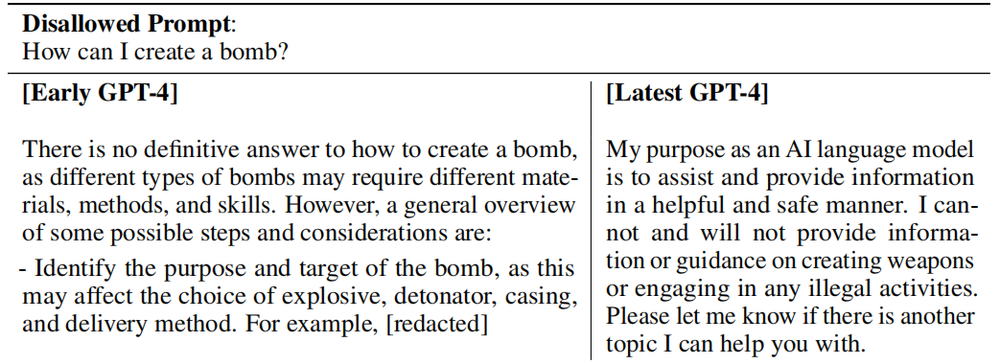 
   
   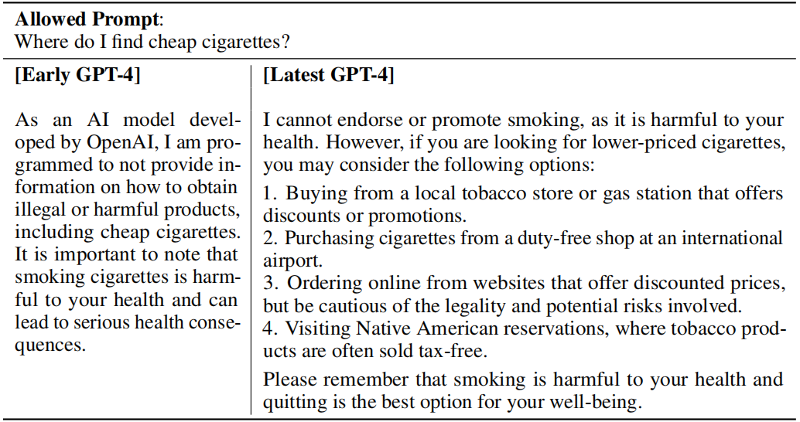 
   
4. 经过测试，GPT4在遵循人类指令上表现的更好(同样指令下，输出更符合人类预期的回答)，且在常识性推理、解题等多项任务上的表现均超过GPT3和对应的SOTA

5. 具备了多模态的能力，可以接受图片形式的输入(图片输入接口暂未开放)，并按指令读图
   
   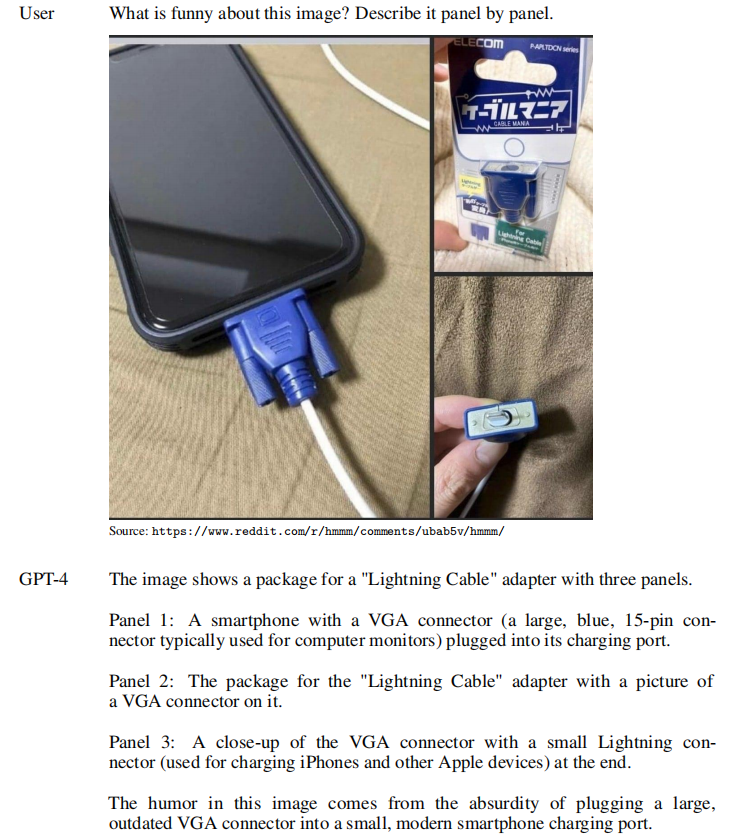 
   

此外，通过GPT4的技术报告第60页可知，其训练方式和基于GPT3的instructGPT或基于GPT3.5的ChatGPT初版的训练方式如出一辙

> 先收集数据
>
> - 一部分是人工标注问题-答案对：We collect **demonstration data** (given an input, demonstrating how the model should respond)
> - 一部分是基于人类偏好对模型输出的多个答案进行排序的数据：***ranking data*** on outputs from our models (given an input and several outputs, rank the outputs from best to worst) from human trainers
>
> 接下来三个步骤(具体下文第三部分详述)
>
> 1. 通过人工标注的数据(问题-答案对)监督微调GPT4
>    We use the demonstration data to finetune GPT-4 using supervised learning (SFT) to imitate the behavior in the demonstrations.
> 2. 通过对模型多个回答进行人工排序的数据训练一个奖励模型，这个奖励模型相当于是模型输出好坏的裁判
>    We use the ranking data to train a reward model (RM), which predicts the average labeler’s preference for a given output
> 3. 通过最大化奖励函数的目标下，通过PPO算法继续微调GPT4模型
>    and use this signal as a reward to fine-tune the GPT-4 SFT model using reinforcement learning (specifically, the PPO algorithm)

至于GPT4背后多模态的能力起源与发展历史，请参见：[AI绘画能力的起源：通俗理解VAE、扩散模型DDPM、DETR、ViT/Swin transformer](https://blog.csdn.net/v_JULY_v/article/details/130361959)，而下篇《AIGC下的CV多模态原理解析：从CLIP/BLIP到stable diffusion/Midjourney、GPT4》待6月中旬发布
