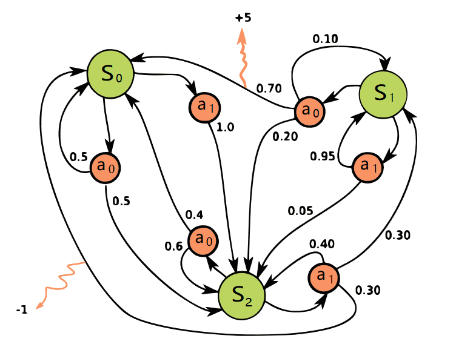
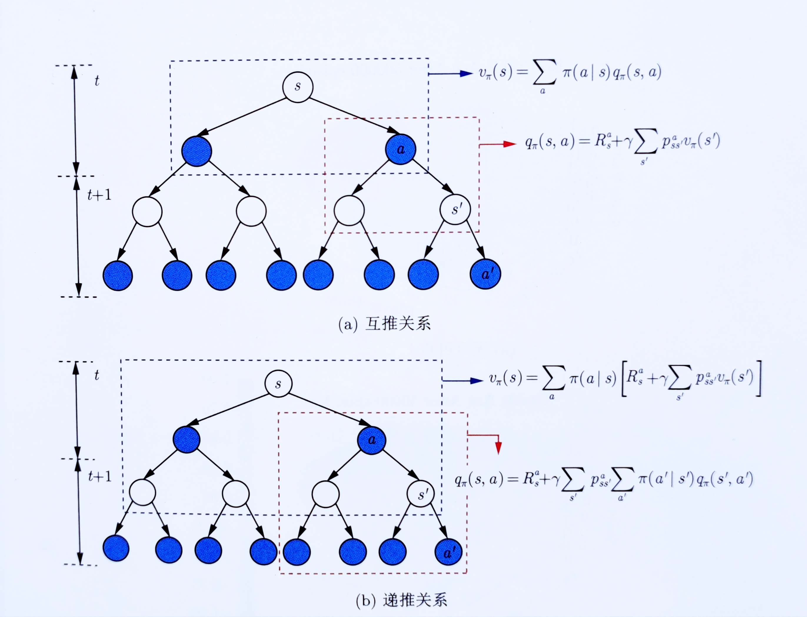
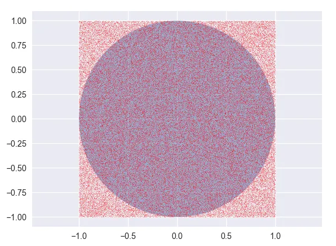
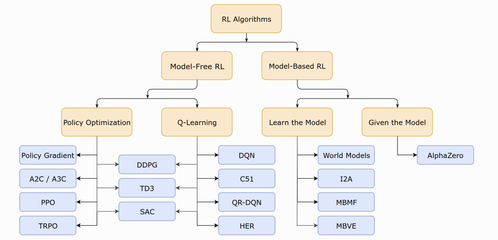
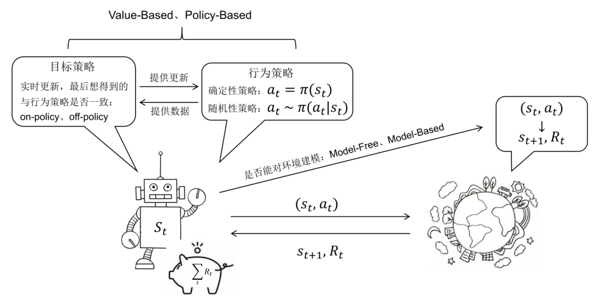
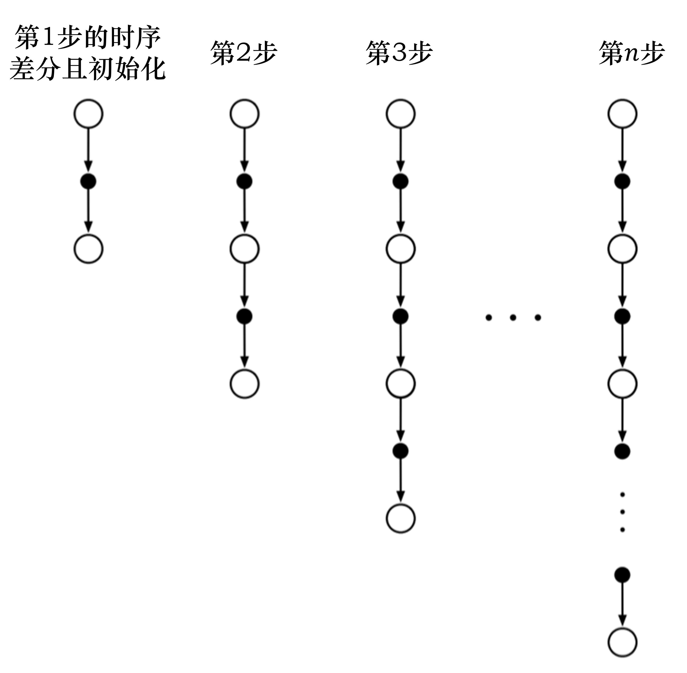

## **前言**
22年底/23年初ChatGPT大火，在写《[ChatGPT技术原理解析](https://blog.csdn.net/v_JULY_v/article/details/128579457 "ChatGPT技术原理解析")》的过程中，发现ChatGPT背后技术涉及到了RL/RLHF，于是又深入研究RL，研究RL的过程中又发现里面的数学公式相比ML/DL更多，于此激发我一边深入RL，一边重修微积分、概率统计、最优化，前者成就了本篇RL极简入门，后者成就了另两篇数学笔记：概率统计极简入门(23修订版)、一文通透优化算法(23修订版).

如上篇ChatGPT笔记所说，本文最早是作为ChatGPT笔记的第一部分的，但RL细节众多，如果想完全在上篇笔记里全部介绍清楚，最后篇幅将长之又长同时还影响完读率，为了避免因为篇幅限制而导致RL很多细节阐述的不够细致，故把RL相关的部分从上文中抽取出来独立成本文.

+   一方面，原有内容(第一部分 RL基础：什么是RL与MRP、MDP，和第四部分 **策略学习**：从策略梯度到TRPO、PPO算法)继续完善、改进，完善记录见本文文末
+   二方面，在原有内容上新增了以下这两部分内容的详细阐述：  
    第二部分 RL进阶之三大表格求解法：DP、MC、TD  
    第三部分 **价值学习**：从n步Sarsa算法到Q-learning、DQN

另，本文有两个特色

1.  定位入门.过去一个多月，我翻遍了十来本RL中文书，以及网上各种RL资料  
    有的真心不错(比如sutton的RL书，但此前从来没有接触过RL的不建议一上来就看该书，除非你看过本文之后)  
    其余大部分要么就是堆砌概念/公式，要么对已经入门的不错，但对还没入门的初学者极度不友好，很多背景知识甚至公式说明、符号说明没有交待，让初学者经常看得云里雾里  
    本文会假定大部分读者此前从来没有接触过RL，会尽可能多举例、多配图、多交待，100个台阶，一步一步拾级而上，不出现任何断层
2.  推导细致.本文之前，99%的文章都不会把PPO算法从头推到尾，<u>本文会把PPO从零推到尾</u>，按照“**RL-策略梯度-重要性采样(重要性权重)-增加基线(避免奖励总为正)-TRPO(加进KL散度约束)-PPO(解决TRPO计算量大的问题)**”的顺序逐步介绍每一步推导  
    且为彻底照顾初学者，本文会解释/说明清楚每一个公式甚至符号，包括推导过程中不省任何一个必要的中间推导步骤，十步推导绝不略成三步

总之，大部分写书、写教材、写文章的人过了那个从不懂到懂的过程，所以懂的人写给不懂的人看，处处都是用已懂的思维去写，而不是用怎么从不懂到懂的思维 去写，​未来三年 奋笔疾书，不断给更多初学者普及AI和RL技术

## 第一部分 RL基础：什么是RL与MRP、MDP

## 1.1 入门强化学习所需掌握的基本概念

### 1.1.1 什么是强化学习：依据策略执行动作-感知状态-得到奖励

强化学习里面的概念、公式，相比ML/DL特别多，初学者刚学RL时，很容易被接连不断的概念、公式给绕晕，而且经常忘记概念与公式符号表达的一一对应.

为此，我建议学习RL的第一步就是一定要扎实关于RL的一些最基本的概念、公式(不要在扎实基础的阶段图快或图囵吞枣，不然后面得花更多的时间、更大的代价去弥补)，且把概念与公式的一一对应关系牢记于心，这很重要.当然，为最大限度的提高本文的可读性，我会尽可能的多举例、多配图.

另，RL里面存着大量的数学，考虑到可以为通俗而增加篇幅，但不为了介绍而介绍式的增加篇幅，故

+ 像高数/概率统计里的什么叫[导数](https://zh.wikipedia.org/wiki/%E5%AF%BC%E6%95%B0 "导数")，期望以及什么叫[概率分布](https://blog.csdn.net/v_july_v/article/details/8308762 "概率分布")、熵/香浓熵(Shannon熵)/交叉熵、相对熵(也称KL散度，即[KL divergence](https://zhuanlan.zhihu.com/p/425693597?utm_id=0 "KL divergence"))、多元函数、偏导数，可以参见Wikipedia或《[概率统计极简入门：通俗理解微积分/期望方差/正态分布前世今生(23修订版)](https://blog.csdn.net/v_JULY_v/article/details/8308762 "概率统计极简入门：通俗理解微积分/期望方差/正态分布前世今生(23修订版)")》等类似笔记
+ 而AI一些最基本的概念比如损失函数、[梯度](https://zh.wikipedia.org/wiki/%E6%A2%AF%E5%BA%A6 "梯度")、梯度下降、随机梯度下降(SGD)、[学习率](https://paddlepedia.readthedocs.io/en/latest/tutorials/deep_learning/model_tuning/learning_rate.html "学习率")等，可以参考此篇笔记：《[一文通透优化算法：从梯度下降、SGD到牛顿法、共轭梯度(23修订版)](https://blog.csdn.net/v_JULY_v/article/details/81350035 "一文通透优化算法：从梯度下降、SGD到牛顿法、共轭梯度(23修订版)")》，本文则不过多介绍

话休絮烦，下面进入正题，且先直接给出强化学习的定义和其流程，然后再逐一拆解、说明.

所谓强化学习(Reinforcement Learning，简称RL)，是指基于智能体在复杂、不确定的环境中最大化它能获得的奖励，从而达到自主决策的目的.

经典的强化学习模型可以总结为下图的形式（你可以理解为任何强化学习都包含这几个基本部分：智能体、行为、环境、状态、奖励）：


一般的文章在介绍这些概念时很容易一带而过，这里我把每个概念都逐一解释下  
+ Agent，一般译为智能体，就是我们要训练的模型，类似玩超级玛丽的时候操纵马里奥做出相应的动作，而这个马里奥就是Agent  

+ action(简记为$a$)，玩超级玛丽的时候你会控制马里奥做三个动作，即向左走、向右走和向上跳，而马里奥做的这三个动作就是action  

+ Environment，即环境，它是提供reward的某个对象，它可以是AlphaGo中的人类棋手，也可以是自动驾驶中的人类驾驶员，甚至可以是某些游戏AI里的游戏规则  

+ reward(简记为$r$)，这个奖赏可以类比为在明确目标的情况下，接近目标意味着做得好则奖，远离目标意味着做的不好则惩，最终达到收益/奖励最大化，且这个奖励是强化学习的核心
+ State(简介为$S$)，可以理解成环境的状态，简称状态  

总的而言，Agent依据策略决策从而执行动作action，然后通过感知环境Environment从而获取环境的状态state，进而，最后得到奖励reward(以便下次再到相同状态时能采取更优的动作)，然后再继续按此流程“**依据策略执行动作-感知状态--得到奖励**”循环进行.

### 1.1.2 RL与监督学习的区别和RL方法的分类

此外，RL和监督学习（supervised learning）的区别：

+   监督学习有标签告诉算法什么样的输入对应着什么样的输出（譬如分类、回归等问题）  
    所以对于监督学习，目标是找到一个最优的模型函数，使其在训练数据集上最小化一个给定的损失函数，相当于最小化预测误差    
    最优模型 = arg minE{ [损失函数(标签,模型(特征)] }  
    RL没有标签告诉它在某种情况下应该做出什么样的行为，只有一个做出一系列行为后最终反馈回来的reward，然后判断当前选择的行为是好是坏  
    相当于RL的目标是最大化智能体策略在和动态环境交互过程中的价值，而策略的价值可以等价转换成奖励函数的期望，即<u>最大化累计下来的奖励期望</u>    
    最优策略 = arg maxE { [奖励函数(状态,动作)] }  

+   监督学习如果做了比较坏的选择则会立刻反馈给算法  
    RL的结果反馈有延时，有时候可能需要走了很多步以后才知道之前某步的选择是好还是坏  

+   监督学习中输入是独立分布的，即各项数据之间没有关联  
    RL面对的输入总是在变化，每当算法做出一个行为，它就影响了下一次决策的输入

进一步，RL为得到最优策略从而获取最大化奖励，有

+ **基于值函数的方法**，通过求解一个状态或者状态下某个动作的估值为手段，从而寻找最佳的价值函数，找到价值函数后，再提取最佳策略  
    比如Q-learning、DQN等，适合离散的环境下，比如围棋和某些游戏领域
+ **基于策略的方法**，一般先进行策略评估，即对当前已经搜索到的策略函数进行估值，得到估值后，进行策略改进，不断重复这两步直至策略收敛  
  
    比如策略梯度法(policy gradient，简称PG)，适合连续动作的场景，比如机器人控制领域  
    以及Actor-Criti(一般被翻译为演员-评论家算法)，Actor学习参数化的策略即策略函数，Criti学习值函数用来评估状态-动作对，不过，Actor-Criti本质上是属于基于策略的算法，毕竟算法的目标是优化一个带参数的策略，只是会额外学习价值函数，从而帮助策略函数更好的学习.

    此外，还有对策略梯度算法的改进，比如TRPO算法、PPO算法，当然PPO算法也可称之为是一种Actor-Critic架构，下文会重点阐述.  

可能你还有点懵懵懂懂，没关系，毕竟还有不少背景知识还没有交待，比如RL其实是一个马尔可夫决策过程(Markov decision process，MDP)，而为说清楚MDP，得先从随机过程、马尔可夫过程(Markov process，简称MP)开始讲起，故为考虑逻辑清晰，我们还是把整个继承/脉络梳理下.

## 1.2 什么是马尔科夫决策过程

### 1.2.1 MDP的前置知识：随机过程、马尔可夫过程、马尔可夫奖励

如HMM学习最佳范例中所说，有一类现象是确定性的现象，比如红绿灯系统，红灯之后一定是红黄、接着绿灯、黄灯，最后又红灯，每一个状态之间的变化是确定的  

<div align=center>
 </div>

但还有一类现象则不是确定的，比如今天是晴天，谁也没法百分百确定明天一定是晴天还是雨天、阴天(即便有天气预报)  
<div align=center>
 </div>  

对于这种假设具有$M$个状态的模型

1.  共有$M^2$个状态转移，因为任何一个状态都有可能是所有状态的下一个转移状态
2.  每一个状态转移都有一个概率值，称为状态转移概率，相当于从一个状态转移到另一个状态的概率
3.  所有的$M^2$个概率可以用一个**状态转移矩阵**表示

下面的状态转移矩阵显示的是天气例子中可能的状态转移概率： 
$$\,\,\,\,\,\,\,\,\,\,\,\,\,\,\,\,\,\,\,\,\,\,\,\,\,\,\,\,\,\,\,\,\,\,\,\,\,\,\,\,\,   Today\\Yesterday\,\,\begin{array}{c}\\sun\\cloud\\rain\\\end{array}\left[ \begin{matrix}sun&		cloud&		rain&		\\0.50&		0.375&		0.125&		\\0.25&		0.125&		0.625&		\\0.25&		0.375&		0.375&		\\\end{matrix} \right]$$

也就是说，如果昨天是晴天，那么今天是晴天的概率为0.5，是多云的概率为0.375、是雨天的概率为0.125，且这三种天气状态的概率之和必为1.

接下来，我们来抽象建模下.正如概率论的研究对象是静态的随机现象，而随机过程的研究对象是随时间演变的随机现象(比如天气随时间的变化)：

+   随机现象在某时刻t的取值是一个向量随机变量，用$S_t$表示,比如上述天气转移矩阵便如下图所示  
$$\begin{bmatrix} s_1\rightarrow s_1,s_1\rightarrow s_2,s_1\rightarrow s_3& \\ s_2\rightarrow s_1,s_2\rightarrow s_2,s_2\rightarrow s_3 & \\ s_3\rightarrow s_1,s_3\rightarrow s_2,s_3\rightarrow s_3 & & \end{bmatrix}$$
+  在某时刻t的状态$S_t$通常取决于t时刻之前的状态，我们将已知历史信息$(S_1,\cdots ,S_t)$时下一个时刻的状态$S_{t+1}$的概率表示成$P(S_{t+1}|S_1,\cdots ,S_t)$
如此，便可以定义一个所有状态对之间的转移概率矩阵  
$$P=\begin{bmatrix} P(s_1|s_1) \ P(s_2|s_1) \ P(s_3|s_1) \cdots P(s_n|s_1)&\\ P(s_1|s_2) \ P(s_2|s_2) \ P(s_3|s_2) \cdots P(s_n|s_2) &\\ \cdots \cdots \cdots &\\ \cdots \cdots \cdots &\\P(s_1|s_n) \ P(s_2|s_n) \ P(s_3|s_n) \cdots P(s_n|s_n) \end{bmatrix}$$

+   当且仅当某时刻的状态只取决于上一时刻的状态时，一个随机过程被称为具有**马尔可夫性质**，即$P(S_{t+1}|S_t) = P(S_{t+1}|S_1,\cdots ,S_t)$，当然了，虽说当前状态只看上一个状态，但上一个状态其实包含了更上一个状态的信息，所以不能说当下与历史是无关的
+   而具有马尔可夫性质的随机过程便是**马尔可夫过程**

在马尔可夫过程的基础上加入奖励函数$R$和折扣因子$\gamma$，就可以得到**马尔可夫奖励过程**(Markov reward process，MRP).其中  
+   **奖励函数**，某个状态$s$的奖励$R(s)$，是指转移到该状态s时可以获得奖励的期望，有$R(s) = E[R_{t+1}|S_t = s]$  

    **注意，有的书上奖励函数和下面回报公式中的$R_{t+1}$的下标$t+1$写为t**，其实严格来说，先有t时刻的状态/动作之后才有t+1时刻的奖励，但应用中两种下标法又都存在，读者注意辨别  
+  此外，实际中，因为一个状态可以得到的奖励是持久的，所有奖励的衰减之和称为回报，可用$G$**表示当下即时奖励和所有持久奖励等一切奖励的加权和** (考虑到一般越往后某个状态给的回报率越低，也即奖励因子或折扣因子越小，用$\gamma$表示)，从而有  
    $$\begin{aligned}G_t &=R_{t+1} + \gamma \cdot R_{t+2}+ \gamma ^2\cdot R_{t+3} + \gamma ^3\cdot R_{t+4}+\cdots\\&= R_{t+1} + \gamma (R_{t+2}+ \gamma \cdot R_{t+3} + \gamma ^2\cdot R_{t+4}+\cdots) \\&= R_{t+1} + \gamma G_{t+1} \end{aligned}$$

    举个例子，一个少年在面对“上大学、去打工、在家啃老”这三种状态，哪一种更能实现人生的价值呢？
    相信很多人为长远发展都会选择上大学，因为身边有太多人因为上了大学，而好事连连，比如读研读博留学深造、进入大厂、娶个漂亮老婆、生个聪明孩子
    当然了，上大学好处肯定多多，但上大学这个状态对上面4件好事所给予的贡献必然是逐级降低，毕竟越往后，越会有更多或更重要的因素成就更后面的好事，总不能所有好事都百分百归功于最开头选择了“上大学”这个状态/决策嘛

而一个状态的期望回报就称之为这个状态的价值，所有状态的价值则组成了所谓的价值函数，用公式表达为$V(s) = E[G_t|S_t=s]$，展开一下可得
$$\begin{aligned} V(s) &= E[G_t|S_t=s] \\& = E[R_{t+1} + \gamma G_{t+1}|S_t =s]\\& = E[R_{t+1}|S_t =s] + \gamma E[G_{t+1}|S_t =s]\\& = E[R_{t+1}|S_t = s] + \gamma E[V(S_{t+1})|S_t = s] \end{aligned}$$

在上式最后一个等式中  
+   前半部分表示当前状态得到的即时奖励$E[R_{t+1}|S_t = s] = R(s)$
+  后半部分表示当前状态得到的所有持久奖励$\gamma E[V(S_{t+1})|S_t = s]$，可以根据从状态s出发的转移概率得到『至于上述推导的最后一步，在于$E[G_{t+1}|S_t = s]$等于$E[V(S_{t+1})|S_t = s)]$』  

   有个别朋友在我维护的Machine Learning读书会群里说，对上述推导最后一步的推导过程有疑问，考虑到本文追求详尽细致，加之大部分资料都是把这个当结论默认的，故还是把这个推导过程详细写一下  
$$\begin{aligned} E[G_{t+1}|S_t = s] &= \sum G_{t+1}P\left \{ G_{t+1}|S_t = s \right \} \\& = \sum G_{t+1}\sum_{s'}^{}P\left \{ G_{t+1}|S_{t+1} = s',S_t =s \right \}P\left \{ S_{t+1} = s'|S_t =s \right \} \\& = \sum_{s'}^{}\sum G_{t+1}P\left \{ G_{t+1}|S_{t+1} =s',S_t =s \right \}P\left \{ S_{t+1} =s'|S_t =s \right \} \\& = \sum_{s'}^{}E[G_{t+1}|S_{t+1} = s',S_t =s]P\left \{ S_{t+1}=s'|S_t =s \right \} \\& = \sum_{s'}^{}V(S_{t+1})P\left \{ S_{t+1}=s'|S_t =s \right \} \\& = E[V(S_{t+1})|S_t =s] \end{aligned}$$  
   可能又有同学对上述第二个等式怎么来的又有疑问了，怎么推导呢？我们只需推导出
$$P\left \{ G_{t+1}|S_t =s \right \} = \sum_{s'}^{}P\left \{ G_{t+1}|S_{t+1} = s',S_t =s \right \}P\left \{ S_{t+1} = s'|S_t =s \right \}$$  
推导过程如下
   $$\begin{aligned} P\left \{ G_{t+1}|S_t=s \right \} &= \frac{P\left \{ G_{t+1},S_t=s \right \}}{P(S_t=s)} \\&= \frac{\sum_{s'}^{}P\left \{ G_{t+1},S_{t+1}=s',S_t =s \right \}}{P(S_t =s)} \\&= \frac{\sum_{s'}^{}P\left \{ G_{t+1}|S_{t+1}=s',S_t=s \right \}P(S_{t+1}=s',S_t =s)}{P(S_t =s)}\\&= \frac{\sum_{s'}^{}P\left \{ G_{t+1}|S_{t+1}=s',S_t=s \right \}P(S_{t+1}=s'|S_t =s)P(S_t =s)}{P(S_t =s)}\\&= \sum_{s'}^{}P\left \{ G_{t+1}|S_{t+1}=s',S_t=s \right \}P(S_{t+1}=s'|S_t=s) \end{aligned}$$

从而，综合前后两个部分可得
$$V(s) = R(s) + \gamma \sum_{s'\in S}^{}P(s'|s)V(s')$$

而这就是所谓的**贝尔曼方程**(bellman equation).该公式精准而简洁，其背后浓缩了很多信息，为形象起见，举个例子，比如状态$S_1$得到的即时奖励为$R_{s1}$，然后接下来，有  
+  $P_{12}$的概率引发$S_2$状态，此时状态$S_2$得到的即时奖励为$R_{s2}$  
   接下来有$P_{24}$的概率引发状态$S_4$($S_4$的即时奖励为$R_{s4}$，后续无持久奖励)，有$P_{25}$的概率引发$S_5$状态($S_5$的即时奖励为$R_{s5}$，后续无持久奖励)
+  $P_{13}$的概率引发$S_3$状态，此时$S_3$状态得到的即时奖励为$R_{s3}$  
   接下来有$P_{36}$的概率引发状态$S_6$($S_6$的即时奖励为$R_{s6}$，后续无持久奖励),，有$P_{37}$的概率引发状态$S_7$($S_7$的即时奖励为$R_{s7}$，后续无持久奖励)   

其中折扣因此为$\gamma$，那么因状态$S_1$而得到的一切奖励为
$$R_{s1} + \gamma (P_{12}R_{s2} + P_{13}R_{s3}) + \gamma^2(P_{24} R_{s4} + P_{25} R_{s5}) + \gamma^2(P_{36} R_{s6} + P_{37}R_{s7}) \\ = R_{s1} + \gamma (P_{12}R_{s2} + P_{13}R_{s3}) + \gamma^2(P_{24} R_{s4} + P_{25} R_{s5} + P_{36} R_{s6} + P_{37}R_{s7})$$

类似的，因状态$S_2$得到的一切奖励为$R_{s2} + \gamma (P_{24}R_{s4} + P_{25}R_{s5})$

> 为更加形象起见，再举一个生活中最常见的“吃饭-抽烟/剔牙”例子  
> 比如你吃完饭后你自己的心情愉悦值即奖励+5，然后下一个状态，有
> + 0.6的概率是抽烟(抽烟带来的心情愉悦值即奖励+7，要不说 饭后一支烟 赛过活神仙呢)
> +   0.4的概率是剔牙(剔牙带来的奖励值+3)  
>
> 假设折扣因子$\gamma$(上文说过了，就是一个状态对后续状态的贡献程度)为0.5，且假定
> + 吃饭的状态定义为$s_1$，则$R_{s1} = 5$
> + 抽烟的状态定义为$s_2$，则$R_{s2} = 7$，且由于抽烟之后无后续状态，所以$G_{s2}$也是$7$
> + 剔牙的状态定义为$s_3$，则$R_{s3} = 3$，且由于剔牙之后无后续状态，所以$G_{s3}$也是$3$
>
> 从而有：  
> 当从$s_1 \rightarrow s_2$时，  
> $G_{s1} = R_{s1} + \gamma R_{s2} = 5 + 0.5 \times 7 = 8.5$  
> 当从$s_1 \rightarrow s_3$时，   
>.$G'_{s1} = R_{s1} + \gamma R_{s3} = 5 + 0.5\times 3 = 6.5$
>
> 由于状态$s_2$和状态$s_3$没有后续状态，所以$s_2$和$s_3$对应的状态值函数分别为  
> $$v_{s2} = R_{s2} = 7  \\
v_{s3} = R_{s3} = 3$$
> 再根据贝尔曼方程$V(s) = R(s) + \gamma \sum_{s'\in S}^{}P(s'|s)V(s')$，可得状态$s_1$的状态价值函数为
> $$\begin{aligned} V(s1) &= R_{s1} + \gamma (P_{12}R_{s2} + P_{13}R_{s3}) \\&= 5+ 0.5 \times (0.6\times 7 + 0.4 \times 3) \\&= 7.7 \end{aligned}  $$  
> 当然，你也可以如此计算(可以很明显的看出，计算量不如上述过程简洁，所以一般优先按上述方式计算)
> $$\begin{aligned} V(s1) &= E[G_t|S_t=s] \\& = p_{12} \times G^{s2}_{s1} + p_{13} \times G^{s3}_{s1} \\& = P_{12} (R_{s1} + \gamma R_{s2}) + P_{13} (R_{s1} + \gamma R_{s3})\\& = 0.6(5 + 0.5\times 7) + 0.4(5+0.5\times 3) \\& = 7.7 \end{aligned}$$

上述例子的状态比较少所以计算量不大，但当状态一多，则贝尔曼方程的计算量还是比较大的，而求解较大规模的马尔可夫奖励过程中的价值函数时，可以用的方法包括：动态规划、蒙特卡洛方法、时序差分(temporal difference，简称TD)方法  
当然，其中细节还是不少的，下文第二部分会详述这三大方法

### 1.2.2 马尔可夫决策过程(MDP)：马尔可夫奖励(MRP) + 智能体动作因素

根据上文我们已经得知，在随机过程的基础上  
+   增加马尔可夫性质，即可得马尔可夫过程
+   而再增加奖励，则得到了马尔可夫奖励过程(MRP)
+   如果我们再次增加一个来自外界的刺激比如智能体的动作，就得到了**马尔可夫决策过程**(MDP)  
    通俗讲，MRP与MDP的区别就类似随波逐流与水手划船的区别
> 在马尔可夫决策过程中，$S_t$($S$是状态的集合)和$R_t$($R$是奖励的集合)的每个可能的值出现的概率只取决于前一个状态$S_{t-1}$和前一个动作$A_{t-1}$($A$是动作的集合)，并且与更早之前的状态和动作完全无关

换言之，当给定当前状态$S_t$(比如$S_t =s$，以及当前采取的动作$A_t$(比如$A_t = a$，那么下一个状态$S_{t+1}$出现的概率，可由状态转移概率矩阵表示如下  
$$\begin{aligned}P_{ss'}^{a} &= P(S_{t+1}=s'|S_t =s,A_t = a) \\&= {}P(s'|s,a) \end{aligned}$$

假定在当前状态和当前动作确定后，其对应的奖励则设为$R_{t+1} = r$，故sutton的RL一书中，给的状态转移概率矩阵类似为  
$$\begin{aligned}
p(s',r|s,a)=P\left \{ S_{t+1} = s',R_{t+1} = r |S_t = s,A_t = a \right \} 
\end{aligned}$$

从而可得奖励函数即为
$$\begin{aligned}R(s,a) &= E[R_{t+1} | S_t = s,A_t = a] \\&=\sum_{s'\in S}^{}p(s',r|s,a) \sum_{r\in R}^{}r \end{aligned}$$

> 考虑到后来有读者对上面这个公式有疑惑，所以解释下推导步骤
> 
> 1.  首先，计算在状态$s$下采取动作$a$后，转移到下一个状态$s'$并获得奖励$r$的概率，表示为$p(s',r|s,a)$  
> 
> 2.  然后，我们对所有可能的下一个状态$s'$求和，并对所有可能的奖励$r$求和(不少情况下，即使状态转移和动作是已知的，奖励$r$仍然可能是随机的，比如买股票，股票价格随机波动，导致购买之后的盈亏也具有随机性)
> 3.  最后，我们将这些概率与对应的奖励$r$相乘并相加，以得到条件期望
> 
> 当然，如果奖励是确定性的，则可以简化公式，去掉对$r$的求和，即：
> $$R(s,a) = \sum p(s',r|s,a) * r$$
> 
> 相当于此时只需要计算在状态$s$下采取动作$a$后，转移到下一个状态$s'$的概率乘以确定的奖励$r$，然后对所有可能的下一个状态$s'$求和以得到条件期望  

至于过程中采取什么样的动作就涉及到策略policy，**策略函数**可以表述为$\pi$函数(当然，这里的$\pi$跟圆周率没半毛钱关系)
+  从而可得$a=\pi(s)$，意味着输入状态$S$，策略函数$\pi$输出动作$a$
+  此外，还会有这样的表述：$a = \pi _{\theta }(s)$，相当于在输入状态$s$确定的情况下，输出的动作$a$只和参数$\theta$有关，这个$\theta$就是策略函数$\pi$的参数
+  再比如这种$\pi (a|s) = P(A_t = a| S_t = s)$，相当于输入一个状态$s$下，智能体采取某个动作$a$的概率

通过上文，我们已经知道不同状态出现的概率不一样（比如今天是晴天，那明天是晴天，还是雨天、阴天不一定），同一状态下执行不同动作的概率也不一样（比如即便在天气预报预测明天大概率是天晴的情况下，你大概率不会带伞，但依然不排除你可能会防止突然下雨而带伞）

而有了动作这个因素之后，我们重新梳理下价值函数
+  首先，通过**状态价值函数**对当前状态进行评估
$$\begin{aligned} V_{\pi}(s) &= E_\pi [G_t|S_t = s] \\&= E_\pi [R_{t+1} + \gamma G_{t+1} | S_t = s] \\&= E_\pi [R_{t+1} + \gamma V_\pi (S_{t+1}) | S_t = s] \end{aligned}$$
   相当于从状态$​s$出发遵循策略$\pi$能获得的期望回报
+  其次，通过“动作价值函数”对动作的评估
$$\begin{aligned} Q_\pi (s,a) &= E_\pi [G_t | S_t=s,A_t = a] \\& = E_\pi [R_{t+1} + \gamma G_{t+1}| S_t=s,A_t = a] \\& = E_\pi [R_{t+1} + \gamma Q_\pi (S_{t+1},A_{t+1})| S_t=s,A_t = a] \end{aligned}$$
   相当于对当前状态$s$依据策略$​\pi$执行动作$​a$得到的期望回报，这就是大名鼎鼎的$​Q$函数，得到$​Q$函数后，进入某个状态要采取的最优动作便可以通过$​Q$函数得到​  
   
   
当有了策略、价值函数和模型3个组成部分后，就形成了一个马尔可夫决策过程（Markov decision process）.如下图所示，这个决策过程可视化了状态之间的转移以及采取的动作.




且通过状态转移概率分布，我们可以揭示状态价值函数和动作价值函数之间的联系了

+   在使用策略$\pi$时，**状态$S$的价值等于在该状态下基于策略$\pi$采取所有动作的概率与相应的价值相乘再求和的结果**
    $$V_{\pi}(s) = \sum_{a \in A}^{}\pi (a|s)Q_\pi (s,a)$$
    
    我猜可能有读者会问怎么来的，简略推导如下
    $$\begin{aligned} V_{\pi}(s) &= E_\pi [G_t|S_t = s] \\& = \sum_{a \in A}^{}\pi (a|s)E_\pi [G_t|S_t = s,A_t = a]\\& = \sum_{a \in A}^{}\pi (a|s)Q_\pi (s,a) \end{aligned}$$
    
+ 而使用策略$\pi$时，在状态$S$下采取动作$a$!的价值等于当前奖励$R(s,a)$，加上经过衰减的所有可能的下一个状态的状态转移概率与相应的价值的乘积  
  $$Q_\pi (s,a) = R(s,a) + \gamma \sum_{s' \in S}^{}P(s'|s,a)V_\pi (s')$$
  针对这个公式 大部分资料都会一带而过，但不排除会有不少读者问怎么来的，考虑到**对于数学公式咱们不能想当然靠直觉的自认为**，所以还是得一五一十的推导下  
  $$\begin{aligned} Q_\pi (s,a) &= E[G_t|S_t = s,A_t = a] \\&= E[R_{t+1} + \gamma G_{t+1} | S_t =s,A_t = a] \\&= E[R_{t+1}|S_t = s,A_t = a] + \gamma E[ G_{t+1} | S_t =s,A_t = a] \\&= R(s,a) + \gamma \sum_{s'}^{} V_\pi (S_{t+1}) P[S_{t+1} = s' |S_t =s,A_t = a ] \\&= R(s,a) + \gamma \sum_{s'}^{} P_{ss'}^{a}V_\pi (s') \end{aligned}$$
    
  上述推导过程总共五个等式，其中，第三个等式到第四个等式依据的是
  $$E[ G_{t+1} | S_t =s,A_t = a] = \sum_{s'}^{} V_\pi (S_{t+1}) P[S_{t+1} = s' |S_t =s,A_t = a ]$$
  至于第四个等式到第五个等式依据的是状态转移概率矩阵的定义  
  $$P_{ss'}^{a} = P(S_{t+1}=s'|S_t =s,A_t = a)$$

接下来，把上面$V_\pi (s)$和$Q_\pi (s,a)$的计算结果互相代入，可得**马尔可夫决策的贝尔曼方程**
$$V_{\pi}(s) = \sum_{a \in A}^{}\pi (a|s)\left [ R(s,a) + \gamma \sum_{s' \in S}^{}P(s'|s,a)V_\pi (s'))\right ]$$
$$Q_\pi (s,a) = R(s,a) + \gamma \sum_{s' \in S}^{}P(s'|s,a)\left [ \sum_{a' \in A}^{}\pi (a'|s')Q_\pi (s',a') \right ]$$

上述过程可用下图形象化表示(配图来自文献21)




## 第二部分 RL进阶之三大表格求解法：DP、MC、TD

## 2.1 动态规划法

### 2.1.1 什么是动态规划

上文简单介绍过动态规划，其核心思想在于复杂问题的最优解划分为多个小问题的最优解的求解问题，就像递归一样，且子问题的最优解会被储存起来重复利用

举个例子，输入两个整数n和sum，从数列1，2，3.......n 中随意取几个数，使其和等于sum，要求将其中所有的可能组合列出来.

注意到取n，和不取n个区别即可，考虑是否取第n个数的策略，可以转化为一个只和前n-1个数相关的问题.

+   如果取第n个数，那么问题就转化为“取前n-1个数使得它们的和为sum-n”，对应的代码语句就是sumOfkNumber(sum - n, n - 1)；
+   如果不取第n个数，那么问题就转化为“取前n-1个数使得他们的和为sum”，对应的代码语句为sumOfkNumber(sum, n - 1)

所以其关键代码就是

```cpp
	list1.push_front(n);      //典型的01背包问题
	SumOfkNumber(sum - n, n - 1);   //“放”n，前n-1个数“填满”sum-n
	list1.pop_front();
	SumOfkNumber(sum, n - 1);     //不“放”n，前n-1个数“填满”sum
```

> 其实，这是一个典型的0-1背包问题，其具体描述为：有$N$)件物品和一个容量为$V$的背包.放入第$i$件物品耗费的费用是$C_i$(也即占用背包的空间容量)，得到的价值是$W_i$，求解将哪些物品装入背包可使价值总和最大.
>
> 简单分析下：这是最基础的背包问题，特点是每种物品仅有一件，可以选择放或不放.用子问题定义状态：即$F[i,v]$表示前$i$件物品恰放入一个容量为$v$的背包可以获得的最大价值
> 
> 对于“将前$i$件物品放入容量为$v$的背包中”这个子问题，若只考虑第$i$件物品的策略（放或不放），那么就可以转化为一个只和前$i-1$件物品相关的问题.即： 
>+  如果不放第$i$件物品，那么问题就转化为“前$i-1$件物品放入容量为$v$的背包中”，价值为$F[i-1,v]$;
>+  如果放第$i$件物品，那么问题就转化为“前$i-1$件物品放入剩下的容量为$v-C_i$的背包中”，此时能获得的最大价值就是$F[i-1,v-C_i]$再加上通过放入第i件物品获得的价值$W_i$
> 
>  则其状态转移方程便是：
> $$F[i,v]=max\{F[i-1,v],F[i-1,v-C_i]W_i\}$$

通过上述这两个个例子，相信你已经看出一些端倪，具体而言，动态规划一般也只能应用于有最优子结构的问题.最优子结构的意思是局部最优解能决定全局最优解(对有些问题这个要求并不能完全满足，故有时需要引入一定的近似).简单地说，问题能够分解成子问题来解决.

动态规划算法一般分为以下4个步骤：

1.  描述最优解的结构
2.  递归定义最优解的值
3.  按自底向上的方式计算最优解的值   //此3步构成动态规划解的基础.
4.  由计算出的结果构造一个最优解      //此步如果只要求计算最优解的值时，可省略

换言之，动态规划方法的最优化问题的俩个要素：最优子结构性质，和子问题重叠性质

+   最优子结构  
    如果问题的最优解所包含的子问题的解也是最优的，我们就称该问题具有最优子结构性质（即满足最优化原理）.意思就是，总问题包含很多个子问题，而这些子问题的解也是最优的.
+   重叠子问题  
    子问题重叠性质是指在用递归算法自顶向下对问题进行求解时，每次产生的子问题并不总是新问题，有些子问题会被重复计算多次.动态规划算法正是利用了这种子问题的重叠性质，对每一个子问题只计算一次，然后将其计算结果保存在一个表格中，当再次需要计算已经计算过的子问题时，只是在表格中简单地查看一下结果，从而获得较高的效率

更多请参看此文(上面阐述什么是DP的内容就来自此文)：[通俗理解动态规划：由浅入深DP并解决LCS问题(23年修订版)](https://blog.csdn.net/v_JULY_v/article/details/6110269 "通俗理解动态规划：由浅入深DP并解决LCS问题(23年修订版)")

### 2.1.2 通过动态规划法求解最优策略

如果你之前没接触过RL，你确实可能会认为DL只存在于数据结构与算法里，实际上

+   最早在1961年，有人首次提出了DP与RL之间的关系
+   1977年，又有人提出了启发式动态规划，强调连续状态问题的梯度下降法
+   再到1989年，Watkins明确的将RL与DP联系起来，并将这一类强化学习方法表征为增量动态规划

下面，我们考虑如何求解最优策略$v_*(s)$

1.  首先，最优策略可以通过最大化$q_\pi (s,a)$找到  
    $$Q_\pi (s,a) = R(s,a) + \gamma \sum_{s' \in S}^{}P(s'|s,a)V_\pi (s')$$
2.  当$a= argmax \left \{ Q_*(s,a) \right \}$时，$\pi _*(a|s) = 1$

综合上述两点，可得

$$v_{*}(s) = max \left \{ R(s,a) + \gamma \sum_{s' \in S}^{}P(s'|s,a)V_\pi (s')) \right \}$$

另，考虑到

$$\begin{aligned}R(s,a) &= E[R_{t+1} | S_t = s,A_t = a] \\&=\sum_{s'\in S}^{}p(s',r|s,a) \sum_{r\in R}^{}r \end{aligned}$$

故也可以如sutton的RL一书上，这样写满足贝尔曼最优方程的价值函数$V_*(s)$

$$\begin{aligned} v_*(s) &= max E[R_{t+1} + \gamma v_*(S_{t+1}) | S_t =s,A_t =a] \\&= max \sum_{s',r}^{}p(s',r|s,a) [r + \gamma v_*(s')] \end{aligned}$$

相当于当知道奖励函数和状态转换函数时，便可以根据下一个状态的价值来更新当前状态的价值，意味着可以把计算下一个可能状态的价值当成一个子问题，而把计算当前状态的价值看做当前问题，这不刚好就可以用DP来求解了

于是，sutton的RL一书上给出了DP求解最优策略的算法流程
> 1.初始化
> $$对s\in S，任意设定V(s)\in \mathbb{R}以及\pi (s) \in A(s)$$
> 2.策略评估
> $$\begin{array}{l}
  循环：\\\,\,\,\,\Delta \leftarrow 0 \\\,\,\,\,对每一个s\in S循环：\\\,\,\,\,\,\,\,\,\,\,\,   v \leftarrow V(s) \\\,\,\,\,\,\,\,\,\,\,\,   V(s) \leftarrow \sum_{s',r}^{} p(s',r|s,\pi (s)) [r + \gamma V(s')] \\\,\,\,\,\,\,\,\,\,\,\,\Delta \leftarrow max(\Delta ,|v - V(s)|) \\直到\Delta <\theta (一个决定估计精度的小正数) \end{array}$$
> 3.策略改进
> $$\begin{array}{l}policy-stable \leftarrow true \\对每一个s\in S:\\\,\,\,\,\,old-actiton \leftarrow \pi (s) \\\,\,\,\,\,\pi (s) \leftarrow argmax_{(a)} \left \{ \sum_{s',r}^{}p(s',r|s,a) [r + \gamma V(s')] \right \}\\\,\,\,\,\,如果old-action \neq \pi (s)，那么policy-stable \leftarrow false \\如果policy-stable为true，那么停止并返回V \approx v_*以及\pi \approx \pi _*；否则跳转到2 \end{array}$$

## 2.2 蒙特卡洛法

蒙特卡洛(monte carlo，简称MC)方法，也称为统计模拟方法，就是通过大量的随机样本来估算或近似真实值，比如近似估算圆的面经、近似定积分、近似期望、近似随机梯度

比如先看估算圆的面积，如下图



可以通过这个式子来近似计算：圆的面积/ 正方形的面积 = 圆中点的个数/正方形中点的个数

类似的，我们也可以用蒙特卡洛方法来估计一个策略在一个马尔可夫决策过程中的状态价值.考虑到 一个状态的价值是它的期望回报，那么如果我们用策略在MDP上采样很多条序列，然后计算从这个状态出发的回报再求其期望是否就可以了？好像可行！公式如下：

$$V_\pi (s) = E_\pi [G_t|S_t = s] = \frac{1}{N} \sum_{i=1}^{N}G_{t}^{(i)}$$

再看下如何估算定积分的值『如果忘了定积分长啥样的，可以通过RL所需数学基础的其中一篇笔记《[概率统计极简入门：通俗理解微积分/期望方差/正态分布前世今生(23修订版)](https://blog.csdn.net/v_JULY_v/article/details/8308762 "概率统计极简入门：通俗理解微积分/期望方差/正态分布前世今生(23修订版)")》回顾下，比如积分可以理解为由无数个无穷小的面积组成的面积S』


如上图，我们可以通过随机取4个点，然后类似求矩形面积那样(底x高)，从而用4个面积$f(x)(b-a)$的期望来估算定积分$\int_{a}^{b}f(x)dx$的值，为让对面积的估算更准确，我们可以取更多的点，比如$N$当$N \rightarrow \propto$时

$$\int_{a}^{b}f(x)dx = \lim_{N\rightarrow \propto } \frac{1}{N}(b-a)\sum_{i-1}^{N}f(x_i)$$

接下来

1.  假设令$q(x) = \begin{cases} \frac{1}{a-b} &  x\in [a,b] \\
0 & \end{cases},\\
且f^*(x) = \begin{cases} \frac{f(x)}{q(x)} & \text{ if } q(x) \neq 0 \\ 0 & \text{ if } q(x) = 0 \end{cases}$

2.   且考虑到对于连续随机变量$X$，其概率密度函数为$p(x)$，
期望为$E[X] = \int_{-\propto }^{\propto }xp(x)dx$,
则有
$$\int_{a}^{b}f(x)dx = \int_{a}^{b}f^*(x)q(x)dx = E_{x\sim f_{X}(x)}[f^*(x)]]$$
跟蒙特卡洛方法关联的还有一个重要性采样，不过，暂不急，在第四部分时用到再讲.

## 2.3 时序差分法及与DP、MC的区别

当面对状态价值函数的求解时

$$\begin{aligned} V_{\pi}(s) &= E_\pi [G_t|S_t = s] \\& = E_\pi [R_{t+1} + \gamma G_{t+1} | S_t = s] \\& = E_\pi [R_{t+1} + \gamma V_\pi (S_{t+1}) | S_t = s] \end{aligned}$$

上述公式总共三个等式
+ 动态规划(DP)会把上述第三个等式的估计值作为目标，不是因为DP要求需要环境模型本身提供期望值，而是因为真实的$v_\pi (S_{t+1})$是未知的，所以只能使用当前的估计值$V_\pi (S_{t+1})$来替代
  $$V(S_t) \leftarrow E_\pi [R_{t+1} + \gamma V(S_{t+1})]$$
  且DP求解状态S_t的状态值函数时，需要利用所有后续状态$S_{t+1}$
  $$V_{\pi}(s) = \sum_{a \in A}^{}\pi (a|s)\left [ r(s,a) + \gamma \sum_{s' \in S}^{}P(s'|s,a)V_\pi (s'))\right ]$$
+ 蒙特卡洛方法(MC)会上述把第一个等式的估计值作为目标，毕竟第一个等式中的期望值是未知的，所以我们用样本回报来代替实际的期望回报  
  但MC求解状态$S_t$的状态值函数时，需要等一个完整序列结束，因为只有到此时，$G_t$才是已知的
  $$V(S_t) \leftarrow V(S_t) + \alpha [G_t - V(S_t)]$$

+ 而时序差分(TD)呢，它既要采样得到上述第一个等式的期望值，而且还要通过使用上述第三个等式中当前的估计值V来替代真实值$v_\pi$
  且TD每过一个time step就利用奖励$R_{t+1}$和值函数$V(S_{t+1})$ 更新一次（当然，这里所说的one-step TD 方法，也可以两步一更新，三步一更新….）
  考虑到$G_t = R_{t+1} + \gamma V(S_{t+1})$，可得  
  $$V(S_t) \leftarrow V(S_t) + \alpha \left [ R_{t+1} + \gamma V{S_{t+1}} - V(S_t) \right ]$$
  此更新法也叫TD(0)法，或者一步时序差分法，  
  $R_{t+1} + \gamma V{S_{t+1}}$被称为TD目标，  
  $\delta = R_{t+1} + \gamma V_\pi (S_{t+1}) - V(S_t)$被称为TD误差  

  **TD与DP一致的是**，时序差分方法也无需等待交互的最终结果，而可以基于下一个时刻的收益和估计值就可以更新当前状态的价值函数,  
  不需像MC等到N步以后即等一个完整序列结束后才能更新$V(S_t)$
  就像不同学生做题，有的学生则是TD派：做完一题就问老师该题做的对不对 然后下一题即更新做题策略，有的学生是MC派：做完全部题才问老师所有题做的对不对 然后下一套试卷更新做题策略  

  **TD与DP不一致的是**，TD俗称无模型的RL算法，不需要像DP事先知道环境的奖励函数和状态转移函数(和MC一样，可以直接从与环境互动的经验中学习策略，事实上，很多现实环境中，其MDP的状态转移概率无从得知)

总之，TD结合了DP和MC，**与DP一致的点时与MC不一致，与DP不一致的点时恰又与MC一致**，某种意义上来说，结合了前两大方法各自的优点，从而使得在实际使用中更灵活，具体而言如下图所示


顺带再举一个例子，好比行军打仗时，为了得到更好的行军路线，将军派一人前去探路  
+   MC的做法相当于一条道走到黑 没走个10公里不回头
+   DP相当于所有道比如10条道 每条道都走个1公里 不错过任何一条可能成为最好道的可能，最后10条道都走完1公里后才返回汇报/反馈
+   TD则相当于先选一条道走个1公里即返回汇报/反馈，之后再走下一条道的1公里

为承上启下更为总结，再说一个问题，即七月ChatGPT课群里有学问提问：校长 在A2C算法中，这个优势函数中的计算$A(s,a) =Q(s,a) - V(s)$ 其中这个$Q(s,a)$和$V(s)$是由神经网络模拟出来的吗

> 关于什么是优势函数 下文会具体阐述，咱们就用上文的知识来一步步推导  
> 因
> $$\begin{aligned}G_t &= R_{t+1} + \gamma \cdot R_{t+2}+ \gamma ^2\cdot R_{t+3} + \gamma ^3\cdot R_{t+4}+\cdots \\&= R_{t+1} + \gamma (R_{t+2}+ \gamma \cdot R_{t+3} + \gamma ^2\cdot R_{t+4}+\cdots) \\&= R_{t+1} + \gamma G_{t+1} \end{aligned}$$
> 
> 且
> $$\begin{aligned} P\left \{ G_{t+1}|S_t=s \right \} &= \frac{P\left \{ G_{t+1},S_t=s \right \}}{P(S_t=s)} \\&= \frac{\sum_{s'}^{}P\left \{ G_{t+1},S_{t+1}=s',S_t =s \right \}}{P(S_t =s)} \\&= \frac{\sum_{s'}^{}P\left \{ G_{t+1}|S_{t+1}=s',S_t=s \right \}P(S_{t+1}=s',S_t =s)}{P(S_t =s)}\\&= \frac{\sum_{s'}^{}P\left \{ G_{t+1}|S_{t+1}=s',S_t=s \right \}P(S_{t+1}=s'|S_t =s)P(S_t =s)}{P(S_t =s)}\\&= \sum_{s'}^{}P\left \{ G_{t+1}|S_{t+1}=s',S_t=s \right \}P(S_{t+1}=s'|S_t=s) \end{aligned}$$
> 
> $故G_t =R_{t+1} + \gamma * V_{t+1}$，而这就是Q  
> $$Q_\pi (s,a) = R(s,a) + \gamma \sum_{s' \in S}^{}P(s'|s,a)V_\pi (s')$$
> 从而求解Q时，算是实际奖励$R + V$，而$V$通过critic网络学习(比如通过蒙特卡洛或时序差分),  
> 最终$A(s, a) = Q(s,a) - V(s)$  
> 相当于如春天所说，实践中只需要$V(s)$用神经网络来实现就行，因为$Q(s,a)$已经可以被$V(s)$和$R$表示了，不需要再另外实现.


## 2.4 RL的分类：基于模型(Value-base/Policy-based)与不基于模型

根据问题求解思路、方法的不同，我们可以将强化学习分为


+ 基于模型的强化学习(Model-based RL)，可以简单的使用动态规划求解，任务可定义为预测和控制，预测的目的是评估当前策略的好坏，即求解状态价值函数$V_\pi (S)$，控制的目的则是寻找最优策略$\pi ^*$和$V_*(s)$  
  在这里“模型”的含义是对环境进行建模，具体而言，是否已知其$P$和$R$，即$p(s'|s,a)和R(s,a)$的取值  

  $\rightarrow$如果有对环境的建模，    
  那么智能体便可以在执行动作前得知状态转移的情况即$p(s'|s,a)$和奖励$R(s,a)$，也就不需要实际执行动作收集这些数据； 

  $\rightarrow$ 否则便需要进行采样，通过与环境的交互得到下一步的状态和奖励，然后仅依靠采样得到的数据更新策略    

+ 无模型的强化学习(Model-free RL)，又分为  
  **基于价值**的强化学习(Value-based RL)，其会学习并贪婪的选择值最大的动作，即$a =\underset{a}{\arg \max}\ Q(s,a)$,最经典的便是off-policy模式的Q-learning和on-policy模式的SARSA，一般得到的是确定性策略，下文第三部分重点介绍.  

  **基于策略**的强化学习(Policy-based RL)，其对策略进行进行建模$\pi (s,a)$并优化，一般得到的是随机性策略，下文第四部分会重点介绍.  
  

## 第三部分 价值学习：从n步Sarsa算法到Q-learning、DQN

## 3.1 TD(0)控制/Sarsa(0)算法与TD(n)控制/n步Sarsa算法

既然上文可以用时序差分来估计状态价值函数，那是否可以用类似策略迭代的方法来评估动作价值函数呢？毕竟在无模型的RL问题中，动作价值函数比状态价值函数更容易被评估  

如果用类似TD(0)控制的思路寻找最优的动作价值函数并提取出最优策略，便被称作Sarsa(0)算法，所以，Sarsa所做出的改变很简单，它将原本时序差分方法更新$V$的过程，变成了更新$Q$，即可以如下表达  
$$Q(S_t,A_t) \leftarrow Q(S_t,A_t) + \alpha [R_{t+1} + \gamma Q(S_{t+1},A_{t+1}) - Q(S_t,A_t)]$$

此外，上文说过，“TD每过一个time step就利用奖励$R_{t+1}$和值函数$V(S_{t+1})$更新一次，当然，这里所说的one-step TD 方法，也可以两步一更新，三步一更新”，这个所谓的多步一更新我们便称之为N步时序差分法    



首先，我们先回复下回报公式的定义，即为(根据前几项可以看出：$\gamma$的上标加$t+1$即为$R$的下标，反过来，当最后一项$R$的下标$T$确定后，自然便可以得出$\gamma$的上标为$T -t -1$
$$G_t = R_{t+1} + \gamma R_{t+2} + \gamma ^2 R_{t+3}+\cdots + \gamma ^{T-t-1}R_T$$
从而有
+ 单步回报：$G_{t:t+1} = R_{t+1} + \gamma V_t(S_{t+1})$，即为TD(0)控制$/Sarsa(0)$算法  
  
+ 两步回报：$G_{t:t+2} = R_{t+1} + \gamma R_{t+2} + \gamma ^2V_{t+1}(S_{t+2})$  
  
+ n步回报：$G_{t:t+n} = R_{t+1} + \gamma R_{t+2} + \cdots + \gamma ^{n-1}R_{t+n} + \gamma ^nV_{t+n-1}(S_{t+n})$
  此时，类似于TD(0)预测
  $$V(S_t) \leftarrow V(S_t) + \alpha \left [ R_{t+1} + \gamma V{S_{t+1}} - V(S_t) \right ]$$  

  有以下状态值更新规则  
  $$V_{t+n}(S_t) = V_{t+n-1}(S_t) + \alpha \left [ G_{t:t+n} - V_{t+n-1}(S_t) \right ], 0\leq t < T$$  
  而对于其他任意状态$s(s\neq S_t)$的价值估计保持不变：$V_{t+n}(S) = V_{t+n-1}(S)$

类似的，当用n步时序差分的思路去更新$Q$函数则就是所谓的n步Sarsa算法，当我们重新根据动作价值的估计定义如下的b步方法的回报为

$$G_{t:t+n} = R_{t+1} + \gamma R_{t+2} + \cdots + \gamma ^{n-1}R_{t+n} + \\
\gamma ^nQ_{t+n-1}(S_{t+n},A_{t+n}) \\ n\geq 1,0\leq t < T-n$$

如此，便可以得到如下$Q$的更新方式
$$Q_{t+n}(S_t) = Q_{t+n-1}(S_t,A_t) + \alpha \left [ G_{t:t+n} - Q_{t+n-1}(S_t,A_t) \right ],\\0\leq t < T$$

## 3.2 Q-learning

### 3.2.1 重要性采样：让同策略完成到异策略的转变

Q-learning介绍得闲阐明一个问题，即所谓的同策略学习与异策略学习

首先，先来明确两个概念：

+   行动遵循的行动策略与被评估的目标策略是同一个策略(如果要学习的智能体和与环境交互的智能体是相同的)，则称之为同策略，比如上文介绍的Sarsa  
  
+   行动遵循的行动策略和被评估的目标策略是不同的策略(或如果要学习的智能体和与环境交互的智能体不是相同的)，则称之为异策略，比如即将介绍的Q-learning

而异策略就是基于**重要性采样**的原理实现的(但反过来，*不是说只要采用了重要性采用，就一定是异策略*，比如下文将讲的PPO算法)，即通过使用另外一种分布，来逼近所求分布的一种方法

但具体怎么操作呢？为说明怎么变换的问题，再举一个例子.

> 假设有一个函数$f(x)$，$x$需要从分布$p$中采样，应该如何怎么计算$f(x)$的期望值呢？
> 
> 如果分布$p$不能做积分，那么只能从分布$p$尽可能多采样更多的$x^{i}$，然后全都代入到$f(x)$，按照蒙特卡洛方法的原则取它的平均值就可以得到近似$f(x)$的期望值：
> $$\mathbb{E}_{x \sim p}[f(x)] \approx \frac{1}{N} \sum_{i=1}^N f(x^i)$$
> 当不能在分布$p$中采样数据，而只能从另外一个分布!$q$中去采样数据时($q$可以是任何分布），就需要做些变换，如下三步
> 
> 1.  首先，期望值$\mathbb{E}_{x \sim p}[f(x)]$的另一种写法是$\int f(x) p(x) \mathrm{d}x$，对其进行变换，如下式所示
> $$\begin{aligned}
\int f(x) p(x) \mathrm{d}x&=\int f(x) \frac{p(x)}{q(x)} q(x) \mathrm{d}x \\
&=\mathbb{E}_{x \sim q}[f(x){\frac{p(x)}{q(x)}}]
\end{aligned}$$
>    
> 2.  整理下可得（左边是分布$p$，右边是分布$q$）：  
> $$\mathbb{E}_{x \sim p}[f(x)]=\mathbb{E}_{x \sim q}\left[f(x) \frac{p(x)}{q(x)}\right]$$
>     
> 3.  如此，便就可以从$q$里面采样 $x$，再计算$f(x) \frac{p(x)}{q(x)}$，再取期望值
> 
> 所以就算我们不能从$p$里面采样数据，但只要能从$q$里面采样数据，就可以计算从$p$采样$x$，然后代入$f$以后的期望值

### 3.2.2 Sarsa算法与Q-learning更新规则的对比  
  
和Sarsa(0)算法的更新规则  
$$Q(S_t,A_t) \leftarrow Q(S_t,A_t) + \alpha [R_{t+1} + \gamma Q(S_{t+1},A_{t+1}) - Q(S_t,A_t)]$$
有点像，Q-learning的动作价值函数更新规则如下  
$$Q\left(S_{t}, A_{t}\right) = Q\left(S_{t}, A_{t}\right)+\alpha\left[R_{t+1}+\gamma \max _{a'} Q\left(S_{t+1}, a'\right)-Q\left(S_{t}, A_{t}\right)\right]$$

啥意思呢，一步步来看
1.  Q学习有两种策略：目标策略和行为策略  
    目标策略是我们需要学习的策略，一般用$\pi$表示，直接在Q表格上使用贪心策略，取它下一步能得到的所有状态，即
    $$\pi\left(s_{t+1}\right) = \underset{a^{\prime}}{\arg \max}\sim Q\left(s_{t+1}, a^{\prime}\right)$$
    行为策略 $\mu$可以是一个随机的策略，与环境交互(采集轨迹或数据)，但我们采取 $\varepsilon-$贪心策略，让行为策略不至于是完全随机的，它是基于Q表格逐渐改进的  

2.  我们可以构造 Q学习目标，Q学习的下一个动作都是通过arg max 操作选出来 的 (不管行为策略怎么探索、去哪探索，反正就是取奖励最大化下的策略)，于是我们可得  
    $$\begin{aligned} R_{t+1}+\gamma Q\left(S_{t+1}, A^{\prime}\right) &=R_{t+1}+\gamma Q\left(S_{t+1},\arg \max ~Q\left(S_{t+1}, a^{\prime}\right)\right) \\ &=R_{t+1}+\gamma \max _{a^{\prime}} Q\left(S_{t+1}, a^{\prime}\right) \end{aligned}$$

再次总结一下其与Sarsa的区别

+   在Sarsa算法中，新动作用于更新动作价值函数，并且用于下一时刻的执行工作，这意味着行动策略与目标策略属于同一个策略
+   但在Q-learning算法中，使用确定性策略选出的新动作只用于动作价值函数，而不会被真正执行，当动作价值函数更新后，得到新状态，并基于新状态由$\varepsilon-$贪心策略选择得到执行行动，这意味着行动策略与目标策略不属于同一个策略

## 3.3 DQN

// 待更